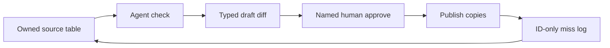

# Keeping Tour Dates and Streaming Links True Without a Full-Time Manager

**You keep tour dates, presaves, and streaming links true without a full-time manager by naming one source of truth, letting an agent check every public copy against it, and requiring a named human to publish.** Linktree, Bandsintown, Instagram, and the site footer are copies. They do not get to invent a Friday night.

I'm William Spurlock — Founder, AI Systems Architect, and Fractional AI CTO at Spurlock Studios LLC. I've built 600+ automations, with 500+ still live. I've spent 20,000+ hours on agentic systems, and those builds have saved clients 35,000+ hours of busywork. I do not invent an artist name, a merch number, or a streaming payout here. I will tell you the loop I actually run: source, check, draft, human-in-the-loop publish. Claude Sonnet 5, GPT-6 Astra, Gemini 3.8 Flash, and Grok 4.6 can read a diff. None of them announce the tour.

This is ops hygiene, not a site rebuild. If you still need the immersive artist destination itself, that build lives in [how I built Fordo's official artist website](/blog/building-fordo-immersive-artist-website-ai-studio-cursor). I am not retelling that Cursor session. A beautiful dates page that still points at last April's presave is a broken machine.

If the roster lives in one Airtable base and the next step is a draft you will read, start with [when Airtable AI is enough](/blog/when-airtable-ai-is-enough-and-when-you-need-an-outside-agent). The second those rows must stay true on the site, Linktree, and Bandsintown on a clock you are not sitting in, you already left the base. Publish still waits on a [human-in-the-loop approve step](/blog/human-in-the-loop-approve-before-your-ai-agent-sends-anything). If the checker would log fan emails hanging off a ticket URL, that is a [customer-data path](/blog/keeping-customer-data-safe-when-agents-touch-your-crm-and-inbox), not a link job.

---

## How do I keep tour dates, presaves, and streaming links true across my site without a full-time manager?

**Keep one owned table as truth, treat every other surface as a copy, run a scheduled check that returns a typed diff, and publish only what a human approved.** A manager is a person who notices rot. An agent is a job that notices rot on a clock. Those are not the same as a person who is allowed to change the public internet.

The rot I see on independent artist stacks is boring and expensive in attention:

| Surface | How it actually rots | What the fan hits |
|---|---|---|
| Site `/dates` or `/tour` | Someone typed the city once and never opened the CMS again | Last year's room, or a cancelled support slot |
| Site listen / footer row | One platform got the new URI; five did not | A track page that 404s, or a different artist with your name |
| Linktree / bio link | Fastest place to "just fix it," so it becomes a second brain | A presave that died on Friday and is still the pin on Monday |
| Instagram / TikTok bio | One short field, one smart link, no date | The drop URL from two singles ago |
| Bandsintown listing | A venue or promoter created an event you did not confirm | A ticket page for a night you pulled |
| Press kit PDF / EPK | Exported once, emailed forever | A merch store that moved hosts |

I do not fix that with a prettier Linktree theme. I fix it with a loop:



Four rules I will not negotiate:

1. **One write authority.** Dates, release URLs, and merch URLs are edited in the source table. Everywhere else is a publish.
2. **The agent does not announce.** It fetches, compares, and drafts. A cancelled date is a human sentence, not a model guess.
3. **Copies are listed.** If a surface is not on the list, it is not "also fine." It is untracked rot.
4. **A miss has an owner and a time.** "I think we updated it" is not a log.

### The copy inventory I make the artist fill once

I will not start a checker until the artist can name every public door. The first hour is a list, not a model. If they cannot name the doors, the agent will "fix" three and miss five.

| Door | Owner login | In the first inventory? |
|---|---|---|
| Official site `/dates` or widget page | CMS or host | Required |
| Official site listen / footer / tap-to-stream | CMS | Required |
| Linktree or equivalent bio tool | Linktree owner email | Required if it exists |
| Instagram bio URL | IG login or Later/Meta Business | Required |
| TikTok / X bio URL | Same | If you use them for music |
| Bandsintown artist page + widget | Bandsintown for Artists | Required if you tour |
| Spotify for Artists + Apple Music for Artists | Label or you | Required for IDs |
| Merch host (Shopify, Big Cartel, Fourthwall, Bandcamp) | Store owner | Required if you sell shirts |
| One current EPK / one-sheet | Drive or Dropbox | Only if someone still sends it |
| Songkick / Facebook Events / venue pages | Often not yours | Inbound review, not source |

Inbound is the pile people pretend is "also us." A venue Facebook event, a Songkick scrape, a promoter graphic with last year's support act — those are signals. They go in a review view. They do not write the table.

Some of those copies already have in-product helpers — Bandsintown's widget, Spotify for Artists URIs, Airtable field agents. That is the [AI already inside your tools](/blog/the-ai-already-inside-your-tools-and-why-most-owners-never-turn-it-on), not a reason to skip the owned table. Flip the switch you already pay for. Then decide whether you still need an outside checker. The monthly run-rate question, if you want the ledger instead of the loop, is [how much an AI agent actually costs each month](/blog/how-much-does-an-ai-agent-actually-cost-your-business-each-month). I will not invent a dollar figure for your tour.

---

## What is the single source of truth, and which surfaces are allowed to copy from it?

**The source of truth is one table you own — Airtable, a CMS collection, or a spreadsheet with real field types — and every public surface is allowed only to copy from it.** The official site is the public canonical for fans. That is not the same job as the source. Linktree is never the source. I will die on that hill.

A source row I will actually keep looks like this. If a column is missing, the checker cannot do the job:

| Field | What I store | Why it exists |
|---|---|---|
| `event_id` / `release_id` | Your ID, not the venue's | Delete and diff need a key |
| `status` | `draft` / `announced` / `on_sale` / `sold_out` / `cancelled` / `postponed` / `live` | "Is this allowed to be public?" |
| `venue` + `city` + `region` | Plain text the site will print | The fan-facing line |
| `iana_tz` | `America/Detroit`, not "ET" | EST and EDT are not a field |
| `start_local` | ISO local + offset, or local time plus the IANA zone | Stops Thursday night becoming Friday morning |
| `ticket_url` | Final on-sale URL, or empty | Empty is honest. A dead stub is not |
| `spotify_artist_url` | `open.spotify.com/artist/{id}` | Name search is how you collide |
| `spotify_release_url` | Album/track URL or URI | Presave and live are different rows |
| `apple_music_url` | `music.apple.com/{storefront}/...` | Different ID, different country prefix |
| `presave_url` | Third-party or Countdown URL | Dies or changes on release day |
| `live_listen_url` | What replaces the presave | The swap the agent is allowed to draft |
| `merch_url` | Product or collection URL you control | Homepage hopes are not SKUs |
| `last_verified_at` | Timestamp of the last clean check | Stale "looks fine" is a smell |
| `approved_by` | Human handle | Silence is not consent |

Surfaces I allow as copies, and the ones I refuse to treat as a second brain:

| Surface | Allowed role | Forbidden role |
|---|---|---|
| Owned source table | Write dates, URLs, status | None — this is the brain |
| Official site dates + listen modules | Public canonical copy | Hand-typed extras that are not in the table |
| Bandsintown | Copy, or *the* tour calendar if the site only embeds the widget | A second handwritten `/tour` plus Bandsintown |
| Linktree / bio smart link | One door that points at the current approved packet | The place you "fix it first" |
| Instagram / TikTok / X bio | One current URL | A calendar |
| Email footer / EPK / PDF | Dated export from the table | A living source |
| Venue / promoter listing | Inbound signal to review | Auto-write into your table |

Bandsintown will happily be your site calendar if you let it. Their artist help article [Sync your events to your website](https://help.artists.bandsintown.com/en/articles/7053470-sync-your-events-to-your-website), dated **August 7, 2025**, says the Widget automatically syncs published events to any site it is embedded in. The [widget setup note](https://help.artists.bandsintown.com/en/articles/7053415-set-up-your-widget) (April 17, 2023) also tells you to use the numeric artist ID in the embed when the name breaks — `ID_1025408` rather than a colliding string. That is a copy mechanism. It is not permission to keep a second handwritten list on `/tour`.

Pick one tour brain:

| Choice | When I use it | What I delete |
|---|---|---|
| **Table is tour SoT; Bandsintown is a copy** | You already have a custom dates module, or you sell tickets off a URL the widget will not own | Hand edits inside Bandsintown that never come home |
| **Bandsintown is tour SoT; the site only embeds the widget** | You refuse to maintain two calendars and the widget is the dates page | The CMS "tour" collection |
| **Both** | Never | This is the rot |

Streaming and merch never live in Bandsintown. Those stay in the table even if the widget owns nights.

Spotify is equally blunt about IDs. [Finding your artist, track, and release links](https://support.spotify.com/us/artists/article/finding-your-artist-track-and-release-links/) tells you a URI (`spotify:artist:…`) and a URL (`open.spotify.com/artist/…`) are the same identifier in two jackets, and that you should give your distributor that link so new music lands on the right profile. Apple Music for Artists' [FAQ](https://artists.apple.com/support/1113-faqs) says albums from different people with the same name can land on the same artist page until someone files the correction. If your source row is "search my name," you volunteered for that collision.

A smart link (Linktree, Feature.fm, Apple's Linkfire door documented in [The value of Linkfire links](https://artists.apple.com/support/3395-value-linkfire-links)) can be the *fan* door. It is still a copy. I store the destination Spotify and Apple URLs in the table so a smart-link outage does not leave you guessing which ID was live last week.

### Public canonical is not source

Fans should be able to trust the official site. That still does not make the CMS the brain. I have watched a dates module stay correct while the footer listen row pointed at a retired smart link, because two people "owned the site" and neither owned the table. Public canonical means: if a stranger Googles you, this is the page I want them to believe. Source means: this is the only place a status may change.

Inbound listings get a third bucket:

| Inbound | What I do | What I refuse |
|---|---|---|
| Venue Facebook event | Compare city/date/ticket host to the table | Let it create a row |
| Songkick / resident-app scrape | Flag if it shows a night you cancelled | Treat scrape as SoT |
| Promoter graphic in the group chat | Human reads it once | OCR-publish into Linktree |
| Support-act post that tags you | Check you are actually on the bill | Mirror their time if they omitted a zone |

If inbound disagrees with the table, the table wins until a human changes the table. If inbound is the only evidence a night exists, the row stays `draft` and the checker is not allowed to publish it. Surprise dates are how you inherit someone else's sold-out link.

---

## Which link-check jobs can an agent run, and which publishes still need a human?

**An agent can fetch, compare, and draft. A human still publishes anything a fan will trust: a new night, a kill, a presave-to-live swap, a ticket URL, or a merch URL.** Read-plus-draft is most of the value. Day-one autonomy on a tour announce is how you post the wrong city at 1 a.m.

I split the work on a hard line:

| Job | Agent | Human |
|---|---|---|
| HTTP status on every URL in the table | Yes — 200/301/302/404/410, final URL after redirects | Confirm a 301 that landed on a different artist |
| Diff public copy vs source | Yes — site dates, Linktree titles, Bandsintown titles if you scrape or use their listing | Decide which side is wrong when they disagree |
| Flag `presave_url` still public after `release_date` | Yes | Approve the swap to `live_listen_url` |
| Flag a date with no `iana_tz` or no offset | Yes | Fill the zone. The model does not invent Detroit vs New York |
| Flag a listen URL that is a search page, not an ID URL | Yes | Confirm the ID against Spotify for Artists / Apple Music for Artists |
| Screenshot or extract Linktree / bio | Yes | Approve the replacement packet |
| Create a Bandsintown event | No | You or your publicist |
| Cancel or postpone a night | Draft the status change only | You publish the sentence |
| Swap ticket vendor URLs | Draft | You, because refunds and holds live there |
| Email the list / post the announce | Draft if you already have HITL | Always a person |

Claude Sonnet 5 and GPT-6 Astra are good at "these two strings are not the same city." They are bad at "the room moved across the street and we are still playing." Gemini 3.8 Flash is cheap enough for the HTTP pass. Grok 4.6 does not get a looser publish rule. The model name does not change the gate.

The checker prompt I actually use. It is a template, not a dump of the fan list:

```text
Task: compare SOURCE_ROW to COPY_SURFACES. Return JSON only.

Allowed output:
- row_id
- surface
- field
- source_value
- copy_value
- http_status (if a URL)
- final_url (if redirected)
- severity: block | warn | info
- draft_fix (one sentence, no announce language)
- needs_human: true | false

Rules:
- Do not invent a venue, date, or URL that is not in SOURCE_ROW.
- If COPY has a date and SOURCE status is cancelled, severity=block.
- If today > release_date and copy still uses presave_url, severity=block.
- If listen URL is a search page or a different artist id, severity=block.
- If timezone is missing, severity=block.
- Do not recommend publishing. Set needs_human=true for every block.
- Do not quote query strings that look like emails or tokens. Store row_id only.
```

That last line is the data rule. Ticket vendors love `?email=` in a manage-order link. Your miss log should hold `event_id`, not the fan. The longer retention argument is the CRM/inbox post. Here I only refuse to turn a link checker into a second mailing list.

The approval card has to decide in a minute or it will get rubber-stamped:

| Card field | Why it is there |
|---|---|
| Row ID + status | Which night or release |
| Surface list that will change | Site / Linktree / Bandsintown / bio — named, not "everywhere" |
| Exact URLs before → after | No "update the links" |
| HTTP proof | Status + final host |
| Risk | `announce` / `kill` / `swap` / `404-fix` |
| Approver | A person, not "the artist team" |
| Timeout | No click means no publish |

If the send — or the CMS publish, or the Linktree save — can run without that click, you do not have a gate. You have a notification after the damage. I will not re-litigate the full HITL article here. I will repeat the one sentence that matters on tour week: silence is not consent.

I do not let the agent hold the Bandsintown password, the Linktree owner login, or the DNS. It can draft the packet into Slack or an Airtable "Pending publish" view. A person who already has those logins clicks. That is slower than a fantasy autopilot. It is how you avoid a cancelled Milwaukee date staying on sale because a venue page still existed.

### Fail closed, and the one unpublish I allow

Fail closed means a new block overnight cancels the morning publish. It does not mean "tweet anyway and fix the 404 later." If Spotify's URI is not in the table at T-0 because the distributor has not delivered, the listen module stays off or stays on the last *approved* live URL. It does not get a search link "just for today."

The one write I will let run without a click is a *kill of a URL that just flipped to 404 or 410*, and only if you wrote that rule on a named surface:

| Auto-unpublish I allow | Auto-unpublish I refuse |
|---|---|
| Hide a merch button whose product URL is 404 | Invent a replacement SKU URL |
| Archive a Linktree pin whose dest is 410 | Create a new pin |
| Drop a listen chip that now 404s | Point it at a different artist |
| | Cancel a date, change a city, swap a ticket host |

A miss log I will keep is boring on purpose:

| Field | Example | Why |
|---|---|---|
| `at` | `2026-09-16T14:12:00-04:00` | When the copy drifted |
| `row_id` | `evt_chi_0919` | What to delete later |
| `surface` | `linktree` | Which door |
| `field` | `presave_url` | What drifted |
| `severity` | `block` | Whether publish froze |
| `approver_id` | `null` or a person | Whether anyone signed |
| `resolved_at` | empty until publish | Open misses stay visible |

If I cannot fill `row_id`, I cannot honor a "take that date down" request at 11 p.m. If I store the full ticket manage-order URL next to that row, I just stored a fan. IDs only.

---

## What does a weekly hygiene loop look like the week before a drop or a tour announce?

**The week before a drop or a tour announce, you freeze the source table, run the checker on a tighter clock, publish one approved packet, and watch 404s for 24 hours.** You do not "get the links later." Later is when the bio still has the presave.

I run the same skeleton for a single and for a date dump. The objects change. The clock does not.

| Clock | Agent | Human | Freeze |
|---|---|---|---|
| **T-7** | Full pass: every URL, every copy surface, timezone presence, ID-vs-search | Confirm the announce list. Add missing rows. Kill surprise venue listings | No new "quick Linktree edits" outside the table |
| **T-3** | Presave-vs-live flag. Merch HTTP. Ticket HTTP if on sale | Approve the swap draft. Confirm Apple and Spotify IDs in the artist dashboards, not in a search bar | No new merch SKUs on the listen row |
| **T-1** | Recheck redirects. Pull Linktree extract. Diff site modules against the table | Sit with the packet. One approver. Timeout = do not publish | No "we'll add Berlin tomorrow" on the same graphic |
| **T-0 morning** | Recheck once. Fail closed if a block appeared overnight | Publish the approved surfaces in a written order | Source table locked except `last_verified_at` |
| **T+1** | 24-hour 404 watch on the live URLs | Kill or redirect anything that broke after the DSP flip | New work goes on next week's list |

Order of publish I use on T-0, because fans do not hit surfaces in the order you designed:

1. **Source table status → `announced` or `live`.** If this stays `draft`, every copy is a lie you chose.
2. **Official site.** Public canonical. If you embed Bandsintown instead of a CMS list, publish in Bandsintown *before* you refresh the site cache, then load the page as a stranger.
3. **Listen / merch modules on the site.** Presave out, live in. Merch URL that returns 200 on the SKU you named, not the store homepage.
4. **Linktree / smart link.** One door, current packet. Old pins archived, not "also there."
5. **Bios.** One URL. If the bio cannot hold the date, it holds the door.
6. **EPK / one-sheet only if someone will send it this week.** Otherwise skip. A PDF is a fossil by Friday.

Spotify's own release machine tells you why T-3 exists. [Countdown Pages](https://support.spotify.com/us/artists/article/getting-started-with-countdown-pages-on-spotify/) are a native pre-save for eligible upcoming albums and EPs — not singles, not rereleases — and on release day Spotify notifies pre-savers and adds the release to their library. The [May 21, 2025 Upcoming Releases hub note](https://newsroom.spotify.com/2025-05-21/upcoming-releases-hub-countdown-pages-charts-discovery/), updated **September 29, 2025**, is the same story: pre-save is a pre-release object. Your Linktree is not. If you used a third-party presave for a single (Countdown Pages will not take it), that URL is your problem after midnight. The agent flags `presave_url` still public. You approve `live_listen_url`. The model does not "just switch it."

A T-0 packet I will sign looks like this:

| Item | Example (fake) | Approver sees |
|---|---|---|
| Night | `evt_chi_0919` · Lincoln Hall · `America/Chicago` · `2026-09-19T20:00:00-05:00` | City, zone, offset |
| Ticket | `https://example-tickets.test/e/chi-0919` · HTTP 200 | Final host |
| Listen | Spotify track URL + Apple Music album URL with `?i=` if it is a song | Two IDs, not one smart link only |
| Merch | `/products/tour-tee-2026` · HTTP 200 | Not `/` |
| Kill | Old presave Linktree pin | Marked archived |

I do not invent what that ticket sold. I invent whether the URL still answers.

If you only do this the week of the announce, you will skip T-7 and find the colliding artist URL while you are already posting. The weekly version, on a quiet Tuesday, is the same checker with a longer timeout and no freeze. Quiet Tuesday is when I want the miss. Tour week is when I want a boring log.

### Late delivery, and who holds which login

Distributor delay is not a checker bug. Spotify for Artists will not show a release URI until the label or distributor delivers it; their [unreleased-music article](https://support.spotify.com/us/artists/article/unreleased-music-in-spotify-for-artists/) is the place you copy that URI, and it says metadata changes go back through the distributor. If Upcoming is empty on T-3, the human writes `delivery: pending` on the row. The agent keeps flagging a missing `live_listen_url`. Nobody pastes a search page to "have something."

The graphic is not the table. A 4:5 announce still can omit a city you added at T-1. I treat the graphic as another copy: if the still lists nights, those nights must match `status=announced` rows. If the still is art-only and the dates live on the site, say that in the caption so fans do not treat the picture as the calendar.

Who actually clicks, because "the artist" is often on a bus:

| Surface | Who I want holding the login | Backup |
|---|---|---|
| Source table | You, or one manager-shaped friend | Shared Airtable with two named humans, not a group Gmail |
| Official site CMS | Same human who approves the packet | Host support as break-glass, not as publisher |
| Bandsintown for Artists | The person who already talks to venues | You. Not the agent. |
| Linktree | The person who already updates bios | 1Password entry, not a DM'd password |
| Spotify / Apple artist dashboards | You or the label | Distributor support for URI mistakes |
| Merch host | Whoever fulfills shirts | Not the publicist "just this once" |

Two named humans beat a full-time manager you cannot hire. Zero named humans is how Linktree stays wrong for eleven days.

A quiet-Tuesday pass I still run when nothing is dropping:

1. HTTP every URL in the table.
2. Diff site dates and listen modules against the table.
3. Extract Linktree. Diff pins to `status` that is allowed public.
4. List inbound Bandsintown / venue events that are not in the table.
5. Open misses older than seven days. Someone owns them or they get a `wont-fix` with a reason.

If that Tuesday pass is clean three weeks in a row, tighten the clock only for announce weeks. If it is never clean, you do not have a tour-week problem. You have no source.

---

## FAQ

### Should I treat Linktree as the source of truth, or the site?

**Neither. The owned table is the source. The site is the public canonical copy. Linktree is a door.** I let Linktree be fast. I do not let it be true first. If a date exists on Linktree and not in the table, that is an incident, not a workflow. The site can still be wrong — hand-typed modules go stale — so "the site is source" is how a footer listen row outlives the album.

### How should Bandsintown stay in sync with the site calendar?

**Pick one tour brain: either the table writes and Bandsintown copies, or Bandsintown is the calendar and the site only embeds the widget.** Bandsintown documents that the Widget [automatically syncs published events](https://help.artists.bandsintown.com/en/articles/7053470-sync-your-events-to-your-website) into the page that holds the embed. That fails the minute you also type dates into a CMS. Use the [artist ID in the widget code](https://help.artists.bandsintown.com/en/articles/7053415-set-up-your-widget) when the name collides. A venue-created listing you did not confirm is inbound review, not auto-truth.

### What do I do with a dead presave after the track is live?

**Move the public door to the live store URL the same day, and treat a still-public presave as a block.** Spotify's Countdown Page job ends at release: they notify and add the album or EP to the library. A third-party presave for a single can 404, redirect to a homepage, or sit on a "thanks" page that no longer saves anything. The agent can flag it. You approve the swap. Leave the old URL in the table as `retired` so the next checker knows it was not a miss.

### Why do Apple Music and Spotify URLs both need their own fields?

**Because they are different catalogs with different IDs, and a smart link is a door, not a record.** Spotify wants the artist or release URL/URI from [their own share sheet](https://support.spotify.com/us/artists/article/finding-your-artist-track-and-release-links/). Apple Music for Artists tells you to [copy the Music link or build one in Marketing Tools](https://artists.apple.com/support/1117-apple-music-marketing-tools); song links often live on the album URL with an `?i=` track id. Country storefronts (`/us/`, `/gb/`) are part of the Apple URL. One "stream" field that holds whichever you grabbed last is how Android users get a dead door.

### How do I catch a merch 404 before fans do?

**Put the exact product or collection URL in the table and let the agent request it on the same clock as the dates.** A 200 on the store homepage is not a pass. A 301 through a sold-out handle to `/collections/all` is a warn. A 404 is a block. I do not estimate what that SKU would have sold. I only refuse to print a URL that does not answer. If merch is not ready, the listen row does not get a merch button.

### How should timezones sit on tour dates so the wrong city does not show the wrong night?

**Store an IANA zone and a local start with an offset. Do not store "8pm ET" on a row that might be Detroit or New York in March.** [Schema.org DateTime](https://schema.org/DateTime) is ISO 8601: `CCYY-MM-DDThh:mm:ss` plus `Z` or `±hh:mm`. Google's [event structured-data guide](https://developers.google.com/search/docs/appearance/structured-data/event) says to include the UTC offset, and that if you omit it Google will use the timezone of `location`. That is how a 7pm show becomes the wrong calendar day for a fan two zones over. The agent flags a missing zone. You fill `America/Chicago`. The model does not pick one.

### How do I stop same-name artist collisions on streaming links?

**Store IDs, never a search URL, and give those IDs to the distributor.** Spotify's artist-link article is written for this failure: send the artist URL or URI so deliveries land on the right profile. Apple's FAQ admits same-name catalogs can share a page until you file a ticket. Bandsintown's widget doc says to embed `ID_…` when the name breaks. The agent's job is to reject `https://open.spotify.com/search/your%20name`. Your job is to paste the ID from the logged-in artist dashboard.

### Can the agent auto-publish a new date to every surface?

**No. Auto-publish is how a guessed city becomes a ticket page.** The agent may draft the row, the Linktree pin, and the site module. A named human publishes. I will allow auto-*unpublish* of a URL that just started returning 404, if you wrote that rule and logged it — kill a dead merch button, do not invent a replacement. New nights, kills with a sentence, and presave-to-live swaps stay gated. If you want the fantasy where the agent "just handles tour," hire a manager. The checker is cheaper. It is not that person.

---

## Book an artist ops automation review

If your dates, presaves, and listen links already disagree across the site, Linktree, and Bandsintown, that is the build I want to do with you. I design the source table, the check, the typed diff, and the approve step. I do not sell you a full-time manager, and I do not rebuild the immersive site unless you ask for that separately.

I am William Spurlock. I ship this the same way I ship the rest of the book: 600+ automations built, 500+ live, 20,000+ hours in the seat. If you want that review, use [the contact form](/contact) and say you need tour-and-link hygiene. This is an automation working session, not an AI-visibility audit.
