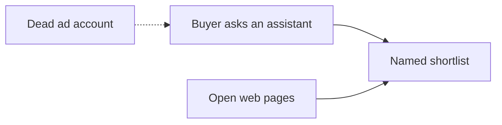

# Meta Banned the Ads. AI Answers Are the Inbound You Still Own

**If Meta and Google ads banned your licensed shop, you still get inbound from AI answers by making crawlable, entity-true pages that ChatGPT, Google AI Overviews, and AI Mode can retrieve — because those products do not bill your ad account.** A dead auction ends paid reach. It does not de-index a page Googlebot can fetch, and it does not stop a buyer from asking "licensed shop near me that does pickup" out loud.

I am **William Spurlock**, Founder, AI Systems Architect, and Fractional AI CTO. I have been SEO-certified since 2021; the work now sits under AEO, AIO, and GEO. I have shipped **600+ automations** with **500+ live**, logged **20,000+ hours** inside agentic systems, and deleted **35,000+ hours** of client busywork across that book of work. I do not invent ad spend, CPMs, recovered revenue, or client names. This post is for **licensed operators** only. If you are not licensed, this is not a marketing plan for you. I will not write a path around ad review, and I will not make medical claims.

This spoke owns one problem: **paid social and paid search are closed; AI answers are the inbound channel you still own.** It is not a remake of [why your traffic is dropping even though you still rank on Google](/blog/why-your-traffic-is-dropping-even-though-you-still-rank-on-google). That pillar is the rank-but-no-click pattern. If you still have a working Ads account and you are wondering where research clicks went, use [what Google AI Mode means for your Google Ads budget](/blog/what-google-ai-mode-means-for-your-google-ads-budget). If impressions held and sessions fell, use [how to tell if AI Overviews caused a traffic drop](/blog/did-google-ai-overviews-cause-your-traffic-drop-how-to-tell). Come back here when the account itself is banned or the category is blocked.

I also will not retell [how to get ChatGPT and Perplexity to recommend your business](/blog/how-to-get-chatgpt-and-perplexity-to-recommend-your-business). That pillar is the proof-and-entity playbook. This page stops at the restricted-category split: what the ad policies actually close, which owned pages still get cited, and how you score inbound this month without Ads Manager as a scoreboard.

### What this post will not do

- Tell you how to get a THC retail ad through Meta or Google review.
- Name a private community product or write an acquisition engine that lives off-platform.
- Promise that if/when federal rules change, the ad accounts reopen on a calendar you can buy against.
- Invent last quarter's spend, a replacement CPM, or a recovered-revenue number.
- Turn a licensed shop into a medical publisher.

If you need any of those, you are in the wrong document — or the wrong studio.

---

## If Meta and Google ads banned my shop, how do I still get inbound from AI answers?

**You still get inbound by becoming a name the open web already repeats, then publishing pages an answer engine can lift — hours, license class, city, pickup rules, and a FAQ that answers the buyer's question without a health claim.** ChatGPT, Perplexity, Google AI Overviews, and AI Mode do not check whether your Meta Business Manager is in good standing. They retrieve what they can fetch. If the only pages you ever built lived inside Ads Manager, the ban did not just cut spend. It cut the only copy you had.

I treat this as a channel divorce, not a traffic mystery. Paid social and paid search are rented. The site, the Business Profile, and the third-party listings that already name you are owned. The buyer who used to see a boosted post now asks an assistant. That assistant names two or three options and moves on. You either appear in that shortlist or you do not.

### Rented auction vs owned answer

| Surface | What the ban does | What still works |
|---|---|---|
| **Meta Ads** | Stops paid reach for THC and related psychoactive products under Meta's cannabis policy | Organic Page posts are a different product; they are not a replacement inbound plan |
| **Google Ads** | Blocks marijuana and "cannabis coffee shop" style ads under [Recreational drugs](https://support.google.com/adspolicy/answer/16489299); a Canada Search pilot is a narrow exception | Organic Search and AI features are a different stack |
| **Apple Ads** | Treats tobacco, illegal drugs, and narcotics as prohibited controlled-substance ad content ([Apple Advertising Policies](https://ads.apple.com/policies), last updated February 26, 2025) | An App Store listing is not a shop inbound channel |
| **Google AI Overviews / AI Mode** | Does not read your ad account | Cites crawlable pages and supporting links |
| **ChatGPT / Perplexity** | Does not bill Meta or Google Ads | Names businesses the open web already treats as real |
| **Google Business Profile** | Not an ads auction | Storefront profiles can still exist when the ad account is dead |

The opinion I will hold in a room with a licensed owner: **a fifth appeal to Ads Manager is not a Q4 inbound plan.** Appeal if you have a legitimate policy error. Do not wait on the appeal to publish the pages a model can quote.

If someone is asking the assistant out loud in the car, the spoken shortlist is even shorter. That test lives in [can your business show up when someone asks ChatGPT out loud](/blog/can-your-business-show-up-when-someone-asks-chatgpt-out-loud). I am not rewriting the voice mechanics here. I am telling you the ad ban did not create a new spoken product. It just removed the paid fallback you used to hide behind.

The dotted line is the habit. The solid line is the work.

### What "inbound" means when you cannot buy the click

Inbound, in this post, is a named answer that sends a human to a channel you still control: the site, the phone, the licensed door, a branded search. It is not a paid impression. It is not a boosted Page post that "does okay." It is not a private community acquisition engine. I will not write that playbook here.

The questions I actually hear from licensed owners after a ban look like this:

1. **"Licensed shop in [city] that does pickup today"** — a shortlist question. If you are not on it, the buyer does not open ten blue links to be fair.
2. **"Who is allowed to buy, and what ID do they need"** — a rules question. AI Overviews love a first-sentence answer. Your FAQ should already have it.
3. **"Is this a real licensed retailer or a delivery pop-up"** — an entity question. The model will use whatever the rest of the web repeats.
4. **"Hours and whether I can reserve"** — a logistics question. Hours pages get cited. Slogan homepages do not.

Those four are enough to start. I do not need your old campaign structure. I need the questions the assistant is already answering without you.

### The first week I will not let you skip

- **Confirm the ban is ads, not Search.** Open Search Console. If the homepage is indexed, stop telling the room "Google banned us" as if it were one product. URL Inspection on the homepage, the hours page, and the FAQ. If Google-InspectionTool can see the license sentence, a buyer-facing assistant can too. If it only sees `/verify`, fix the gate before you rewrite copy.
- **List every URL that only existed for a campaign.** Redirect the ones you still want. Kill the ones that 404 with a parameter salad.
- **Write the four facts on one page:** legal name, city, license class, hours. Same strings as the Business Profile.
- **Freeze ten prompts** you will re-run every Monday. City plus licensed plus the job (pickup, hours, ID). Save the outputs. Do not edit the wording when you dislike the answer.
- **Appeal if you have a real policy error.** Then close the tab and publish. The appeal is not the inbound plan.

If you want the longer "how do I get named" sequence after that week, it is the ChatGPT pillar. If you want to argue about Overview CTR, it is the traffic-drop spoke. Neither of those is the ban.

Appeal and publish can run on the same calendar. They are not a sequence. The appeal asks a reviewer to reverse a paid placement. The pages ask a crawler to fetch a fact. I have never seen a restored ad account invent the hours page you refused to write while you waited.

| This week | Next week |
|---|---|
| Search Console on the live URLs | First prompt-panel rescore |
| Entity + hours on one indexable page | How-buying-works + FAQ |
| Redirects off dead campaign URLs | Third-party name match |
| Appeal filed, if you have a real error | Appeal status checked once — then ignored |

If week two starts and the hours URL is still not in the index, stay on crawl. Do not open a new blog idea. The assistant cannot cite a page Google has not fetched.

Request indexing on the entity page and the hours page after they are live. Then wait. Daily recrawl superstition is not a strategy.

A page that is live, indexed, and boring beats a page that is branded, gated, and invisible.

I will take boring.

---

## What do restricted-category ad policies actually block, and what do they not block on the open web?

**Restricted-category ad policies block paid placements and, in many cases, the landing-page review behind those placements. They do not, by themselves, remove you from organic Search, AI Overviews, ChatGPT retrieval, or a qualifying Google Business Profile.** Google states the paid/organic split in plain language: [investment in paid search has no impact on organic ranking](https://support.google.com/google-ads/answer/3097241), and [Google does not accept payment to crawl more often or rank higher](https://developers.google.com/search/docs/fundamentals/how-search-works). A banned ad account is not a Search penalty.

I am not a lawyer, and this is not legal advice. Read the live policy pages before you file anything. The point of this section is the split operators keep collapsing: **ads review is not the open web.**

### What the current public policies actually say

| Policy | As of | What it blocks in ads | What it does not automatically block |
|---|---|---|---|
| [Meta cannabis and cannabis-derived products](https://www.facebook.com/business/help/5356017181162381) | Live Meta Business Help, retrieved September 18, 2026 | Ads that promote or offer THC products or related psychoactive components; drug-related paraphernalia | Education or advocacy ads that do not offer a prohibited product; organic site pages; directories that already list you |
| [Google Ads recreational drugs](https://support.google.com/adspolicy/answer/16489299) | Live Ads Policy, retrieved September 18, 2026 | Ads for marijuana and for products or services marketed for recreational drug use, including cannabis coffee shops | Organic indexing; AI Overviews; a storefront Business Profile |
| [Google Ads Canada cannabis pilot](https://support.google.com/adspolicy/answer/16851502) | Posted January 15, 2026 | Nothing for a U.S. shop. Search-only, Canada-only, through December 31, 2026, for listed Health Canada and provincial operators | Your U.S. Meta or Google Ads ban |
| [Google Ads CBD carve-out](https://support.google.com/adspolicy/answer/16489299) | Same recreational-drugs page | Most THC retail ads | A narrow path for topical hemp-derived CBD at or under 0.3% THC, with certification and limited geos — not a licensed flower shop |
| [Apple Advertising Policies §3.5](https://ads.apple.com/policies) | Last updated February 26, 2025 | Ad content that promotes sale, distribution, or use of tobacco, illegal drugs, or narcotics | Your website. Apple Ads is an app-ads product, not a replacement storefront channel |
| [Google Business Profile guidelines](https://support.google.com/business/answer/3038177) | Live Help, retrieved September 18, 2026 | Age-restricted categories (alcohol, cannabis, weapons) as service-area businesses **without** a storefront | A licensed public storefront that meets customers in person during stated hours |

Meta's help page is explicit on THC: ads may not promote or offer the sale of THC products or cannabis products containing related psychoactive components. It also bans paraphernalia examples such as bongs, rolling papers, and vaporizers. The same page allows some legally permissible CBD in the U.S. with LegitScript certification and Meta authorization, and it forbids disease claims in those ads. That CBD lane is not a loophole for a licensed adult-use menu. I will not pretend it is.

Google's recreational-drugs page lists marijuana next to other substances it will not let you advertise, and it lists cannabis coffee shops as an example of services marketed for recreational drug use. The January 15, 2026 changelog extends a **Canada Search-only** pilot through the end of 2026. If you are a U.S. licensed retailer, that changelog is context, not a reopen button.

Apple's February 26, 2025 advertising policies put controlled substances in the **prohibited** list, not the restricted-with-placement table that alcohol and some medical ads sit in. I do not tell a licensed shop to "just run Apple Search Ads" as the backup. That is usually the wrong product and the wrong policy bucket.

### What I tell owners they still own

- **The website**, if humans and crawlers can read the same facts.
- **Organic Google Search**, which is not Google Ads.
- **AI Overviews and AI Mode**, which [Search Central's AI features page](https://developers.google.com/search/docs/appearance/ai-features) treats as generative Search features that surface supporting links. There is no "apply with your ad account" form.
- **ChatGPT and Perplexity recommendations**, which synthesize third-party proof plus your own pages. The method is the ChatGPT pillar, not a boosted post.
- **A qualifying Google Business Profile**, if you have a public storefront and you follow [eligibility](https://support.google.com/business/answer/13763036) and representation rules.
- **Directories, press, and review surfaces** that already use your legal name.

What they do not own, and should stop budgeting as if they do:

- A guaranteed Meta or Google Ads placement for THC retail.
- A bought citation inside ChatGPT or an AI Overview.
- A promise that if/when federal rescheduling happens, the ad policies flip the same week. Platform ads rules are separate documents from a statute. I will not date a reopening.

If a consultant sells you "restricted-category media buying" that sounds like a way around review, hang up. This post is the opposite of that pitch.

### Education ads are not a shop plan

Meta's help page says you may educate, advocate, or run public-service copy related to cannabis-derived products **as long as the ad does not promote or offer a prohibited product**. That sentence gets abused. Owners hear "education" and write a boosted essay that still points at a menu. Reviewers hear a sale. I treat the education lane as a compliance footnote, not as the new media mix.

Google's CBD carve-out is the same kind of trap. Topical hemp-derived CBD at or under 0.3% THC, certification, limited locations, no disease claims. A licensed adult-use retailer who tries to "just advertise the cream" while the rest of the domain sells what Google lists as marijuana is asking for another disapproval. I will not diagram how to dress a catalog for review. I will tell you the carve-out is not your inbound.

Landing-page review is also not indexing. Ads systems fetch the destination to decide whether the *ad* may run. Search systems fetch the URL to decide whether the *page* may appear. You can fail the first and still pass the second. You can also `noindex` a campaign URL for years, then act shocked when the assistant has nothing to cite. Check the live headers before you rewrite the homepage.

### Three bans people mash into one word

| Event | Whose document | What it actually removes | What it leaves |
|---|---|---|---|
| **Ads policy disapproval / account suspension** | Meta Advertising Standards; Google Ads policies; Apple Advertising Policies | Paid placements, sometimes the ability to create new campaigns | The website, organic Search, AI features, a qualifying Profile |
| **Search spam or security issue** | [Spam policies for Google web search](https://developers.google.com/search/docs/essentials/spam-policies) and Search Console | Organic rankings or indexing for the affected URLs | Unrelated ads accounts, unless you also violated ads rules |
| **Legal or local-license action** | Your regulator, not Mountain View or Menlo Park | The right to operate, advertise, or list — depending on the order | Nothing I can recover with a blog post |

If you cannot point to which row you are in, you will brief the wrong vendor. I have sat in rooms where the owner said "Google banned us" and meant a single disapproved Performance Max asset. I have sat in rooms where they meant the domain was dropped. Those are not the same Monday.

Hemp vs cannabis vs CBD is a labeling fight reviewers will not let you blur. Meta defines hemp, on that help page, as products from the plant that do not contain CBD or more than 0.3% THC, and it defines THC products as over 0.3% THC, self-described THC, or related psychoactive components. Google's recreational-drugs page still names marijuana in the "not allowed" list. If your license is adult-use flower, you are in the blocked ads bucket on both platforms. Write the site like a licensed retailer. Do not write it like a supplement brand that "happens to" share a domain.

---

## Which owned pages still get cited when the ad account is dead?

**The pages that still get cited are the ones a model can verify without an ad tag: the legal name, the city, the license class, the hours, the pickup or delivery rules you are allowed to publish, and a FAQ that answers the actual question in the first sentence.** Paid landing pages that only existed inside Ads Manager die with the account. Thin "best shop in town" slogans were never citable. I want the opposite of a boosted creative: a boring, dated, extractable record.

I do not need you to win a featured snippet to show up in an Overview. Those are different products — the split is in [featured snippet vs AI Overview](/blog/featured-snippet-vs-ai-overview-what-changed-and-what-to-do-about-it). I do need a page that can contribute a passage a merge can credit.

### The cite stack I ask a banned shop to ship

| Page | What the model should be able to lift | What I refuse to put on it |
|---|---|---|
| **Homepage / entity page** | Legal name, city, license type, one-sentence who-you-serve | Lifestyle health claims, "cures," unlicensed medical language |
| **Location + hours** | Address or licensed premises facts you are allowed to publish, hours, pickup window | A fake storefront, a P.O. box dressed as a door |
| **How buying works** | Age requirement, ID at the door, pickup vs delivery as your license allows | Consumption how-tos, dose advice, private acquisition playbooks |
| **FAQ** | Eight to twelve real buyer questions with a bold first sentence | Ad-review bait, "how we got around Meta" stories |
| **Policy / age page** | Who may enter or order, what you will not ship | A wall of legal paste with no extractable answer |
| **Third-party twins** | Same NAP and category on the Profile and directories | A second name for ads that no longer exist |

That is enough surface for a 30-day pass. You do not need a 40-page blog to get named on "licensed retailer in [city] that does pickup." You need the facts identical everywhere and written so a crawler can see them.

### What I see fail after a ban

1. **The only URL that ever ranked was a paid landing page.** The ad is gone. The page was `noindex`, or it 302s to a dead campaign. The assistant has nothing left to retrieve.
2. **The age-gate is a hard redirect to a form.** Googlebot does not fill forms. If the crawler never sees hours and license text, neither does the Overview. More on that in the FAQ. This is a crawl problem, not an ads-review trick.
3. **The homepage is a slogan and a newsletter field.** No city. No license class. No hours. A model cannot recommend a mood board.
4. **The name does not match.** Ads used a handle. The site uses an LLC. The Profile uses a DBA. ChatGPT will pick the string the rest of the web repeats — often not yours.
5. **Third-party proof is empty.** The ChatGPT pillar is blunt about this: if the open web never names you, the engine rarely invents you. A ban does not create that proof. It just makes the missing proof obvious.

I want one truth, published three ways: HTML a human can read, the same facts in JSON-LD if you already ship schema, and the same name/address/hours on the Business Profile. I will not sell you a new schema type that "submits you to AI." Search Central has said you do not apply for Overviews.

Keep the copy inside what a licensed shop is allowed to say. Hours. City. License. Pickup window. What you will not do. If/when rules change, update the dated sentence. Do not write a menu of medical outcomes.

### Sentences I actually want on the page

Write them so a model can lift the whole sentence. Dated. Local. No health claim.

- **Entity:** "[Legal name] is a state-licensed [retailer / grower] in [city, state]. License [class or public ID if you publish it]."
- **Hours:** "The licensed storefront at [address you are allowed to publish] is open [days and hours]. Pickup follows those hours."
- **Rules:** "Buyers must be [legal age] and present government ID at the door. We do not ship where the license does not allow it."
- **What you are not:** "We are not a medical clinic. We do not diagnose, treat, or claim to cure any condition."
- **Freshness:** "Hours and pickup rules last checked [Month Day, Year]."

That last line matters more than a new blog post. Stale hours are how you get recommended for a door that is closed.

### NAP and name collisions

NAP here means name, address, phone — the same three strings on the site, the Profile, and the directories you already occupy. After a ban I see three failure modes:

1. **Ads name ≠ legal name.** The campaign used a punchy handle. The license uses an LLC. The assistant shortlists the LLC because that is what the state page and the Profile use.
2. **Two cities, one brand.** A second door copied the homepage and never changed the city. The model merges you into the wrong town.
3. **Phone only existed in Ads Manager.** The click-to-call number dies with the account. The Profile still has the real line. Update the site to the number a human can still dial.

I do not need a 20-directory blitz. I need the three strings to stop arguing with each other. Then I will look at whether anyone else on the open web has ever used that name in a sentence.

### Order I ship in, first 30 days

1. **Week 1 — entity + hours.** Indexable. Matching Profile. Redirect dead campaign URLs.
2. **Week 2 — how-buying-works + FAQ.** Age, ID, pickup, what you will not do. First sentence is the answer.
3. **Week 3 — third-party twins.** Fix the listings that already exist. Do not open twelve new profiles with a new nickname.
4. **Week 4 — re-run the prompt panel.** If you are still unnamed, the ChatGPT pillar is the next document. If you are named on a dead URL, fix the redirect and wait a week.

I will not start with a brand film, a new logo, or a "restricted-category growth" retainer. Those do not get you cited.

---

## How do I measure AI inbound this month without an ads dashboard?

**Measure AI inbound with a frozen prompt panel, a cite-versus-recommend score, Search Console on those queries, and the referral hostnames you can actually see — not with Ads Manager, CPM, or a made-up recovered-revenue number.** The full metric set is in [how to measure AI visibility in 2026](/blog/how-to-measure-ai-visibility-the-metrics-that-actually-matter-in-2026). The weekly method is in [how to track when AI tools cite or recommend your business](/blog/how-to-track-when-ai-tools-cite-or-recommend-your-business). This section is the 30-day card for a shop that no longer has an ads dashboard to hide in.

I run the card in a spreadsheet. Twelve to twenty prompts. Same wording each Monday. Same engines. I do not open Ads Manager to "prove" the week.

### The 30-day card

| Column | What I log | Pass / fail I will accept |
|---|---|---|
| **Prompt** | Exact buyer wording, including city and "licensed" / "pickup" when that is the real ask | Frozen. Do not rewrite mid-month to chase a yes |
| **Engine** | ChatGPT, Perplexity, Google AI Overview, AI Mode | Score each separately. A cite in one is not a cite in all |
| **Mention / cite / recommend** | Named, linked, or shortlisted as the option | Recommend beats a passing mention |
| **URL credited** | Homepage, hours, FAQ, Profile, or a third party | If they credit a dead ads URL, fix the redirect this week |
| **Search Console** | Impressions and clicks on that query family | Impressions without clicks can still mean the Overview used you |
| **Referral host** | `chatgpt.com`, `perplexity.ai`, and anything your analytics already labels | Absence of a referral is not proof you were unnamed |
| **GBP actions** | Calls, direction taps, if you have a qualifying Profile | A dead ad account does not zero these out |
| **Human close** | Did a real buyer mention the assistant | Anecdote, labeled as anecdote. Not a revenue forecast |

I do not turn twelve prompts into a percentage I can sell. A month that reads "4 recommends, 6 cites, 8 misses" is a meeting. A month that reads "we recovered 22% of lost paid inbound" is a slide I will send back, because you do not have the paid baseline and I will not invent it.

### What I do with the card, in this lane only

- **Miss everywhere:** you do not have an ads problem. You have an evidence problem. Ship the cite stack. Then re-run the same prompts.
- **Cited, never recommended:** the model can verify you and still will not put you on the shortlist. That is usually thin third-party proof or a name collision, not a missing pixel.
- **Recommended, no click:** that can still be inbound. The buyer heard or read the name. Track branded search and "they said ChatGPT sent me," not last-click only.
- **Overview present, you absent:** read the traffic-drop diagnostic if clicks also fell. Do not use that page to relitigate the ads ban.
- **Profile actions up, site sessions flat:** the inbound may be Maps, not the blog. Keep the Profile truthful. Do not stuff it with product claims Shopping will reject.

I will not give you a CPM to replace. I will not guess what the banned account "would have" produced this month. If you cannot name the unpaid answers that already mention you, you are not ready to spend on a new rented channel either.

Thirty days is enough to see whether the cite stack moved the panel. It is not enough to declare a new media mix. If the panel is still all misses after the pages are live and indexed, the next document is the ChatGPT recommend pillar, not another appeal letter.

### A prompt panel I will actually freeze

Keep them boring. City plus licensed plus the job. No trick wording designed to "beat" the model.

1. Licensed cannabis retailer in [city] that does in-store pickup
2. What ID do I need at a licensed shop in [city]
3. Hours for [legal name] in [city]
4. Is [legal name] a licensed storefront or delivery-only
5. Licensed shops in [city] that publish pickup rules
6. [Legal name] age requirement
7. Who owns [legal name] and where are they licensed
8. Best licensed shop in [city] for pickup today
9. Does [legal name] still operate in [city]
10. [Legal name] phone and hours

Run the same ten in ChatGPT, in Perplexity, and as a Google query you inspect for an Overview or AI Mode handoff. Screenshot the answer. Note the URLs. That is the panel. "Best" in line 8 is there because buyers type it — not because I want you to write a "best of" page full of adjectives.

### What I refuse to put in the spreadsheet

- **Last month's CPM or spend.** I do not have it, and I will not reconstruct it from memory.
- **A recovered-revenue cell.** A citation is not a ticket. Do not multiply recommends by average order and call it inbound recovered.
- **A vanity "AI visibility %" from a tool you cannot audit.** If the vendor will not show the prompt and the raw answer, it is not a source.
- **A row for "we posted on the Page."** Organic social is not the measurement for this spoke.
- **A row for a rented community.** Public thesis here is AI visibility plus owned pages. I will not score a private acquisition engine.

Week 1 is the baseline. Week 3 is the first honest read after the entity and hours pages are live. Week 5 is when I decide whether the miss is still evidence or still crawl. If Search Console still cannot find the hours URL, stop arguing with ChatGPT. Fix robots, the gate, and the sitemap first.

---

## Frequently asked questions

### Does a Google Ads cannabis or hemp ban also kill my organic Search listing?

**No. Google documents a hard split: paid investment does not buy organic rank, and nobody can pay to be crawled more or ranked higher.** A disapproved ad or a suspended Google Ads account is an ads-policy event. Organic removal is a Search spam or legal-removal event. Confirm the URL in Search Console. If it is indexed, the ads ban did not secretly de-index it. If it is not indexed, look at `noindex`, robots, the age-gate, or a quality issue — not Ads Manager.

### Can I just switch a banned shop to Apple Search Ads?

**Usually no — Apple Ads is the wrong product for a storefront, and [Apple Advertising Policies §3.5](https://ads.apple.com/policies) (February 26, 2025) prohibits ad content that promotes the sale, distribution, or use of tobacco, illegal drugs, or narcotics.** Apple Search Ads exists to promote apps in the App Store. It is not a Meta replacement for a licensed retail menu. I do not treat it as the backup inbound channel after a social ban.

### Can a licensed shop still have a Google Business Profile after the ad account dies?

**Yes, if you qualify as a business that meets customers in person at a public storefront during stated hours — a dead ads account is not the eligibility test.** [Google's representation guidelines](https://support.google.com/business/answer/3038177) and [eligibility rules](https://support.google.com/business/answer/13763036) say age-restricted categories such as cannabis are not permitted as service-area businesses without a storefront. Delivery-only or online-only setups are the suspension risk, not the missing campaign. Keep the name and hours honest. Product Editor still follows Shopping rules; do not dump a regulated catalog into it and hope.

### Does an age-gate stop ChatGPT and AI Overviews from citing my site?

**A hard redirect or a form Googlebot cannot submit can hide the same pages an answer engine needs to retrieve.** [Search Central's explicit-content guidelines](https://developers.google.com/search/docs/specialty/explicit/guidelines) tell publishers who use an age gate to let Googlebot crawl without triggering it, by verifying the crawler and serving the content. I cite that as the crawl mechanism, not as a claim that a licensed shop is "explicit" under SafeSearch. Keep the human age check your jurisdiction requires. Do not build a gate that leaves the crawler on an empty `/verify` URL. I am not telling you to cloak a catalog to pass ads review.

### We got banned, so SEO is dead — is that true?

**No. SEO and AEO were never a feature of Ads Manager.** If you only ever paid for traffic, the ban feels like the channel died. The open web did not die. The work is the cite stack and the third-party name match. Owners who say "SEO is dead" after a policy suspension usually mean "I never built pages a crawler could use." That is a site problem. It is not proof that organic and AI answers closed with the auction.

### If AI cites my shop but nobody clicks, is that still inbound?

**Yes — a named recommendation can send a branded search, a phone call, or an in-store visit that never shows as `chatgpt.com` in analytics.** Citations are not the same as clicks. Overviews and spoken answers often resolve the question on the spot. Score mention / cite / recommend on the panel, then watch branded queries and "the assistant named you" conversations. I will not invent a click-through rate that turns a citation into revenue. If you need the measurement method, use the tracking spoke linked above.

### Does Google's Canada cannabis ads pilot change a U.S. shop's inbound plan?

**No. The [January 15, 2026](https://support.google.com/adspolicy/answer/16851502) update extends a Search-only Canada pilot through December 31, 2026 for listed Health Canada and provincial operators.** It is not a U.S. reopen, it is not Meta, and it is not AI Overviews. If you are a U.S. licensed retailer, treat it as a dated policy note. Do not pause the owned-page work waiting for a U.S. ads pilot that Google has not published.

### Can I buy a ChatGPT or AI Overview placement now that ads are banned?

**No. There is no official paid citation slot in ChatGPT or Google AI Overviews that replaces a banned Meta or Google Ads account.** Overviews attach supporting links from Search. ChatGPT and Perplexity synthesize what they can retrieve. Buying a different ad network does not insert your name into that shortlist. Spend, if you still have a legal channel, stays in the channels that channel allows. The inbound you still own is the citeable record.

### If/when federal rescheduling happens, do the ad bans lift automatically?

**I do not treat rescheduling as a date or a certainty, and I do not assume platform ads policies move on the same clock as a statute.** Meta, Google Ads, and Apple each keep their own restricted-goods documents. If/when federal status changes, re-read those live pages. Until then, inbound is still the owned pages and the Profile you already qualify for. Do not freeze the cite stack waiting for a policy you cannot schedule.

---

## Get a site that can still be named after the auction dies

A banned ad account ends the rental. It does not end the question a buyer types or says into ChatGPT, Perplexity, or Google AI Mode. **If the only pages you had were campaign URLs, you do not have an ads problem anymore. You have no citeable record.**

I build **Premium AIO/AEO websites** for licensed operators in categories ad platforms punish: entity-true homepages, hours and license facts a crawler can fetch, FAQ blocks with a first-sentence answer, and names that match the Business Profile. The offer is the site. It is not a promise that Meta will restore the account, and it is not a promised revenue replacement for the spend I will not invent.

If you want that AI-visibility-ready site built, use [/contact](/contact). Bring the policy email and the URLs you still own. We will map the prompt panel and the four pages that have to exist before you write another appeal.

SEO-certified since 2021. Founder, AI Systems Architect, Fractional AI CTO. The job this month is to stop treating Ads Manager as the only inbound you had — and to publish the answers you still own.

If you still have a working paid account in another category, keep that fight on the AI Mode budget spoke. If you still rank and the clicks vanished, keep that fight on the traffic-drop pillar. This page is only for the owner whose auction already ended.

Bring three artifacts if we talk: the policy notice, Search Console on the homepage, and Monday's prompt-panel screenshots. I can work from those. I cannot work from "we used to do fine on Meta."
