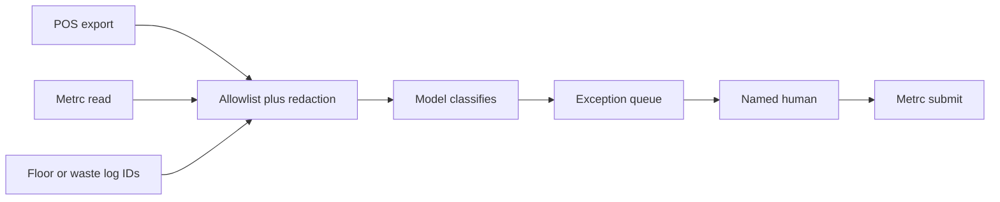

# METRC Compliance Without a Five-Figure Seed-to-Sale Suite

**You stay Metrc-compliant without a five-figure seed-to-sale suite by treating Metrc as the state ledger, building a nightly exception queue that diffs tags and quantities against your POS and floor logs, and putting a named human on every state-facing submit.** The agent drafts, flags, and reconciles. A person files. I will not design a bypass, a hidden plant, or an auto-submit into the state's system.

I'm William Spurlock — Founder, AI Systems Architect, and Fractional AI CTO. I've built 600+ automations, with 500+ still live. I've spent 20,000+ hours on agentic systems, and those builds have saved clients 35,000+ hours of busywork. I do not invent licensee names here. I do not invent fine amounts, state statutes, or vendor list prices. This post is operations design for a **licensed** independent dispensary or craft cultivator that already has a Metrc account. It is not legal advice, not counsel, and not a replacement for the state system.

[Metrc](https://www.metrc.com/) is the track-and-trace platform states use to follow cannabis from seed to sale with software plus RFID tags. Their homepage still dates the Colorado start to **2011**. Illinois later named Metrc the official cannabis inventory tracking system as of **1 July 2025** in the [CROO seed-to-sale timeline](https://cannabis.illinois.gov/research-and-data/seed-to-sale-tracking.html). Your state may use Metrc, BioTrack, or something else. The pattern does not change: the government ledger is the ledger. Your POS is a store tool. A suite that promises to be both is a purchase. It is not a requirement that I have seen written as "buy this SKU or you are out of compliance."

The data rules for any agent that reads a regulated system live in [keeping customer data safe when agents touch your CRM and inbox](/blog/keeping-customer-data-safe-when-agents-touch-your-crm-and-inbox). I am not retelling redaction and retention. The send-gate lives in [human-in-the-loop approve before your AI agent sends anything](/blog/human-in-the-loop-approve-before-your-ai-agent-sends-anything). Here the "send" is a Metrc submit. The deny-list for write credentials is in [which permissions your AI agent should never have by default](/blog/which-permissions-your-ai-agent-should-never-have-by-default). A Metrc POST is a production write. It stays off the agent on day one.

---

## How do I stay METRC compliant without buying a five-figure seed-to-sale suite?

**Stay Metrc-compliant without a five-figure seed-to-sale suite by keeping the POS and floor process you already run, reading Metrc on a clock, and filing only the exceptions a named human approved.** You do not need a second store OS to know that package `1A4…` is two grams light against last night's drawer. You need a diff, a queue, and a person who is allowed to click.

I hear "five-figure suite" from operators the way I hear "we need an agent" from SaaS founders: it is a category of quote, not a SKU I can open a public price sheet for this week. I will not invent Dutchie, LeafLogix, or anyone else's year-one number. What I will say is the job those quotes are actually selling. Cultivation planning. Retail POS. Loyalty. Labor. A reporting UI on top of Metrc. Some of that you already bought. The pain that shows up in a Monday Slack is narrower: tags, transfers, waste, lab results, and POS-versus-ledger drift.

Metrc already publishes the integration door. [Metrc Connect](https://www.metrc.com/track-and-trace-technology/metrc-connect/) is their API program. The **Standard** plan on that page is listed as **Free** (portal, lookback, docs, email support). **Custom** is "monthly pricing — based on needs." I am not your integrator. Becoming a [validated integrator](https://www.metrc.com/massachusetts-integration-and-api/) is a Metrc process with training, a sandbox assessment, and a production key — Massachusetts still lists those steps on their integration page. A shop that only needs read-plus-queue should not pretend it is shipping a public integrator product.

| What you keep | What you add | What you refuse |
|---|---|---|
| The POS the floor already hits | A nightly (or hourly) pull of Metrc package and transfer IDs | A rip-and-replace "compliance suite" before you can name the miss |
| Metrc as the state ledger | An exception table: tag, qty delta, reason, owner, due | Auto-POST into Metrc because the model sounded sure |
| Physical RFID plant and package tags | A least-data prompt: label, item, qty, location, exception type | Patient names, purchaser IDs, payment, or medical-card numbers in the model |
| A named submitter | A blocking approve card before anyone files | "The agent has my Metrc login in case I'm in the grow" |

The stack I actually ship for this job is boring on purpose:

1. **Export** the POS inventory slice that already carries a Metrc package label, or that you can join to one.
2. **Read** Metrc through a validated path or a licensed export your state already allows — active packages, in-transit, incoming, outgoing, rejected. Oregon's public [Metrc API notes](https://api-or.metrc.com/Documentation/PrintableList) are blunt: packages leave active inventory through **finishing, discontinuing, and outgoing transfers**. That sentence is why I watch those three doors.
3. **Shape** the row down to IDs and quantities. Strip buyer and patient fields before Claude Sonnet 5, Claude Opus 5, GPT-6 Astra, Gemini 3.8 Flash, or Grok 4.6 sees a token.
4. **Classify** the miss: qty drift, orphan tag, stale transfer, missing waste, missing lab, unit-of-measure mismatch.
5. **Queue** the exception in Airtable or a sheet the closer already opens.
6. **Wait.** A human files in Metrc. The workflow dies on timeout. Silence is not consent.

If the exception table lives in one Airtable base and a person still pulls the CSV, [Airtable AI can be enough](/blog/when-airtable-ai-is-enough-and-when-you-need-an-outside-agent). The second you need Metrc plus POS on a clock nobody is sitting in, that is an outside agent — n8n or equivalent — not a second chat tab.

I would rather you keep the POS you already trained the floor on than buy a suite you will still babysit. The suite is not evil. It is the wrong first purchase when the actual pain is "Friday's tags do not match Monday's drawer."



If the last arrow can fire without the human box, you do not have a compliance helper. You have an unattended filer. I will not build that.

### Week-one checklist I run before the model is on

I do not start with Claude Sonnet 5. I start with a join key and a miss log. If step two fails, we stop.

1. **Name the license and the Metrc user who will submit.** One person, written down. A backup person. Not "the shop."
2. **Prove the POS can store a Metrc package label** on the SKU or the lot, or that you can join to one without guessing.
3. **Export one quiet day.** Active packages. Open transfers. Yesterday's sales by label. No patient columns.
4. **Hand-diff ten packages.** If you cannot explain those ten misses in English, a model will only decorate the confusion.
5. **Write the tolerance** per unit of measure with the inventory lead. Flower grams are not concentrate grams.
6. **Write the deny list** on the credential: no POST, no PUT, no finish, no waste, no transfer create.
7. **Stand up the exception table** with owner, due, source timestamps, and a "filed in Metrc at" stamp the human fills.
8. **Then** add the classifier. Not before.

[The AI already inside your tools](/blog/the-ai-already-inside-your-tools-and-why-most-owners-never-turn-it-on) is the right first switch if that table lives in Airtable or Notion and a person still pastes the export. Flip the in-app draft. Read it. Then decide if you still need n8n. Two systems on a clock you do not sit in is the line that forces an outside agent.

### What this is not

I will say this in plain language once, because cannabis work attracts the wrong brief.

- **Not a tracking bypass.** Tags stay on. Transfers stay in Metrc. Waste stays in Metrc.
- **Not a way to hide plants, hide packages, or "fix" an overage off-books.** If that is the ask, I am not the builder.
- **Not legal advice.** Your counsel and your state bulletin win. This is an ops pattern.
- **Not a replacement for Metrc, BioTrack, or a validated integrator.** It sits beside the ledger.
- **Not a generic "AI for dispensaries" catalog.** I am not wiring loyalty texts, budtender scripts, or a store-traffic forecast. Those are different jobs and I will not smuggle them into a compliance post.

---

## Which Metrc jobs are safe for an agent versus a human-in-the-loop submit?

**Read, diff, flag, and draft are safe for an agent. Any state-facing create, adjust, finish, waste, or transfer submit stays human-in-the-loop.** I treat a Metrc write the way I treat a payment API: the model does not hold the credential.

Metrc's own API docs split the world into GET lists and POST/PUT actions. I copy that split into the permission sheet. The [getting-started](https://api-mt.metrc.com/Documentation/getting-started) page says every call needs an integrator key plus a **user** API key, and that the user key is tied to a person's account, not the company. That is a person. That person is the submitter. The agent does not become a second user so you can skip the click.

| Job | Agent | Human | Why |
|---|---|---|---|
| Pull active / inactive / in-transit packages | Yes | Review the miss list | Read. Least-data IDs only |
| Pull incoming, outgoing, rejected transfers | Yes | Accept, reject, or complete in Metrc | A stale inbound is a flag, not a receive |
| Diff POS qty vs Metrc qty vs last physical count | Yes | Decide which number is true | The model cannot weigh a jar |
| Draft a waste packet from the floor log | Yes | Record waste in Metrc | Waste is a state event |
| Draft transfer fields from a purchase order | Yes | Create or accept the transfer | Manifests move product on a public ledger |
| Finish, unfinish, adjust, or discontinue a package | Never auto | Always | Those are the official exits from active inventory |
| Attach or chase a lab result | Flag "result missing" | Lab and licensee file per state rules | The agent does not invent a COA |
| Retail sale / patient allotment | Never | POS and Metrc rules | Buyer identity does not belong in this agent |
| Order or activate RFID tags | Remind "tags on hand low" if you already track that | Order and affix | Illinois's [tag page](https://cannabis.illinois.gov/research-and-data/seed-to-sale-tracking.html) still treats tags as a licensee action |

Claude Fable 5.1 and Mythos 5.1 (invite) do not get a looser write. Opus 5 does not get a looser write. The model name does not change the deny-list.

The approval card I want in Slack or email is short enough to decide in a minute:

- **Record** — package label or transfer ID, not a customer name
- **Exception type** — qty drift, stale inbound, missing waste, missing lab, orphan tag
- **Suggested action** — "adjust +2.1g," "accept inbound 1842," "record waste reason X"
- **Sources** — POS snapshot time, Metrc pull time, floor-log row ID
- **Risk** — "state-facing submit" in one word so nobody treats it like a tweet draft
- **Approver** — the Metrc user who will file, not "whoever is awake"

If the card cannot show those six lines, the agent is not ready. I will not let a model "just finish the package" because the POS hit zero. Zero in the POS and zero in Metrc are different facts. One of them might be a missed transfer.

A prompt I actually use for the classifier. It is a template, not a dump, and it never asks for a submit:

```text
Task: classify one inventory exception. Return JSON only:
{exception_type, severity, suggested_action, needs_human, reason}.

Allowed fields (do not infer missing people or payments):
- package_label
- item_name
- metrc_qty
- pos_qty
- unit_of_measure
- location_name
- transfer_id
- last_lab_status
- floor_log_id
- pulled_at

Rules:
- exception_type must be one of: qty_drift, orphan_tag, stale_transfer, missing_waste, missing_lab, uom_mismatch, none
- needs_human is always true when suggested_action is a Metrc write
- Do not invent a quantity. If a number is missing, say so.
- Do not mention patients, purchasers, or payment.
- Do not claim the package should be hidden, retagged off-books, or skipped.
```

That last line is the licensed-ops line. If a builder asks me for "a quieter way to handle overages," the job ends. I build exception queues. I do not build concealment.

### Credentials I will and will not attach

The permission post is the deny-list. Here is the Metrc-shaped version I write on the build ticket.

| Credential | Day one | Later, maybe | Never |
|---|---|---|---|
| Metrc GET of packages and transfers | Yes, scoped to this license | Same | Cross-license "just in case" |
| POS inventory export | Yes, label + qty + UOM + location | Add cost fields if the miss needs them | Full customer history |
| Metrc user API key with write | No | Still no on the agent. The human keeps it | Shared in Slack |
| Metrc UI password | No | No | Browser-saved "shop" login in the runner |
| Lab portal | No | Read-only status enum if the lab offers it | PDF COAs into the prompt |
| Patient or medical registry | No | No | No |

If the only way your integrator will talk is a key that can also POST, I do not give that key to the model node. I put a thin server in front that exposes `list_active_packages` and `list_open_transfers` and nothing else. The human still files in the Metrc UI they already trained on. A pretty integrator screen is not an excuse to auto-submit.

Timeouts matter here the same way they matter on outbound mail. If the closer does not click by the time you set — end of receiving window, end of day, end of the next morning — the write does not run. I will not "helpfully" submit at 11:59 p.m. so the dashboard turns green.

---

## How do I catch package, transfer, and waste exceptions before they become a state problem?

**Catch them by polling the three doors Metrc already names — packages, transfers, waste — and opening a ticket the same day the numbers disagree, not the week an inspector asks.** I will not quote a fine. I have not opened your state's penalty schedule for this post, and I will not invent one. A late transfer and a missing waste event are still operational fires. You want them on a list with an owner before they age.

I watch five miss shapes. If you cannot name which one bit you last month, you are not ready to buy software. You are ready to keep a miss log.

| Exception | What the read shows | What the agent does | What the human files |
|---|---|---|---|
| **Qty drift** | Metrc package qty ≠ POS qty for the same label, outside your tolerance | Writes the delta, the two timestamps, and the unit | Adjust, sale correction, or a recount — after they look at the jar |
| **Orphan tag** | A label on the floor that is not in active packages, or a Metrc label with no floor row | Flags "unmatched label" | Activate, retag per state rules, or finish the ghost — never "lose" the tag |
| **Stale transfer** | Incoming, outgoing, or rejected row sitting past your SLA | Ages the row. Does not receive it | Accept, reject, or complete in Metrc |
| **Missing waste** | Floor or harvest log has a waste row; Metrc waste for that plant, batch, harvest, or package is empty | Drafts the waste fields from the log IDs | Records waste in Metrc |
| **Missing lab** | Package or transfer requires a test; result is blank or failed and still on the floor | Flags "do not move" | Hold, remediate, or transfer per the lab and the state — the agent does not write a COA |

Illinois's **2025** transition notes are a useful dated example of how a state talks about these objects, not a statute for your license. CROO told licensees that **plant tags** track a plant from immature through harvest and **package tags** track harvested cannabis, intermediates, and infused goods that may be sold, processed, or transferred. They also set **25 May 2025** for lab results in Metrc only and **2 June 2025** for transfers in Metrc only during that cutover. If your state is mid-switch, the exception queue watches both systems until the old one is actually dark. It does not invent a third ledger.

### Packages

I start with active packages. Then I join on the label the POS already printed, or the label you wrote on the lid. If the POS SKU has no Metrc label, that is exception zero: you cannot reconcile a vibe. Fix the join before you buy a model.

Tolerance is a number you pick with the inventory lead. I do not pick it from a blog. A 0.1g flower miss and a 0.1g concentrate miss are not the same conversation. The agent reports the raw delta. The human decides if it is weigh-scale noise or a missing sale.

### Transfers

Transfers are where independent shops get surprised because the product already left the room. The public API lists incoming, outgoing, rejected, and delivery packages. I poll those on a tighter clock than nightly if you move product the same day — hourly during receiving windows is a product choice, not a legal safe harbor.

The agent may say "inbound 1842 has been sitting 26 hours." The agent may not click receive. Receiving a transfer you did not count is how you inherit someone else's shortage.

### Waste

Waste is the exception operators still keep on a clipboard next to the trim bin. That clipboard is fine as a source. It is a failure as the only copy. Plant-batch, plant, harvest, and package waste all exist as separate Metrc actions in the public endpoint lists. I do not care which one your license uses this week. I care that the floor-log row has a matching Metrc waste row before the day ends, or that a named person owns the gap.

If/when federal rescheduling moves, your state track-and-trace obligation does not vanish because a headline did. I will not date that if. I will not treat it as a certainty. Keep the queue.

### What I put in the prompt, and what I refuse

Least data is the parent post applied to a grow and a vault. The model gets the label, the item, the two quantities, the location name, the transfer ID, and a lab-status enum. It does not get:

- Patient or caregiver identifiers
- Adult-use purchaser names, IDs, or residency flags
- Payment methods, loyalty phones, or delivery addresses
- Employee home contact data
- Raw Metrc API keys
- Photos of the vault "so the model can count"

A photo of the vault is a second copy of your entire floor. I extract three numbers with a human or a scale. I do not attach the room.

Logs stay IDs. `package_label`, `transfer_id`, `workflow_id`, `approver_id`, timestamps. If your n8n execution still holds the full POS dump, you built a second ledger with worse access control than Metrc. Prune it. The retention math is in the parent data-handling post.

### The field allowlist I send the model

I write the task first. Then I write the fields. If I cannot name the fields, I do not have an agent. I have a fishing expedition through a vault.

| Field | In the prompt? | Why |
|---|---|---|
| `package_label` | Yes | The join key |
| `item_name` | Yes | So a UOM miss is readable |
| `metrc_qty` / `pos_qty` | Yes | The actual diff |
| `unit_of_measure` | Yes | Grams vs each vs milliliters |
| `location_name` | Yes | Vault vs sales floor vs quarantine |
| `transfer_id` | Yes when the miss is a transfer | Age the row, do not receive it |
| `last_lab_status` | Enum only: `pass` / `fail` / `missing` / `not_required` | Hold ticket, not a COA |
| `floor_log_id` | Yes | Points at the clipboard row |
| `pulled_at` | Yes | Two clocks, or the diff is theater |
| Purchaser / patient / caregiver | No | Special-category and retail identity |
| Payment, loyalty phone, address | No | Not a Metrc-recon job |
| Employee personal mobile | No | The submitter ID is enough |
| Raw API keys, magic links | No | Secrets do not classify a gram |

One record per model call. I do not batch "here are 80 packages, tell me which are wrong" into a single completion. That is 80 labels in one log line and one Slack paste. Loop. Keep the blast radius at one tag.

### Cadence I actually run

| Window | What I poll | Why |
|---|---|---|
| Receiving hours | Incoming and in-transit transfers | Product is in the hallway. Nightly is too late |
| End of day | Waste log vs Metrc waste | The trim bin is emptied. The clipboard lies if you wait |
| Nightly | Active packages vs POS | Qty drift can sit until close. It should not sit until Friday |
| Weekly | Orphan-tag sweep + finished-but-still-selling | Slow rot. A person walks the room with the list |
| After a lab drop | Packages waiting on results | "Do not move" tickets go stale if nobody owns them |

None of those clocks is a legal safe harbor. They are how I keep the miss list shorter than the inspector's patience. Your state bulletin wins if it names a tighter window.

---

## What does a cheap exception queue cost compared with a full seed-to-sale suite?

**A cheap exception queue costs a live-agent monthly bill — seats, tokens, retries, babysitting, and a runner — plus the Metrc path you already owe. A full seed-to-sale suite is a store OS quote that I will not invent a list price for.** You are comparing a nightly diff to an implementation project. Those are different purchases.

I already priced one live agent's monthly run-rate in [how much an AI agent actually costs your business each month](/blog/how-much-does-an-ai-agent-actually-cost-your-business-each-month). That ledger is seats, tokens, retries, babysitting hours, tool or MCP fees, and logs. I will not mint a second fake invoice labeled "Metrc." Re-open that page the week you budget, then add two cannabis-specific lines: the Metrc Connect plan you actually have, and the hours a licensed submitter already spends in the Metrc UI.

| Line | Exception queue (what I can defend) | Full seed-to-sale suite (what I will not invent) |
|---|---|---|
| Software | Airtable or a sheet + n8n (or the [AI already inside your tools](/blog/the-ai-already-inside-your-tools-and-why-most-owners-never-turn-it-on) if the job stays in one app) | POS + inventory + reporting + often loyalty and labor, sold as one stack |
| Model | Claude Sonnet 5 or Gemini 3.8 Flash on a 12-field object. Opus 5 only if the miss text is messy | Vendor "AI compliance" add-on I have not priced from a primary sheet this week |
| Metrc access | Read via a path your license and Metrc already allow. Connect **Standard** is listed **Free** on Metrc's page | Often a validated integrator bundled into the suite |
| Submit | Human. Already on payroll if you are licensed | Still a human in most shops I see. The UI is prettier. The click remains |
| Implementation | Days to a short build if the POS already stores the package label | A cutover. Training. Dual entry while you migrate |
| What you do not get | Cultivation ERP, buying, payroll, a new register | That is the point of the suite. Buy it when those are the pain |

Babysitting is the line that surprises people. A queue that pages the closer with twelve false qty-drifts a night will cost more in attention than a suite's seat. Tighten the join and the tolerance before you add GPT-6 Astra. A classifier that cannot shut up is not cheaper than a person who already opens Metrc at 10 a.m.

When the suite wins anyway:

- You have no POS, or the POS cannot store a package label and the vendor will not add the field
- You are opening a second license type (craft grow plus dispensary) and you want one inventory brain
- Your state or your insurer is already pointing you at a validated integrator list and you want that paper
- The closer is the owner, the owner is also the trimmer, and they will not open a second queue

When the queue wins:

- The register works. Metrc works. The miss is the gap between them
- You can name last month's exceptions in one sitting
- You will accept a human click on every write
- You would rather spend the five-figure quote on canopy, packaging, or payroll

I do not sell "AI for cannabis." I sell a miss list that a licensed person can clear before it ages. If a vendor demo opens with a chatbot on the sales floor, that is a different product and I am not in that meeting.

### A sample month I will actually put on a whiteboard

I still will not invent your invoice. I will name the line items so you can fill them from the cost post and from Metrc's current page.

- **Runner.** Self-hosted n8n or a small hosted seat. This is a poll-and-queue job, not a chatbot OS.
- **Model.** Sonnet 5 or Gemini 3.8 Flash on a 12-field object. Token spend stays small if you loop one package at a time and you do not paste vault photos.
- **Queue.** Airtable or a sheet the closer already lives in. If Omni or Field Agents can draft the miss note inside that base, start there.
- **Metrc path.** Connect Standard is listed Free. If you are already paying a validated integrator, do not buy a second one so the agent has a logo.
- **Babysitting.** Fifteen to forty minutes a day for a shop that already rings clean, in my experience — that is a hedged operator estimate, not a study. If you are clearing two hours of false drift, the join is wrong.
- **Submitter time.** You already pay this. The queue is supposed to shorten the Metrc tab, not add a third tab of fan fiction.

Add those up against the suite quote you already have in email. If the suite is also replacing a dying POS, that is a POS project. Do not hide it inside "compliance." If the suite is only promising a prettier Metrc, buy the queue first and keep the quote.

Grok 4.6 does not change the bill shape. GPT-6 Astra does not change the bill shape. Claude Opus 5 is the wrong default for "is this tag two grams light." Save Opus for a messy floor-log sentence the cheaper model cannot classify. I still do not let it submit.

---

## What does the closer actually do with the queue on a Monday?

**They open the miss list, walk the three rooms that usually lie — vault, receiving, waste — and file only the rows they can defend in Metrc.** The agent already did the homework. The closer does the judgment. If a row cannot be walked, it stays open. It does not get "cleaned up" from a desk.

A Monday I will actually run with a two-person independent shop:

1. **Sort by severity.** Stale inbound and failed-lab-still-on-floor first. Qty drift under tolerance last.
2. **Walk receiving.** If inbound 1842 is on the list, count the boxes before anyone clicks accept. The card is a hint. The count is the fact.
3. **Walk the vault for orphan tags.** Phone flashlight. Label to list. List to label. Two directions or you will miss the ghost on the shelf.
4. **Waste.** Match yesterday's clipboard IDs to Metrc waste. File the gap or assign the grower by name. Do not let "we'll catch it Wednesday" become the process.
5. **Qty drift.** Weigh the jar if the delta is outside tolerance. Then decide: missed sale, missed split, bad UOM, or a POS void that never hit Metrc.
6. **Stamp the queue.** Every filed row gets `filed_at`, `metrc_receipt` or screenshot ID, and the submitter's name. A green Slack emoji is not a receipt.
7. **Kill the false pile.** If eight of twelve qty-drifts were a gram-vs-each join error, fix the join that morning. Do not train the team to ignore the queue.

I want the closer to finish this in a sitting they can still open the store after. If Monday is a second full-time job, the suite is not the fix yet. The join is. Or the floor process is. Software on top of a bad join is how you pay five figures to see the same red row in a nicer font.

Inspectors do not grade your agent. They grade whether the tag in the room matches the tag in Metrc. The queue is how you get to that sentence without buying a second POS.

### Dual systems during a cutover

If your state is moving onto Metrc — Illinois's **2025** CROO timeline is the dated example I already cited — you will spend weeks with two inventories that both claim to be true. The queue's job in that window is to name the mismatch, not to pick a winner so the dashboard looks calm.

| During a cutover I do | During a cutover I refuse |
|---|---|
| Tag both IDs on the exception row when a package still exists in the old system | "Just enter it in Metrc and delete the old row" as an agent action |
| Age transfers that the new system has and the old one does not | Auto-receive so the new ledger looks caught up |
| Hold sellable product that is missing a lab result in the system the state named as official | Invent a pass because the old system had one |
| Keep a named human on every write to either system | A shared "migration" bot with both passwords |

When the old system goes dark, delete that second ID from the queue template. Do not keep a shadow column "in case we need it." Shadow columns become shadow ledgers.

---

## FAQ

### Do I still need Metrc plant and package RFID tags if I skip the five-figure suite?

**Yes. The exception queue does not replace RFID tags, activation, or the Metrc UI.** Illinois's **April 2025** CROO note still required licensees to order plant and package tags from Metrc and affix them before inventory is in the system. Your state's tag rules are the ones that bind you. I build around tags. I do not design a shop that "just uses SKUs."

### Can an AI agent create or accept a Metrc transfer?

**No. The agent may draft the fields and age a stale inbound. A named human creates, accepts, rejects, or completes the transfer in Metrc.** A transfer moves product on the state ledger. That is a submit. Silence on the approval card means the transfer does not run.

### How should a licensed shop record waste so the paper log does not drift overnight?

**Write the waste on the floor log with a plant, batch, harvest, or package ID the same hour it happens, then file the matching Metrc waste action before you leave — the agent only drafts the packet from those IDs.** A clipboard with no ID is not a source. A model that invents a waste reason is not a source. The human records waste.

### What should the agent do with lab results?

**Flag packages or transfers that are missing a required result, or that failed and are still in a sellable location. Do not write, upload, or "fix" a lab result.** Testing labs and licensees already have a Metrc path for results. During Illinois's **2025** cutover, labs were told to report results in Metrc only after **25 May 2025**. I treat "result missing" as a hold ticket, not a creative writing job.

### Why does the POS disagree with the Metrc ledger?

**Because they are different books: the POS records the sale you rang, Metrc records the package the state can see, and a missed transfer, a leftover split, or a unit-of-measure mismatch will desync them.** The agent reports the delta and the two timestamps. The human counts the jar. I do not let the model pick a winner so the numbers look tidy.

### Who is allowed to click submit in Metrc?

**Only a person whose Metrc user can perform that action on that license — not the agent, not a shared "shop" login sitting in an n8n credential, not whoever reacted with an emoji.** Metrc's API docs tie the user key to a person's account. Put that person's name on the approval card. If they are out, the queue waits. It does not promote the intern.

### Can I paste a Metrc user API key into Claude, ChatGPT, or a consumer tab?

**No. Treat the user key like a production database password: vault it, never put it in a prompt, and never paste package or transfer exports into a consumer chat product.** The parent data-handling post is the full copy map. Consumer paste bypasses your allowlist, your log, and your retention job. The exception queue exists so people stop doing that.

### Does an exception queue replace Metrc or a validated integrator?

**No. Metrc stays the state system. A validated integrator is a Metrc-approved vendor. An exception queue is an internal miss list with a human submit.** I am not your counsel and I am not Metrc. If your state requires a specific integrator or a specific report, file that. This design does not hide inventory, skip tags, or stand in for a lawyer.

---

## Book a Metrc exception-queue review

If you already have a license, a POS, and a Metrc login, and the pain is the gap between them, that is the build I want to do with you. I design the read, the least-data shape, the exception table, and the blocking human submit. I do not design an auto-filer, and I do not replace the state system.

I am William Spurlock. I ship this the same way I ship the rest of the book: 600+ automations built, 500+ live, 20,000+ hours in the seat. If you want that review, use [the contact form](/contact) and say you need a Metrc exception queue with human-in-the-loop submit. This is an automation working session for licensed operators, not an AI-visibility audit.
