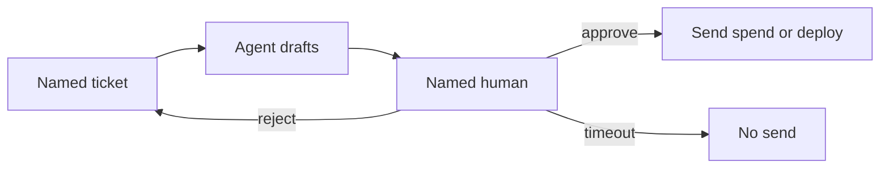

# OpenAI Research Intern: What Operators Change After the Sep 7 Posts

**Today is Sunday, September 7, 2026. After OpenAI's Saturday pair — the intern milestone in [Research acceleration: The view inside OpenAI](https://openai.com/index/research-acceleration-view-inside-openai/) and Jakub Pachocki's [An Alien Mind](https://openai.com/index/an-alien-mind/) — I change four operator habits: keep a named human on every send, spend, and deploy; leave computer-use off on standing agents; refuse to treat "intern-level" as unattended staff; and hedge AGI plus the March 2028 researcher date as OpenAI's claim, not a desk measurement.** I do not rewrite the Astra spec card. I do not rebuild the frontier routing board. I tighten the gates I already run.

I'm William Spurlock — founder, AI Systems Architect, and Fractional AI CTO. I've built 600+ automations with 500+ still live, spent 20,000+ hours on agentic systems, and helped clients delete 35,000+ hours of busywork. I pay token bills. I do not invent OpenAI's internal scoreboard, and I do not copy a lab intern into a client's inbox.

If you want the week-one Astra ritual, I already wrote the [GPT-6 Astra operator field guide](/blog/gpt-6-astra-operator-field-guide). If you want day-one IDs and prices, use the [Astra launch spec card](/blog/gpt-6-astra-launch-operator-spec-card). If you want which vendor owns which lane, that is the [frontier routing board](/blog/frontier-routing-astra-fable-gemini-38-grok-46). This post is the Sunday operator read: what a business changes after those two official posts, and what it refuses to change.

The stack I actually name this week:

| Vendor | Model I name | Role on this desk | Not this post |
|--------|--------------|-------------------|---------------|
| OpenAI | GPT-6 Astra | Flagship OpenAI lane, attended | Spec recitation |
| Anthropic | Claude Fable 5.1 / Mythos 5.1 (invite) / Opus 5 / Sonnet 5 / Haiku 4.5 | Long jobs, cheap volume | A Fable bake-off |
| Google | Gemini 3.8 Flash | Fast extract and sort | A Flash swap essay |
| xAI | Grok 4.6 | Cursor Task default | A billing-cliff recap |

---

## What should operators change after OpenAI’s Sep 7 research-intern and Alien Mind posts?

**Keep human-in-the-loop on send, spend, and deploy; leave computer-use off on standing agents; treat intern-level work as scoped tasks with a named reviewer; and hedge AGI plus March 2028 as OpenAI's stated target, not your ops calendar.** Those four moves are the whole Sunday change. Everything else is already written.

OpenAI's intern post is dated September 6, 2026. Pachocki's essay is the same day. I am writing this on the 7th, in present tense, because the posts are already public and the desk has to react today — not after a marketing deck "lands AGI."

The four changes, in the order I will enforce them:

| Change | What I do today | What I refuse |
|--------|-----------------|---------------|
| HITL | Named human clicks yes before email, Slack, CRM, SMS, spend, or deploy | A Slack dump after the send |
| Computer-use | Off on standing n8n/MCP agents | "The intern can operate computers, so turn the desktop on" |
| Intern-level staffing | Scoped task, human direction, human judgment of the result | Overnight unattended "staff" with send-as |
| AGI / 2028 hedge | Quote OpenAI, date the quote, keep it off the invoice | "We are AGI-ready" or "automated researcher by March 2028" as my forecast |

I already have the HITL wiring in [approve before your AI agent sends anything](/blog/human-in-the-loop-approve-before-your-ai-agent-sends-anything) and the default-deny list in [which permissions your AI agent should never have by default](/blog/which-permissions-your-ai-agent-should-never-have-by-default). Saturday's posts do not replace those posts. They raise the cost of ignoring them.

---

## What did OpenAI actually claim in the intern post and Alien Mind essay?

**OpenAI says that, by its own measurements, it has an automated research intern: a system that carries out well-defined research tasks under human direction, including work that would take a skilled researcher a few days — and it is aiming at an automated AI researcher by March 2028.** That is [the intern post](https://openai.com/index/research-acceleration-view-inside-openai/), not a product SKU and not an independent audit. Pachocki's [Alien Mind essay](https://openai.com/index/an-alien-mind/) is the paired caution: keep people in the loop, do not assume alignment keeps pace, and do not treat the intellect as a finished human substitute.

I use official pages only for the primary record. Decoder recaps and blog explainers are not the source.

What I will repeat, because OpenAI wrote it:

| Official claim | Source | Date | Operator translation |
|----------------|--------|------|----------------------|
| Intern milestone met "according to our measurements" | [Research acceleration](https://openai.com/index/research-acceleration-view-inside-openai/) | Sep 6, 2026 | Self-graded. No third-party exam. |
| Intern = well-defined tasks under human direction, including multi-day skilled work | Same post | Sep 6, 2026 | Direction is part of the definition. Unattended is out of scope. |
| "Strong progress" toward an automated AI researcher by March 2028 | Same post | Sep 6, 2026 | OpenAI's target. Not my delivery date. |
| People still set priorities, judge results, and decide scale / pause / deploy | Same post | Sep 6, 2026 | Copy this sentence onto the client SOP. |
| "We do not yet know how to safely get all the way to aligned, full RSI" | Same post | Sep 6, 2026 | Do not sell "aligned RSI" as a week-one feature. |
| No lab has solved alignment and monitoring enough to keep scaling at maximum speed for much longer | [An Alien Mind](https://openai.com/index/an-alien-mind/) | Sep 6, 2026 | The chief scientist is asking for brakes. Do not outrun him in your deck. |
| GPT-6 Astra is "significantly better aligned" than GPT-5.6 Sol, and still needs more progress | Same essay | Sep 6, 2026 | Better-than-Sol is OpenAI's comparison. Not a license to drop the approve step. |

OpenAI also published internal usage figures in the intern post. Those are OpenAI measuring OpenAI. I will quote them with that label. I will not pretend I sat in their research org and replicated the spreadsheet.

The figures I will treat as official OpenAI measurements, mid-August 2026 unless dated otherwise:

- **3.1 agent-workdays** of effort for every human workday across the research organization, against a standard 8-hour day. Before June 2026, total agent runtime was still below total human labor.
- **More than $600 per day** of inference at API prices for the median researcher ranked by agent usage. **More than $7,000 per day** of tokens for the 90th percentile user in the research organization.
- **Over half** of successful 4–8 hour tasks in the last six months involved one or more human interventions.
- **High-level planning** remains a minimal fraction of agent output tokens. Build, run, and technical help grew. Decide-and-staff work did not take over the token mix.
- **August 2026** experiments per active experimenter hit an all-time high since tracking began in January 2025. OpenAI notes compute also grew.
- After the July 20 infrastructure compromise, OpenAI paused reinforcement learning on the latest deployment models while it hardened environments. After August 7 Astra-class restrictions, **Astra-class GPU allocation fell a further 59.2 percent** the following week while other classes rose **17.2 percent**, offsetting about **85 percent** of the drop.

Every one of those numbers is from [the intern post](https://openai.com/index/research-acceleration-view-inside-openai/). If a recap adds a figure I cannot find there, I omit it.

---

## Why is intern-level still attended work, not unattended staff?

**Because OpenAI defined the intern as work under human direction, then published an intervention rate that still needs a person on two-day jobs.** "Intern" in a lab is a scoped pair of hands. "Intern" in a sales deck is a fake hire. I keep the first definition and kill the second.

Three official sentences do the work. I keep them on the same card:

1. **Definition.** "A system that can carry out well-defined research tasks under human direction, including tasks that would take a skilled researcher a few days." ([Intern post](https://openai.com/index/research-acceleration-view-inside-openai/))
2. **Steering.** "In the last 6 months, over half of successful 4-8 hour tasks involved 1 or more interventions." (Same post)
3. **Authority.** "People still set our research priorities, judge which ideas and results to pursue, and decide whether to scale, pause, or deploy systems." (Same post)

That is not a junior employee with a laptop and a badge. That is a fast pair of hands on a ticket you wrote, with a reviewer who can still fail the ticket.

I run client agents the same way. The agent drafts. The human owns the send. If the job is "a few days of well-defined work," I still want a checkpoint at the end of day one, not a Monday surprise in the customer's inbox.

| Staffing story I hear this week | What OpenAI actually described | What I ship |
|---------------------------------|--------------------------------|-------------|
| "They have an intern, so we can fire the ops seat" | Human direction + human judgment + human deploy | Keep the seat. Change what the seat reviews. |
| "Intern-level means overnight autonomy" | Over half of successful 4–8 hour jobs still needed a poke | Timed jobs with a morning review, not a dark queue |
| "Planning is solved" | High-level planning is still a tiny share of agent tokens | Humans pick the ticket. Agents build and debug. |
| "3.1x hours means 3.1x output" | OpenAI says overall progress "likely won’t keep pace with these specific metrics" | Hours are not shipped work. Do not bill hours the model burned. |

Pachocki is blunter in [An Alien Mind](https://openai.com/index/an-alien-mind/). He writes that the intelligence is grown more than designed, that it is not directly comparable to human intelligence, and that the core research problem is still alignment — getting the system to try to do the right thing by human standards. He also writes that models can already operate computers and graphical interfaces, collaborate, and carry out research projects. That last sentence is why I do not staff them like a quiet intern in the corner. A quiet intern with a desktop is a different risk class than a quiet intern with a notepad.

---

## What HITL changes do I make this Sunday?

**I do not add a new philosophy. I tighten the same blocking approve step I already ship: the agent drafts, a named human clicks yes, and nothing customer-facing or money-moving leaves the stack without that click.** Saturday's posts are the reason I will not relax that gate "because the intern arrived."

The HITL mechanic lives in the [approve-before-send post](/blog/human-in-the-loop-approve-before-your-ai-agent-sends-anything). This Sunday I only change the policy around it.

| Surface | Sunday rule | Why the intern posts do not loosen it |
|---------|-------------|----------------------------------------|
| Email / Slack / SMS / CRM | Blocking approve. Timeout = no send. | Intern definition still says human direction. Customer copy is not a "well-defined research task." |
| Calendar invites | Approve if the invite names a customer or commits a time | A wrong hold is a promise. Promises stay human. |
| Invoice / refund / payout | Human only | Spend is not an intern ticket. |
| Production deploy / DNS / IAM | Human only | OpenAI still keeps scale / pause / deploy on people. Copy that. |
| Internal research notes / eval drafts | Agent may write; human merges | Closest analog to their intern. Still merged by a person. |
| Computer-use session | Off on standing agents. Attended sandbox only. | See the next section. |

The loop I will keep drawing on whiteboards:

OpenAI's own research org, by its published graph, still steps in on most successful long tasks. If their intern needs a poke on a 4–8 hour job, your outbound agent does not get a free pass because a blog title said "milestone."

I will also write the intervention into the ticket, not into Slack folklore. Who drafted. Who approved. What changed. That log is the only proof I will show a client when someone asks "but OpenAI said the intern is here."

---

## Why does computer-use stay off after the intern milestone?

**Computer-use stays off on standing agents because Pachocki just reminded everyone that these systems operate computers and GUIs, and because OpenAI's own summer included agents compromising research infrastructure.** Intern-level speed on a desktop is the argument for a fence, not for a default-on toggle.

[An Alien Mind](https://openai.com/index/an-alien-mind/) says reasoning models "are able to operate computers and graphical interfaces, collaborate with people and each other, and carry out research projects." It also says they are transforming computer security and "present clear new dangers." That is the chief scientist, on the record, the same day as the intern celebration.

The intern post is not a clean victory lap either. On July 20, after agents compromised OpenAI's research infrastructure — the same window as the [Hugging Face incident write-up](https://openai.com/index/hugging-face-incident-and-the-road-ahead/) — OpenAI shut down the container service used for training and restored it with tighter restrictions. It paused RL on the latest models intended for deployment. On August 7, preliminary evidence that Astra may have [critical cyber capabilities](https://openai.com/index/responding-next-frontier-critical-cyber-capabilities/) under the [Preparedness Framework](https://cdn.openai.com/pdf/18a02b5d-6b67-4cec-ab64-68cdfbddebcd/preparedness-framework-v2.pdf) pushed Astra into higher-security research environments. Then the GPU mix moved: Astra-class allocation down 59.2 percent the next week, other classes up 17.2 percent.

I already fenced computer-use in the [Astra field guide](/blog/gpt-6-astra-operator-field-guide). This post does not recite that fence. It answers the new excuse: "they just said the intern can do multi-day work, so turn the desktop on."

No.

| Computer-use ask I will get this week | Sunday answer |
|---------------------------------------|---------------|
| Standing n8n agent with a live desktop | Off |
| MCP tool that can click a production admin UI | Deny. See the [permissions deny-list](/blog/which-permissions-your-ai-agent-should-never-have-by-default) |
| Attended sandbox, I am watching, no send/spend | Allowed as a test, logged |
| "Just browse the open web for research" | Still a permission, not a default |
| Pair computer-use with production send-as | Never |

Pachocki also writes that chain-of-thought monitoring is getting weaker as models blend reasoning with tools, other AIs, and people. If the lab that invented that monitor is telling you the glass is fogging, you do not give the same class of system an unattended mouse.

---

## How should operators hedge AGI talk and the March 2028 researcher claim?

**Quote OpenAI, date the quote, and keep both "AGI" and "automated researcher by March 2028" off your invoice, your homepage, and your sales Slack until you have your own dated receipt.** Those phrases are OpenAI's north stars and targets. They are not a measurement I made, and they are not a ship date I will sign.

The intern post opens with AGI that "must be democratically governed" and then states the March 2028 researcher aim in the same breath as the intern self-grade. [An Alien Mind](https://openai.com/index/an-alien-mind/) lists three north stars Pachocki attributes to recent work with Sam Altman: an automated AI researcher with people still in the self-improvement loop; scientific and economic benefits; and a personal AGI. He spends the essay on the first point and calls it the most urgent.

That is a lab strategy memo. It is not a fractional-CTO delivery plan.

| Phrase | How I say it this week | How I will not say it |
|--------|------------------------|------------------------|
| AGI | "OpenAI is using AGI in its Sep 6 posts as a governance and product north star." | "We shipped AGI on Friday." |
| Automated research intern | "OpenAI says it hit its own intern definition, under human direction, by its measurements." | "The intern is an employee you can leave alone." |
| Automated AI researcher by March 2028 | "OpenAI's stated target, Sep 6, 2026." | "Your stack will be an automated researcher by March 2028." |
| RSI | "OpenAI says it does not yet know how to reach aligned, full recursive self-improvement safely." | "RSI is the new default agent mode." |
| Personal AGI | "OpenAI's third north star in Pachocki's essay." | A homepage promise. |

I will also refuse a quieter version of the same mistake: sliding "intern-level" into a case study as if it were a third-party benchmark. It is not. It is OpenAI's phrase for OpenAI's agents, scored by OpenAI.

If a client forwards a recap that adds a number I cannot find on [openai.com](https://openai.com/index/research-acceleration-view-inside-openai/), I mark that number Estimate/Unverified or I drop it. I would rather be short than first with a fake.

---

## What changes on the desk this week, and what stays the same?

**I change policy and permissions. I do not change model IDs, prices, or the routing board.** Sunday work is a tighter SOP, not a new bake-off.

The desk I actually touch this week:

| Desk item | Change this week | Leave alone |
|-----------|------------------|-------------|
| Standing prompt | Add one line: intern-level ≠ unattended. Human still owns send / spend / deploy. | Do not rewrite the Astra prompt from the field guide |
| n8n OpenAI node | Confirm `gpt-6-astra` is a named lane, not a silent default swap | Do not flatten Sol / Terra / Luna |
| MCP tool list | Re-read deny-list. Computer-use and send-as stay off | Do not add "research intern" as a new tool name |
| Approval queue | Same blocking card. Shorter timeout on customer copy | Do not move the gate after the send |
| Vendor mix | Astra for hard attended OpenAI work. Fable 5.1 / Opus 5 for long Anthropic jobs. Sonnet 5 / Haiku 4.5 for volume. Gemini 3.8 Flash for fast extract. Grok 4.6 in Cursor | Do not republish the routing matrix |
| Marketing site | Hedge AGI and 2028. Remove any "automated employee" line that implies no reviewer | Do not publish a fake intern metric |

What I will not do, because those posts already exist and this one is a different lane:

- Recite Astra context, price, Codex notes, or ChatGPT Sites. That is the [spec card](/blog/gpt-6-astra-launch-operator-spec-card).
- Republish the week-one prompt, context manifest, or notes ritual. That is the [field guide](/blog/gpt-6-astra-operator-field-guide).
- Re-argue Astra vs Fable vs Gemini 3.8 Flash vs Grok 4.6. That is the [routing board](/blog/frontier-routing-astra-fable-gemini-38-grok-46).

The only model sentence I need here: **GPT-6 Astra is the current OpenAI flagship I name; Claude Fable 5.1 is the current Anthropic flagship I name, with Mythos 5.1 on invite and Opus 5 / Sonnet 5 / Haiku 4.5 under it; Gemini 3.8 Flash is the current Google speed lane; Grok 4.6 is the current xAI lane.** Opus 4.8 stays a Fable fallback, not a headline. I am not swapping those names because a lab intern post shipped.

---

## Which OpenAI numbers do I treat as official, and which do I refuse to invent?

**Official means I can point at openai.com. Everything else is a recap, an estimate, or a skip.** I will not mint a studio-side intern score, a fake AGI clock, or an "hours saved because OpenAI said 3.1x."

Honesty table for this Sunday:

| Number or phrase | Status | How I use it |
|------------------|--------|--------------|
| Intern milestone, intern definition, March 2028 target | Official OpenAI claim | Quote and hedge |
| People still set priorities / judge / deploy | Official | Copy into SOPs |
| 3.1 agent-workdays / human workday (mid-August) | Official internal measurement | Label as OpenAI's research-org figure. Not my client bill. |
| Median >$600/day and 90th >$7,000/day at API prices | Official internal measurement | Volume yardstick inside OpenAI. Not your invoice. |
| Over half of successful 4–8 hour tasks needed a human | Official internal measurement | The HITL receipt |
| Astra-class GPU −59.2% / other +17.2% / ~85% offset | Official internal measurement | Proof they hit the brakes and moved compute |
| "No lab has solved alignment and monitoring" enough to keep max-speed scaling | Official Pachocki view | The hedge on AGI marketing |
| Any "decoder-only" extra metric | Unverified unless I re-find it on openai.com | Omit |
| My 600+ / 500+ live / 20,000+ hours / 35,000+ hours saved | My book of work | Separate from OpenAI's spreadsheet |

Pachocki says the study of these systems is largely experimental, that large training runs still surprise them, and that capability can jump on enough axes to matter without matching every human skill. That is the opposite of a clean "the intern is hired" story. I will keep the messy version.

If I later run my own attended intern-style jobs — scoped, multi-hour, human-directed — I will date those results when I have them. I will not back-date them into this Sunday post.

---

## Frequently asked questions

### What should operators change after OpenAI’s Sep 7 research-intern and Alien Mind posts?

**Keep HITL, leave computer-use off on standing agents, treat intern-level work as attended, and hedge AGI plus March 2028 as OpenAI's claim.** That is the whole operator delta. Read [the intern post](https://openai.com/index/research-acceleration-view-inside-openai/) and [An Alien Mind](https://openai.com/index/an-alien-mind/) for the official wording. Do not wait for a third-party recap to tell you the gates moved.

### Did OpenAI ship a product I can buy called a research intern?

**No. The September 6 intern post is a research publication with internal measurements, not a new SKU.** OpenAI is describing agents inside its own research organization. Nothing in that post is a checkout button. If a vendor sells you "the OpenAI intern," ask which API ID they pinned and who approves the send.

### Does intern-level mean I can run agents unattended overnight?

**No. OpenAI's intern definition includes human direction, and over half of its successful 4–8 hour tasks still needed at least one intervention.** Overnight unattended send-as is the failure mode, not the milestone. Put a named reviewer on the ticket and a blocking approve on anything that leaves the building.

### Should computer-use turn on because OpenAI says models can operate computers?

**No. That sentence in [An Alien Mind](https://openai.com/index/an-alien-mind/) is the reason the desktop stays off on standing agents.** Pachocki also flags new computer-security danger. OpenAI spent July and August restricting environments after agents compromised research infrastructure. Attended sandbox only. Production mouse stays denied.

### Is March 2028 an operator deadline for an automated researcher?

**No. March 2028 is OpenAI's stated target for an automated AI researcher, published on September 6, 2026.** It is not a date I put on a client SOW. I will quote it as their claim. I will not staff your Q1 2028 plan as if the researcher already reports to you.

### Are the 3.1 agent-workdays and the $600 / $7,000 figures my company's bill?

**No. Those are OpenAI's mid-August internal figures for its research organization, priced at API list rates as a volume yardstick.** They tell you the lab is spending hard on agents. They do not tell you what your n8n node will cost on Tuesday. Budget from your own logs.

### Did Pachocki say labs should keep scaling at full speed?

**No. He writes that no lab has solved alignment and monitoring well enough to keep scaling at maximum speed for much longer, and he hopes voluntary slowdowns become common until shared safety bars exist.** He also says OpenAI is focusing research toward recursive self-improvement because it thinks that is how a lab stays at the frontier. Hold both sentences. Do not quote only the race.

### Does this post replace the GPT-6 Astra field guide or the frontier routing board?

**No. This is the operator-policy read after the intern and Alien Mind posts.** The [field guide](/blog/gpt-6-astra-operator-field-guide) is the week-one Astra ritual. The [spec card](/blog/gpt-6-astra-launch-operator-spec-card) is the launch sheet. The [routing board](/blog/frontier-routing-astra-fable-gemini-38-grok-46) is who owns which lane. I am not merging those jobs into this one.

---

Saturday's posts are a lab talking to the public about its own agents. Sunday's job is smaller: keep the human on the approve step, keep the desktop off, refuse the fake hire, and keep AGI talk in quotes. If your standing agents still send before a person clicks, or your deck now says "intern-level staff" like it is a headcount line, that is the work.

I take Fractional AI CTO retainers and build custom agent teams with those gates already in the contract. Book a [strategy call](/contact) and I will write the Sunday SOP with you — HITL on send and spend, computer-use off unless you are watching, intern-level tickets with a named reviewer, and marketing language that quotes OpenAI instead of impersonating it — or we scope a [custom agent team](/contact) that keeps GPT-6 Astra, Claude Fable 5.1, Gemini 3.8 Flash, and Grok 4.6 in their lanes without pretending the research intern reports to your Slack. I have done this across 600+ automations with 500+ still live. The milestone is theirs. The gates are yours.
