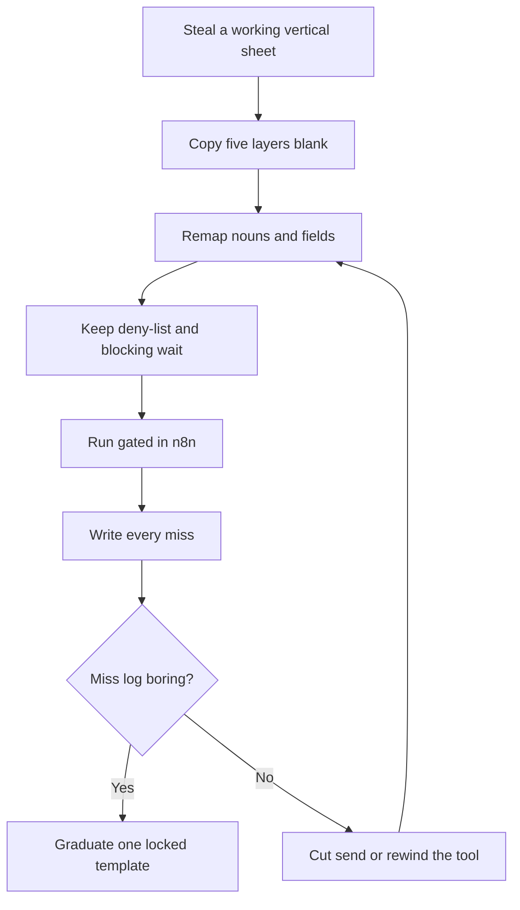

# Vertical AI Agent Playbooks: Steal What Already Works in Your Industry

**A vertical AI agent playbook is a five-layer template — intake, tools, approval, miss log, kill switch — stolen from a stack that already runs in one industry and remapped onto yours by changing nouns and fields, not by inventing a new architecture.** You do not start from a blank "AI employee." You photocopy the controls, then swap the labels.

I am **William Spurlock**, founder, AI Systems Architect, and Fractional AI CTO. I have built **600+ automations** with **500+ still live**, spent **20,000+ hours** inside agentic systems, and deleted **35,000+ hours** of client busywork across that book of work. I do not invent shop names, clinic names, studio names, or a dollar ROI for a business I have not timed.

This spoke owns one operating question: **What are vertical AI agent playbooks and how do I use one for my industry?** The August 26 parent, [an HVAC owner's AI agent stack](/blog/an-hvac-owner-s-ai-agent-stack-and-why-it-transfers-to-other-trades), owns the trades jobs. I am not rewriting that board. I am writing the sheet you fill after you steal it.

If you still need the send gate, read [human-in-the-loop: approve before your AI agent sends anything](/blog/human-in-the-loop-approve-before-your-ai-agent-sends-anything). If you still need the deny-list, read [which permissions your AI agent should never have by default](/blog/which-permissions-your-ai-agent-should-never-have-by-default). If you still need staging and a practiced cut, read [how to deploy an AI agent to production without breaking everything](/blog/how-to-deploy-an-ai-agent-to-production-without-breaking-everything). Then come back here and fill the five layers.

---

## What are vertical AI agent playbooks and how do I use one for my industry?

**A vertical AI agent playbook is the reusable control sheet for one job in one industry: what starts the agent, what it may touch, who approves, what a miss looks like, and how you shut it off.** You use one by stealing a working sheet from a vertical that already has the same job shape, then remapping your nouns onto those five layers. The model is a drafter. The sheet is the product.

That definition is narrower than the vendor pitch. A chatbot on your homepage is not a playbook. A "custom GPT" with your PDF dumped in is not a playbook. A vertical SaaS that says it "runs HVAC" or "runs agencies" is a product. A playbook is the paper you can hold when the product logo changes.

I keep four words separate so the sheet stays honest:

| Word | What it is | What it is not |
| --- | --- | --- |
| **Vertical** | An industry that already has repeating jobs, records, and blast radius | A vibe, a persona, or "we serve everyone" |
| **Playbook** | Five named layers you can fill on one page | A prompt library or a vendor feature list |
| **Steal** | Copy the layers from a stack that already runs | Clone their CRM, their trucks, or their price book |
| **Remap** | Swap nouns, fields, and the human who clicks | Rewrite the deny-list, skip the miss log, or invent a sixth philosophy |

The use sequence is short on purpose:

1. **Pick a source vertical** that already has the job you need — inbound that dies, a quote that sits, a status the customer already asked for.
2. **Copy the five layers** onto a blank sheet. Do not start in the model node.
3. **Remap nouns and fields.** "Missed call" becomes whatever channel your customer actually uses. "Open slot" becomes the next honest window you can keep.
4. **Keep the controls.** Approval still blocks send. Timeout still means no send. The deny-list does not get friendlier because your industry "is different."
5. **Run gated. Log misses. Expand or kill.** Hours back are a later scoreboard. A clean miss log is the first one.

n8n is the wiring I name because I can see the graph, attach an error workflow, and cut a credential without a speech. [n8n's docs](https://docs.n8n.io/) describe that mix of AI steps and process automation. The [n8n Production AI Playbook](https://blog.n8n.io/production-ai-playbook-introduction/) (2026) is explicit: the workflow controls what the model sees, which tools it can use, and what happens after it answers. That is the architecture a playbook encodes. The industry label is a sticker on the folder.

**Model Context Protocol (MCP)** is optional later. The [MCP spec dated 2026-07-28](https://modelcontextprotocol.io/specification/2026-07-28) is the current protocol revision for exposing tools to a model over JSON-RPC. I do not start a remap there. I start with the sheet, then n8n talking to the APIs you already pay for.

### What you steal versus what you invent

You steal the shape of a job that already has volume, rules, and a cheap first mode.

You invent almost nothing. If you find yourself designing a new agent philosophy, you left the playbook and started a product pitch.

| Steal this | Invent this only if you must |
| --- | --- |
| Event → read → draft → gate → send → log | A new job that has no analog in the source |
| Read-only credentials on day one | A write key because the demo looked confident |
| Named approver + timeout = no send | "We'll watch Slack after it sends" |
| Miss taxonomy + weekly rewind | A dashboard with no owner |
| One kill that stops side effects | A hope that someone will notice |

I will not write the agency sheet, the clinic sheet, or the studio sheet on this page. Those are other remaps. This page is the method you use on whichever vertical you actually run.

---

## Why steal a working vertical instead of inventing an AI agent stack?

**You steal a working vertical because a blank agent forces you to invent jobs, tools, and blast radius at the same time — and that is how shops attach write keys to a chatbot and call it operations.** A working vertical already paid the tuition: which job is high-volume, which field must exist, which send is reversible, and which credential stays off. You are buying that tuition. You are not buying their trucks.

The failure mode I keep seeing is the same across industries. An owner buys a chat widget, points it at the website, then grants it write access to the system of record because a vendor booked a fake appointment on a demo. That sequence is backwards in HVAC. It is backwards in every other vertical too. The playbook exists so you do not repeat the sequence with new nouns.

A working source vertical has to pass a steal test. If it fails, you do not have a playbook. You have a story.

| Steal-test question | Pass | Fail |
| --- | --- | --- |
| Does the source have a named job, not "AI for the business"? | Dispatch draft, missed inbound, quote follow-up | "An AI employee that runs the company" |
| Can you name the record the agent reads? | Job, estimate, ticket, order, booking | "The whole drive folder" |
| Is there a first mode that does not write? | Draft, flag, offer two already-open windows | Live reassignment on day one |
| Is the customer-facing send reversible or gated? | SMS/email behind approve | Price, diagnosis, refund, legal promise |
| Can you name the miss in one sentence? | Wrong slot, wrong tone, invented ETA | "It felt off" |

The August HVAC post is a legal source under that test. It already names five jobs, the systems they sit on, and what the agent may not do. I am citing it as the folder you steal from. I am not walking those five jobs again. If you need the trades map, go read [the HVAC owner stack](/blog/an-hvac-owner-s-ai-agent-stack-and-why-it-transfers-to-other-trades) and come back with one job circled.

### Why a generic ops agent is the wrong first steal

A generic operations agent that "analyzes the business" is useful later. It does not catch the inbound that dies after hours. It does not chase the quote that is already sitting on a kitchen table, in an inbox, or in a proposal tool. Vertical first. Briefing memo second.

The steal is also cheaper than a greenfield design. You do not spend a month arguing about agent philosophy. You spend a week filling five boxes:

- What event starts this?
- What may it read?
- Who clicks yes?
- What do we write down when it is wrong?
- How do we cut it in under a minute?

If you cannot fill those boxes, you are not ready for a model. You are ready for a whiteboard.

### What stealing is not

Stealing is not copying another industry's compliance posture. Life-safety, licensed advice, protected health information, and payment exceptions stay human even if the source vertical gated a friendlier send. The playbook can remap a follow-up text. It cannot remap a license.

Stealing is not cloning their software. ServiceTitan versus HubSpot versus a disciplined Airtable is a field problem, not a brand problem. If the record has the fields, the playbook can run. If the record is a whiteboard, you do not attach write credentials. You start with intake and a calendar.

Stealing is not a promise that their cycle time becomes yours. I will not write a payback period for a shop I have not seen. I will write the sheet that keeps you from attaching the wrong tool on Tuesday.

---

## How do you remap the five playbook layers onto your industry?

**You remap a playbook by filling five layers in order — intake, tools, approval, miss log, kill switch — and you only change nouns, field names, and the human who clicks.** The deny-list, the blocking wait, and the rule that timeout means no send do not get remapped. If a layer has no owner, the remap is not done.

Here is the whole method on one table. This is the sheet. Everything after it is how to fill each row without turning the page into a second vertical tour.

| Layer | What you steal | What you remap | What you never remap |
| --- | --- | --- | --- |
| **Intake** | A real event plus the fields that must exist before the agent fires | Trigger name, channel, field nouns | "Fire anyway and let the model guess" |
| **Tools** | Read versus write split, one job per workflow | System names, APIs, which status field is honest | Send-as, delete, pay, production write, open web on day one |
| **Approval** | Blocking wait in front of send | Who clicks, which channel the card uses | After-send Slack as "oversight" |
| **Miss log** | A written miss taxonomy and a weekly rewind | What a miss looks like in your nouns | "We'll remember the bad ones" |
| **Kill switch** | One control that stops side effects fast | Where the switch lives, who can flip it | Silent failure, or "pause the Slack channel" |



n8n's [human-in-the-loop for tools](https://docs.n8n.io/build/integrate-ai/ai-examples/human-in-the-loop-for-tools) page (current as of this writing) describes the pause I want on the send tool: the workflow holds, a human sees the tool and the parameters, approve runs it, deny does not. Their [15 best practices for deploying AI agents in production](https://blog.n8n.io/best-practices-for-deploying-ai-agents-in-production/) (n8n Blog, 2026) call out queue mode, human-in-the-loop, version control, and monitoring. I do not need you to run Kubernetes on day one. I need those five layers filled.

[NIST's AI Risk Management Framework](https://www.nist.gov/itl/ai-risk-management-framework) is the dated public language for human oversight and the ability to intervene. I am not turning this page into a compliance brief. I am saying the playbook is how a small team actually installs "govern" and "manage" on one job.

### Layer 1 — Intake

**Intake is the event that starts the agent and the fields that must already be true, or the run dies before a model sees it.** If the record is missing a phone, a status, or an honest next window, the agent does not draft. It pages a human or it stops.

You steal the idea of a trigger with a shared secret and a required payload. You remap the event name.

| Source shape | Your remap question | First-week answer I accept |
| --- | --- | --- |
| Something arrived and nobody caught it | What channel do customers already use? | The number or inbox they already have. Not a new "AI line." |
| A record is sitting with no next touch | Which record already holds the quote, ticket, or order? | The system you already pay for. Not a second CRM. |
| A status changed and the customer will call | Which field is the honest status? | One field. Not a paragraph the model invents. |
| A job closed clean and paid | What flags "real close"? | Paid + completed. Not a vibe score. |

Required fields I will not let you skip, whatever the nouns:

1. **Idempotency key** — so a double webhook does not double-text.
2. **Customer handle** — phone or email you are allowed to use, plus opt-out.
3. **Record id** — the job, ticket, quote, or order. Not a pasted thread.
4. **Allowed next action** — two windows, one link, or "callback." Not a blank prompt.
5. **Stop conditions** — already replied, already booked, already said no.

If intake is "paste the day into ChatGPT," you do not have a playbook. You have a chat.

### Layer 2 — Tools

**Tools are the credentials and actions the workflow may call. The model does not hold the business. The tool list does.** You steal the read-then-draft split. You remap the API names. You do not remap the default deny.

The deny-list I ship on day one lives in [which permissions your AI agent should never have by default](/blog/which-permissions-your-ai-agent-should-never-have-by-default). I will not retell that post. For a remapped playbook the short version is: no send-as, no delete, no payment, no production database write, no unrestricted web, no identity-admin. Classify the tool. Then refuse those six until a named human expands one path.

What I will attach on week one of a remap:

- Read-only lookup for the record and the next honest window
- A draft tool that writes to a queue, a Gmail draft, or a Slack card
- A logger that stores record id, draft hash, approver, and decision

What I will not attach because your industry "needs to move faster":

- A price or discount tool
- A diagnosis or licensed-advice tool
- A live board move
- A refund or capture tool
- A review kiosk that only asks happy people

MCP can sit in front of those tools later. It does not make a bad tool safer. A missing tool is the control. A "DENY" paragraph in the prompt is a preference.

### Layer 3 — Approval

**Approval is a blocking wait in front of send, spend, or a customer-facing promise.** The agent drafts. A named human clicks. Timeout means the send does not run. If the send node can fire without that click, you remapped a notification, not a gate.

That definition is the whole [human-in-the-loop approve-before-send](/blog/human-in-the-loop-approve-before-your-ai-agent-sends-anything) post. I am not rewriting the card spec. I am telling you what the playbook must name so the remap does not "temporarily" skip the wait.

Fill these four cells or stop:

| Cell | You must name |
| --- | --- |
| **Approver** | A person, not "the office" |
| **Channel** | Slack, email, or n8n's wait — one place, not three |
| **Card** | Recipient, channel, exact body, risk tier, source fields |
| **Timeout** | Duration + behavior. Silence is not consent. |

Week one and two: every customer-facing send waits. After a clean streak on a locked template, you may graduate that template only. You do not graduate "the agent." The HVAC parent and the HITL post both hold that line. The playbook copies it into your nouns.

### Layer 4 — Miss log

**A miss log is a written record of every time the agent was wrong in a way a customer or an operator could feel — wrong window, wrong tone, wrong record, invented fact.** No miss log, no expand. A Slack memory is not a log.

You steal the habit. You remap the miss names.

| Miss class | What you write down | What you do next |
| --- | --- | --- |
| **Honesty miss** | Offered a window, price, or status the source field did not have | Cut the send tool. Do not "tune the prompt" first. |
| **Target miss** | Wrong person, wrong record, wrong job | Fix intake. Check the idempotency key and the record id. |
| **Tone miss** | Legal, rude, or a promise you do not keep | Tighten the locked template. Keep the gate. |
| **Loop miss** | Still nudging after a no, a book, or a STOP | Honor the stop condition. That is intake, not poetry. |
| **Silence miss** | Webhook died and nobody knew | Error workflow pages a human. Silent failure is a kill-switch miss. |

I review the log on a clock — weekly is enough for one job — and I look for the same miss twice. Twice is a tool or an intake bug. It is not a model personality.

### Layer 5 — Kill switch

**A kill switch is one control that stops the agent from taking side effects, preferably in under 30 seconds, without redeploying the whole graph.** Soft "we'll keep an eye on it" is not a switch. [How to deploy an AI agent to production](/blog/how-to-deploy-an-ai-agent-to-production-without-breaking-everything) owns the production checklist. The playbook has to name where *your* cut lives.

Acceptable cuts I will ship:

- Disable the send credential or rotate it
- Flip an environment flag the workflow reads on every run
- Unpublish the production workflow and leave staging up
- Queue-pause so new events stack and nothing leaves

Unacceptable cuts:

- Asking the model to "please stop"
- Muting the Slack channel the receipts land in
- Deleting the prompt and hoping runs die
- Waiting until morning because the owner is on a job

Practice the cut in staging. Time it. If it takes longer than a minute, the remap is not finished.

---

## What does a filled playbook sheet look like after the remap?

**A filled playbook sheet is one job on one page: source job, your nouns, intake event, required fields, allowed tools, denied tools, named approver, miss definitions, and the kill.** If you need a second page, you are filling two jobs. Split them. Two workflows. Two sheets.

I am going to fill a generic inbound-that-dies sheet so you can see the method. I am not touring HVAC. I am not writing a clinic, agency, or studio sibling. The source row is "missed inbound in a working field-service vertical." Your row is whatever channel actually rings in your business.

| Sheet cell | Source (stolen) | After remap (yours) |
| --- | --- | --- |
| **Job name** | Missed inbound follow-up | The inbound that dies when nobody picks up |
| **Trigger** | Missed-call webhook with a shared secret | The event your phone, form, or inbox already emits |
| **Required fields** | Caller id, two open windows, service area, opt-out | Handle, two honest next steps, eligibility, STOP |
| **Read tools** | Calendar or job board, read-only | The system that already knows what is open |
| **Write tools on day one** | None on the board. Draft SMS only after gate | None on the system of record. Draft only. |
| **Denied tools** | Price, diagnosis, live dispatch write | Price, licensed advice, live assignment, refund |
| **Approver** | Dispatcher or owner on Slack | The human who already owns that inbox |
| **Timeout** | Wait expires → no send | Same. Silence is not consent. |
| **Miss** | Phantom slot, diagnosis in the text, double-send | Phantom promise, invented fact, double-touch |
| **Kill** | Disable SMS credential + error page-out | Disable the send credential + page the owner |

That is a completed remap. Notice what did not change: five layers, read-then-draft, blocking wait, deny-list, kill on the credential. Notice what did change: the event name and the nouns on the fields.

### A second sheet, still one job

Status chase is the other steal I see owners skip because it feels unglamorous. The source shape is "a delayed part or a delayed ticket, and the customer will call." Your nouns might be an order, a permit, a proof, or a booking hold. The sheet stays the same size.

| Sheet cell | Rule I will not let you break |
| --- | --- |
| **Intake** | Status must come from a field. If the field is empty, stop. |
| **Tools** | Read the status. Draft the update. Do not invent an ETA. |
| **Approval** | Customer-facing status waits until the field is boringly correct. |
| **Miss** | "You said Tuesday" when Tuesday was never in the field. |
| **Kill** | Cut send the first time an ETA is invented. That is not a prompt tweak. |

Quote follow-up is the third common steal: a price you already produced, sitting, with no next logged touch. The agent nudges and logs. It does not change the number. If you cannot point at the estimate, proposal, or invoice the human already made, you do not have a follow-up job. You have a pricing job. Pricing stays human.

### Shape of the runner in n8n (skeleton, not a live graph)

You do not paste this and go live. You use it as the graph the sheet is describing: trigger, required-field gate, read, draft, policy gate, wait, send, log. Model IDs are current as of September 2026. Swap the logo. Do not swap the gates.

```json
{
  "name": "vertical-playbook-runner",
  "nodes": [
    {
      "name": "Intake Webhook",
      "type": "n8n-nodes-base.webhook",
      "notes": "Shared secret. Require record id, handle, allowed next action. No write creds."
    },
    {
      "name": "Required Fields",
      "type": "n8n-nodes-base.if",
      "notes": "Die or page a human if id, handle, or next action is missing. Do not call the model."
    },
    {
      "name": "Read Source Of Truth",
      "type": "n8n-nodes-base.httpRequest",
      "notes": "READ-ONLY. Two honest windows or one honest status. Never a guessed ETA."
    },
    {
      "name": "Draft",
      "type": "@n8n/n8n-nodes-langchain.agent",
      "notes": "Locked prompt. Low temperature. Claude Sonnet 5 or GPT-5.5. No price tool. No diagnosis tool."
    },
    {
      "name": "Policy Gate",
      "type": "n8n-nodes-base.if",
      "notes": "Block if draft contains a dollar amount, a diagnosis, or a next step not in the read payload."
    },
    {
      "name": "Wait For Approve",
      "type": "n8n-nodes-base.wait",
      "notes": "Named human. Timeout = no send. After a clean streak, skip wait for this locked template only."
    },
    {
      "name": "Send",
      "type": "n8n-nodes-base.httpRequest",
      "notes": "Narrow send credential. Log message id + record id. Honor STOP."
    },
    {
      "name": "Miss Or Success Log",
      "type": "n8n-nodes-base.httpRequest",
      "notes": "Record id, draft hash, approver, decision, miss class. No full customer body in the log if you can avoid it."
    }
  ],
  "settings": {
    "timezone": "America/New_York",
    "errorWorkflow": "playbook-page-owner"
  }
}
```

Wire `errorWorkflow` to page a human. Silent failure is how a team decides "AI doesn't work" when the webhook expired.

### Models I point at while remapping

I route routine classification and short drafts to a workhorse and save the expensive model for ugly threads. The playbook does not change if the node logo changes.

| Job on the sheet | Model I use first | Dated source | Why |
| --- | --- | --- | --- |
| Classify intake, draft a locked template | **Claude Sonnet 5** | Anthropic, [Introducing Claude Sonnet 5](https://www.anthropic.com/news/claude-sonnet-5) (June 30, 2026) | Tool use and agent work at workhorse price |
| Ugly thread, conflicted record, "is this even the same job?" | **Claude Opus 4.8** | Anthropic, [Introducing Claude Opus 4.8](https://www.anthropic.com/news/claude-opus-4-8) (May 28, 2026) | Harder judgment, still behind a human publish |
| Alternate workhorse | **GPT-5.5** | OpenAI, [Introducing GPT-5.5](https://openai.com/index/introducing-gpt-5-5/) (April 23, 2026) | Flagship for tool-heavy professional work |
| Cheap classifier if you already sit on Google | **Gemini 3.5 Flash** | Only if the rest of the stack is already there | Speed. Not a reason to loosen the gate. |

I do not need you to pick a religion. I need one model ID in the node, a locked prompt, and a gate that blocks facts the source record did not emit.

---

## How do you know the remapped playbook is safe to run?

**The remapped playbook is safe to run when intake rejects incomplete records, the tool list cannot spend or delete, every customer-facing send waits on a named human, the miss log is shorter than last week, and you have flipped the kill in staging in under a minute.** Vendor adjectives are not a scoreboard. A clean week on one locked template is.

I measure operations. I do not invent a payback period.

| Signal | How to count it | Green after 14–30 days | Kill or rewind |
| --- | --- | --- | --- |
| **Intake honesty** | Runs that died on missing fields vs runs that guessed | Missing fields stop the run | Any draft built on an empty required field |
| **Time-to-first-touch** | Event timestamp → gated send | Minutes on the inbound job, not hours | Hours-long delays or silent drops |
| **Source fidelity** | Offered window/status vs source field at send time | Zero invented facts | Any fact not in the read payload |
| **Gate integrity** | Sends with an approve click vs sends that skipped wait | 100% gated on week one | Any send that left without a click |
| **Miss log** | Honesty / target / tone / loop / silence | Fewer this week than last | Same miss twice |
| **Kill drill** | Timed cut in staging | Under 60 seconds | "We think we know where the switch is" |

Hours saved belong on the board only if you timed the old process. "We used to spend Thursday afternoon chasing open quotes" is a valid before. A made-up monthly dollar save is not a number I will write for a generic owner.

### Expand versus kill

**Expand** when the miss log is dull and the approver says the drafts match what they would have sent. Expand means: graduate that locked template to a narrower auto-send, or fill a second sheet for a second job. It does not mean attach write keys because the first job had a good month.

**Kill** when the agent invents a price, a part, a window, a diagnosis, or a legal promise. That is a tool you should not have attached. Take the send credential off. Then fix intake or the tool list. Prompt poetry after an honesty miss is how teams talk themselves back into the same incident.

**Do not expand** into live writes on the system of record because the draft SMS had a clean streak. Those are different blast radii. The HVAC parent holds that line on dispatch. The playbook holds it on whatever your "live board" is called.

### Sequencing I actually use on a remap week

Day one is paper. Day two is staging. Day three is one gated job. That is the whole week if you are honest.

1. **Steal one job.** Circle it on the source vertical. One job. Not five.
2. **Fill the five layers** on a single page with your nouns. If a cell is empty, you are not wiring yet.
3. **Stand up the runner** in a staging n8n with fake credentials and synthetic records.
4. **Practice the kill.** Time it. Write the time on the sheet.
5. **Shadow.** Drafts only, real events if you must, no customer send.
6. **Gate live.** Named approver. Miss log open.
7. **Review the log.** Same miss twice → rewind. Dull log → consider graduating the template.

If Monday already breaks when one coordinator is out, you do not have an "AI opportunity" on that job yet. You have a single point of failure. Name the backup approver on the sheet before you attach a send credential.

If you want help filling the five layers against your actual board, phone, inbox, or job system, [book an AI automation strategy call](/contact). Bring last week's inbound that died, the name of the system that already holds the records, and one job you want stolen — not a wish for an AI employee. I will tell you which layer is empty and which credential stays off.

---

## Frequently Asked Questions

### What is a vertical AI agent playbook in one sentence?

**A vertical AI agent playbook is a one-page control sheet — intake, tools, approval, miss log, kill switch — stolen from a working industry stack and remapped onto yours.** The model drafts. The sheet decides what may start, what may be touched, who clicks, what a miss is, and how you cut send. If you cannot hold those five answers on one page, you do not have a playbook yet.

### Do I have to start from HVAC to use a vertical AI agent playbook?

**No. HVAC is one legal source vertical because the jobs are already named. Any working vertical with a steal-test pass is a legal source.** You start from HVAC only if you have the same job shape — missed inbound, sitting quote, status chase, review ask after a real close. If your source is another industry that already runs those controls, steal that sheet instead. I am not writing the clinic, agency, or studio remap here.

### Which of the five playbook layers do I fill first?

**Intake first. If the event and the required fields are fuzzy, every other layer will lie.** Tools second, because the deny-list is easier to keep empty than to unwind. Approval third. Miss log and kill switch before the first live send, not after the first complaint. A beautiful prompt with no intake contract is how you get confident drafts about records that do not exist.

### Can I skip the miss log if the first week looks clean?

**No. A clean week without a log is a week you cannot audit.** Write the empty rows. "No miss" is a valid Tuesday. "We would have remembered" is how the same honesty miss comes back on Friday. I will not expand a template I cannot rewind. The log is the rewind.

### What counts as a kill switch on a remapped playbook?

**A kill switch is a single control that stops side effects — disable the send credential, flip a flag the workflow reads, unpublish production, or pause the queue — in under a minute.** Muting Slack is not a kill. Asking the model to behave is not a kill. The production checklist sits in [deploy an AI agent without breaking everything](/blog/how-to-deploy-an-ai-agent-to-production-without-breaking-everything). The playbook has to name *your* cut and prove you timed it in staging.

### Do I copy the other industry's tools or only the jobs?

**Only the job shape and the five layers. You do not copy their CRM, their phone vendor, or their price book.** If your record has the fields, the playbook can run on the software you already pay for. If you copy their tool names into a stack you do not have, you will fake fields and the model will fill the gaps. Fake fields are how invented ETAs get into a customer text.

### When can a remapped playbook auto-send without approval?

**After a named human has approved a locked template enough times that the miss log is boring — then you unlock that path only, not the whole agent.** Week one is gated. A clean streak on one template can graduate that template. A good month on missed inbound does not unlock live writes on the board. Timeout still means no send for anything that is not on the graduated path.

### How is a playbook different from a vertical AI product I can buy?

**A product is a vendor graph you do not hold. A playbook is the five layers you can fill, audit, and kill even if the vendor logo changes.** Buy the product if it already exposes a blocking wait, a deny-list you can see, a miss you can export, and a credential you can cut. If the demo only shows a chat that "handles the industry," you still need this sheet. The sheet is how you refuse the write key.

### What model should draft a remapped playbook in September 2026?

**Start with Claude Sonnet 5 for classification and locked-template drafts; escalate ugly threads to Claude Opus 4.8; GPT-5.5 is a valid alternate workhorse.** Those names are current as of this post: Sonnet 5 on [June 30, 2026](https://www.anthropic.com/news/claude-sonnet-5), Opus 4.8 on [May 28, 2026](https://www.anthropic.com/news/claude-opus-4-8), GPT-5.5 on [April 23, 2026](https://openai.com/index/introducing-gpt-5-5/). The gate and the missing tools matter more than the logo on the node. Gemini 3.5 Flash is fine as a cheap classifier if the rest of your stack already sits on Google. It is not a reason to skip approval.
