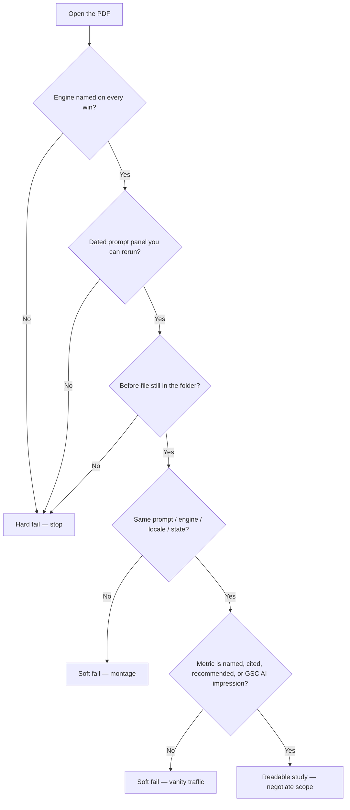

# What a Believable AI Visibility Case Study Looks Like (And What to Ignore)

**A credible AI visibility case study names the engine, dates the prompt panel, shows a before state you can still inspect, and explains the method that sits between the two screenshots. If any of those four pieces is missing, treat the percentage as a sales slide.** That is the whole test. Wednesday, September 9, 2026, I am still seeing decks that skip all four and lead with "+400% ChatGPT traffic."

I am William Spurlock — Founder, AI Systems Architect, and Fractional AI CTO. I have built 600+ automations with 500+ live, spent 20,000+ hours on agentic systems, and deleted 35,000+ hours of client busywork. SEO certified since 2021, now working AEO, AIO, and GEO the same way: receipts first. This post is not a teardown of a named client. I do not invent shop names or ROI slides. It is a reading guide for the PDF a vendor or agency just sent you.

This is also not a self-audit. If you want to check whether *your* business shows up when buyers ask ChatGPT, Perplexity, or Google AI Overviews, run the [15-minute AI visibility audit](/blog/is-your-business-invisible-to-ai-how-to-run-a-15-minute-ai-visibility-audit). That post owns your stopwatch. This one owns their evidence.

---

## How do I tell whether an AI visibility case study is credible?

**Score the deck on five gates: dated prompt panel, named engine, before/after method, kept baseline, and entity metrics instead of vanity traffic.** Pass all five and you have something you can argue with. Fail two and you are reading a brochure.

I use a pass / soft fail / hard fail card. Soft fail means the fact might be true and still useless for *your* category. Hard fail means you cannot verify the claim at all.

| Gate | Pass | Soft fail | Hard fail |
|---|---|---|---|
| Dated prompt panel | Exact buyer prompts, date, locale, logged-out or account state | Prompts exist, no date or locale | "We asked ChatGPT about plumbers" with no wording |
| Named engine | Product + surface: ChatGPT search, Perplexity, Google AI Overviews, Google AI Mode, Gemini, Claude, Microsoft Copilot | "AI search" or "the LLM" | Engine never named |
| Before / after method | Same prompt, same engine, same locale, dates on both captures | After screenshot only, method described in prose | Gallery of wins with no method |
| Kept baseline | Before capture still in the PDF or a linked folder | Before described, file "available on request" | Baseline vanished after the sale |
| Metric type | Named, cited, recommended, or a Search Console generative-AI impression | Referral sessions with the raw export attached | "+400% ChatGPT traffic" and no screenshot |

If the vendor cannot sit through that table without talking over it, the case study is a close. The rest of this post is how each gate fails in the wild.

The work you *do* after you reject a bad deck lives in the parent pillar: [how to get ChatGPT and Perplexity to recommend your business](/blog/how-to-get-chatgpt-and-perplexity-to-recommend-your-business). Do not let a vendor skip that sequence and sell you a percentage.

---

## What belongs in a dated prompt panel?

**A prompt panel is a frozen list of buyer questions, each with a date, engine, locale, and account state — not a vibe, not a recap.** If the case study does not let you rerun the same questions today, it is not a study. It is a story.

I want the panel printed in the PDF, not described. Minimum fields:

- **Exact prompt text.** Copy-pasteable. No paraphrases.
- **Date and time zone.** "Q2" is not a date. "May 3, 2026, America/New_York, 10:14 a.m." is a date.
- **Engine and surface.** ChatGPT search is not Perplexity. Google AI Overviews is not Google AI Mode. [Google Search Central](https://developers.google.com/search/docs/appearance/ai-features) says those two surfaces can use different models and techniques, so the links they show will vary. A deck that collapses them into "Google AI" is already cheating the comparison.
- **Locale and language.** "Best commercial HVAC in Detroit" and "best commercial HVAC" are different jobs.
- **Account state.** Logged out, logged in, Plus vs free, memory on or off. ChatGPT with memory is a different witness than a clean session.
- **Scoring rule.** Named / cited / recommended / absent. Pick one rubric and keep it.

Here is a panel shape I accept. The brand and city are **examples**, not a client:

```
Panel date: 2026-05-03, America/New_York
Engine: Perplexity (web)
Account: logged out
Locale: en-US, Detroit, MI

P1. Who should I hire for a 12-ton rooftop replacement on a 1998 strip plaza in Detroit?
P2. Recommend a commercial HVAC shop in Detroit that will show up for a same-week no-cool call.
P3. Alternatives to [Competitor A] for light-commercial HVAC in metro Detroit.
```

That panel is boring on purpose. Boring is auditable. "We tested dozens of AI queries about local services" is not.

If the vendor says the prompts are confidential because they are "proprietary GEO sauce," walk. Buyer questions are not a trade secret. Hiding them hides the only thing that makes the before/after mean anything.

---

## Why does the engine name have to be on the page?

**Because these products do not share a ranking, a citation habit, or a traffic pipe — so "we got them into AI" is not a result.** Name the product or the claim has no unit.

As of September 9, 2026, I treat these as different surfaces, not nicknames for one machine:

| Surface | What a real win looks like | What a fake win looks like |
|---|---|---|
| ChatGPT (search on) | Brand named on a frozen prompt; sources list visible if the answer used the web | A chat screenshot with memory on and the brand already in the thread |
| Perplexity | Brand page or a third-party page in the source list for that prompt | "Perplexity likes us" with no citation chip |
| Google AI Overviews | Supporting link on a named query; impression in Search Console's generative AI report | "We rank in AI Overviews" with no query and no URL |
| Google AI Mode | Same as above, labeled AI Mode, not mixed into Overviews | One screenshot labeled "Google AI" |
| Gemini | Named in a Gemini answer with the same prompt panel | A Bard-era slide left in the appendix |
| Claude | Named in a Claude answer with web tools on, prompt dated | "Claude mentioned us" from a project with uploaded PDFs |
| Microsoft Copilot | Named in Copilot with the Bing-grounded path shown | A Windows widget screenshot with no query |

OpenAI shipped ChatGPT search on [October 31, 2024](https://openai.com/index/introducing-chatgpt-search/) and, as of the February 5, 2025 update on that same page, said it is available to everyone in regions where ChatGPT is available. Answers can include links to web sources. That matters because a 2023 "ChatGPT named us" screenshot is a training-memory parlor trick, not search. A 2026 case study that never says whether search was on is incomplete.

Perplexity is built to attach sources. Official crawler docs state that [PerplexityBot](https://docs.perplexity.ai/docs/resources/perplexity-crawlers) exists to surface and link websites in Perplexity results, and that `Perplexity-User` may visit a page during a user question and include a link in the response. If a Perplexity "win" has no link, I do not count it.

Google is even blunter about eligibility. [Search Central](https://developers.google.com/search/docs/appearance/ai-features) says a page must be indexed and eligible to appear in Search with a snippet to show as a supporting link in AI Overviews or AI Mode, and that there are no extra technical requirements on top of that. A vendor who claims a secret schema, a magic `llms.txt`, or an "internal Google AI ranking API" is selling a product Google's own [generative-AI optimization guide](https://developers.google.com/search/docs/fundamentals/ai-optimization-guide) tells you to ignore: no special AI text files, no required chunking ritual, no inauthentic mention campaign as a substitute for useful pages.

If the engine is unnamed, I stop reading. There is nothing to rerun.

---

## What does a real before/after method look like?

**Same prompt, same engine, same locale, same account state, two dated captures, and a sentence about what changed on the web in between.** Anything looser is a montage.

I want the method in a table, not a paragraph of adjectives.

| Method field | Required evidence | Reject if |
|---|---|---|
| Before capture | Full-frame screenshot or exported answer, filename dated | Cropped logo, no prompt bar, no date |
| After capture | Same frame, same prompt, later date | Different prompt "because the first one was unfair" |
| Interval | Calendar dates, not "after our sprint" | Interval shorter than a crawl cycle with no other proof |
| Change log | Pages published, schema shipped, third-party mentions earned, GBP edits | "We did GEO" with no URL list |
| Controls | Competitor set frozen; no brand name stuffed into the after prompt | After prompt includes the client name and the before prompt does not |
| Reruns | Three passes on different days, or a note that it was a single pass | "We ran it until it worked" |

The change log is the part vendors skip. A before/after with no URL list claims magic. A before/after with "we published a 2,100-word service page, added `LocalBusiness` JSON-LD that matches the visible NAP, and earned one trade-pub mention on June 12" is a method. You can disagree with the method. You cannot pretend it was not written down.

Reruns matter because these products move. Google says AI Overviews often do not trigger, and that Overviews and AI Mode can return different links. One lucky Thursday is not a quarter. I will take a single honest pass over ten undisclosed retries. I will not take "we tested until ChatGPT agreed."

If you want the operating version of this — how to freeze a panel and score cite versus recommend on *your* property — that is [how to track when AI tools cite or recommend your business](/blog/how-to-track-when-ai-tools-cite-or-recommend-your-business). Steal the ritual. Do not accept a vendor who has never run it.

---

## What is a vanished baseline, and why should I walk away?

**A vanished baseline is a before-state that existed in the pitch and disappeared after the invoice — no file, no date, no prompt, no way to see what "zero" looked like.** Without that file, every after-screenshot is a poster.

I see three flavors:

1. **The oral baseline.** "They were invisible when we started." Invisible on which engine, which prompt, which week? If the answer is a shrug, the study is a shrug.
2. **The replaced baseline.** The PDF used to have a May 3 capture. The "final" case study swapped it for a prettier June photo of a competitor. Ask for the original file. If they cannot produce it, assume it did not help them.
3. **The moving zero.** Before was "not in the top 3." After is "mentioned once in a 900-word answer." Those are different scoreboards. Changing the rubric mid-study is how you manufacture a win.

Keep this rule: **if I cannot hold the before and the after in the same sitting, I do not believe the delta.** Screenshots live in the appendix or a shared folder with the filename `YYYY-MM-DD_engine_prompt-id.png`. Notion galleries that reshuffle on load are not an archive.

A vanished baseline is also a legal smell. The FTC's revised [Guides Concerning the Use of Endorsements and Testimonials in Advertising](https://www.federalregister.gov/documents/2023/07/26/2023-14795/guides-concerning-the-use-of-endorsements-and-testimonials-in-advertising) (effective July 26, 2023) say an advertiser must possess and rely on adequate substantiation for claims made through endorsements, the same way they would if they made the claim themselves. A typicality claim needs proof of what people generally get, or a clear disclosure of expected results. A GEO vendor who publishes "Client X got 400% more AI traffic" as a typical outcome, then cannot show the before file, is not just sloppy. They are making a performance claim without the file the Guides assume they kept.

I am not your lawyer. I am the person who has watched too many retainers start with a missing folder.

---

## Why is "+400% ChatGPT traffic" usually theater?

**Because a ChatGPT referral in analytics is a session source, not a citation, not a recommendation, and not proof the vendor changed how an engine talks about you.** Without the raw export, the date range, the filter, and a matching screenshot of the answer, the percentage is a sticker.

Here is what that number usually hides:

| What they printed | What it might actually be | What I need instead |
|---|---|---|
| "+400% ChatGPT traffic" | 4 sessions to 20 sessions | GA4 exploration with source/medium, date range, and a note on `chatgpt.com` vs `chat.openai.com` vs in-app browsers |
| "AI traffic up" | Branded Google clicks mixed into a custom channel | Separate brand search from generative-AI impressions |
| "ChatGPT conversions" | One form fill from a staff member testing the site | Conversion event, landing page, and a check that the tester IPs were excluded |
| "We own ChatGPT in this niche" | One prompt, one logged-in account, memory on | Named / cited / recommended on the frozen panel |

ChatGPT can send referral traffic. That is real. It is also tiny for most local and B2B sites, noisy (in-app browsers strip sources), and easy to spike by having the team click their own answers. A 4-to-20 jump is a 400% story and a rounding error. I have never hired anyone on a rounding error.

Google now gives you a cleaner number *for Google*. Search Console's [generative AI performance report](https://support.google.com/webmasters/answer/16984139) — rolled out to all websites worldwide as of August 31, 2026 — reports **impressions** when your links show in AI Overviews and AI Mode. It groups by page, country, device, and date. It is still an impression report, not a "ChatGPT traffic" report, and Google notes the report may not appear if the property has too few generative-AI impressions. A case study that quotes "+400% ChatGPT traffic" and never opens this report is measuring the wrong pipe for the Google half of the pitch.

I will accept a traffic claim when I see:

1. The GA4 (or equivalent) screenshot with the date range printed.
2. The channel filter spelled out.
3. A matching prompt-panel result from the same weeks.
4. A sentence that says whether staff, vendors, and the client's office were excluded.

No screenshot, no sale. That is the rule I use on Wednesday, and it will still be the rule next Wednesday.

---

## Which numbers are entity proof, and which are vanity?

**Entity proof is evidence a machine can attach to your organization: name, category, location, offer, and a third-party repeat of those facts. Vanity is a number that moves when nobody in the market would notice.** I pay for the first. I ignore the second.

| Entity proof (keep) | Vanity (ignore unless attached to proof) |
|---|---|
| Brand **named** on a frozen buyer prompt | Follower counts on the agency's GEO product |
| Brand **cited** (source chip, supporting link, footnote) | "Share of AI voice" with no prompt list |
| Brand **recommended** (shortlist, "call this shop") | Composite scores from a tool that will not show the underlying answers |
| Search Console generative-AI impressions on a specific URL | Blended "AI traffic" with brand search inside it |
| NAP / GBP / schema facts that match the visible page | Keyword-rank screenshots from 2024 used as 2026 GEO proof |
| A third-party page that repeats the same facts | Testimonial adjectives with no method |

Naming, citing, and recommending are different outcomes. A model can name you and still tell the buyer to call someone else. A model can cite your FAQ and never recommend you. A model can recommend you with no citation. If the case study uses those three words as synonyms, it cannot tell you what you bought.

Google's own guide is useful here as a filter, not as a religion. The [generative-AI optimization guide](https://developers.google.com/search/docs/fundamentals/ai-optimization-guide) says there is no special schema required for generative AI search, that `llms.txt` is not a Google Search requirement, and that chasing inauthentic mentions is a weak substitute for useful pages. So when a case study leads with "we shipped 40 AI schema types" or "we placed 200 AI mentions," I read that as vanity unless the prompt panel moved.

Entity proof is boring: the same legal name on the homepage, the GBP, the schema, and the one trade article the model can retrieve. Vanity is exciting: dashboards, percentages, heat maps of "AI authority." Excitement is how retainers get signed. Boredom is how buyers find you.

---

## What does a red-flag claim look like next to a green-flag claim?

**Red flags hide the unit, the date, or the before-state. Green flags make the claim rerunnable this week.** The rows below are **hypothetical examples** I use in reviews. They are not client results and not a promise of what your shop will see.

| Flag | Example claim (labeled hypothetical) | Why it fails or passes |
|---|---|---|
| Red | "We grew ChatGPT traffic 400% in 30 days." | No engine surface, no prompt, no screenshot, no baseline sessions |
| Red | "The client now ranks #1 in AI search." | AI search is not a single index; #1 is a Google habit |
| Red | "Claude and ChatGPT both love the brand." | No prompts, no dates, possible project-file contamination |
| Red | "Before: invisible. After: dominant." | Vanished baseline; "dominant" is not a score |
| Red | "Our proprietary GEO score went from 22 to 81." | Score is not inspectable; cannot be rerun outside their login |
| Red | "Featured in Google's AI Overview for the category." | Category is not a query; no URL, no date, no impression export |
| Green | "On 2026-05-03, Perplexity (logged out, en-US) did not cite the client on P1–P3. On 2026-07-12, P1 cited `example.com/rooftop` and P2 named the shop. Screenshots in appendix A." | Engine, dates, prompts, URLs, appendix |
| Green | "Search Console generative AI report (2026-06-01 to 2026-08-31): 140 impressions on `/commercial-hvac`, AI Overviews + AI Mode, US, mobile+desktop. Export attached." | Official report, dates, URL, no invented CTR |
| Green | "ChatGPT search, memory off, 2026-07-12, 10:14 a.m. ET: named on P2, not recommended. Three reruns that week, same result. Screenshots A12–A14." | Surface, state, outcome split, reruns |
| Green | "We published `/commercial-hvac` on 2026-05-20, shipped LocalBusiness JSON-LD matching GBP, and earned one supplier-page mention on 2026-06-04. Prompt panel moved after the mention, not after the schema alone." | Method + humility about what moved the needle |

Print that table. Hold it against the PDF. If the vendor's best slide looks like the red column, you are not being picky. You are refusing to buy a feeling.

Notice what I did not put in the green column: a named restaurant, a named HVAC shop, a dollar ROI. I can show you the *shape* of proof without minting a fake case study. Anyone who needs a fake shop name to make the method sound real does not have a method.

---

## What should I ask the vendor after I read the PDF?

**Ask for files, not slogans — the panel, the before folder, the engine log, and the change log.** A shop that did the work will be slightly annoyed and then send a zip. A shop that did not will start a story.

Use this list on the call. Read it out loud if you have to.

1. **Show me the prompt panel as a table.** Dates, engines, locales, account state.
2. **Open the before folder.** I want the original files, not a redesigned slide.
3. **Name the engine for every screenshot.** If two screenshots are "AI," we stop.
4. **Walk the change log by URL.** What shipped, what was earned, what was only talked about.
5. **Separate named / cited / recommended.** If they cannot, they do not know what they sold.
6. **Show Search Console or say you do not have it.** For Google claims, the [generative AI performance report](https://support.google.com/webmasters/answer/16984139) is the adult number. No access is fine. Inventing ChatGPT-shaped Google numbers is not.
7. **Show the traffic export or drop the traffic claim.** Percentage without a date range is a tattoo.
8. **Tell me what failed.** A study with no misses is a highlight reel.
9. **Tell me what will not transfer.** A national publisher win does not transfer to a three-truck shop. If they say everything transfers, they are selling a course.
10. **Put the substantiation in writing.** Remember the [FTC endorsement guides](https://www.federalregister.gov/documents/2023/07/26/2023-14795/guides-concerning-the-use-of-endorsements-and-testimonials-in-advertising): typicality and performance claims need files, not vibes.

If they answer eight of ten with files, you can negotiate scope. If they answer with a new metaphor, you already have your answer.

---

## How is this different from auditing my own site?

**Reading a vendor case study scores *their* proof. Auditing your site scores *your* presence.** Mix those jobs and you will either hire a storyteller or spend a Saturday rerunning someone else's marketing.

Stay in this lane:

| Job | Who it is for | What you open | What you do not do |
|---|---|---|---|
| Read the case study (this post) | You, staring at a sales PDF | Their screenshots, panel, exports | Rebuild your homepage mid-call |
| Self-check | You, staring at your own brand | ChatGPT, Perplexity, Google — timed | Treat a vendor slide as your baseline |
| Ongoing tracking | You, after you keep the account | Frozen panel + Search Console + referrals | Change the prompts every week so the graph looks alive |
| Build | You, after the evidence is real | Service pages, entity facts, third-party mentions | Buy another dashboard |

For the self-check, use the [15-minute AI visibility audit](/blog/is-your-business-invisible-to-ai-how-to-run-a-15-minute-ai-visibility-audit). I am not reprinting that stopwatch here. For the weekly ritual, use [how to track when AI tools cite or recommend your business](/blog/how-to-track-when-ai-tools-cite-or-recommend-your-business). For the build sequence, stay with the [ChatGPT and Perplexity recommendation pillar](/blog/how-to-get-chatgpt-and-perplexity-to-recommend-your-business).

If a vendor tries to replace those three with their case study, they are asking you to outsource judgment. Keep judgment. Hire help after the files survive this post.

---

## A decision path I actually use

**If the engine is unnamed or the baseline is gone, I stop. If both exist, I check the method. If the method exists, I check whether the metric is an entity outcome or a vanity spike.** That order saves the longest meetings.



I do not "feel good" about a deck that fails the first three nodes. Feeling good is how you buy a vanished baseline.

---

## Frequently Asked Questions

### How do I tell whether an AI visibility case study is credible?

**It is credible when you can rerun it: dated prompts, a named engine, a kept before-file, a written method, and a metric that is named, cited, recommended, or a Search Console generative-AI impression.** If two of those are missing, treat the percentage as decoration. Hypothetical "+400% ChatGPT traffic" slides with no screenshot fail this test on sight.

### Can a case study be real and still useless for my business?

**Yes. A true publisher win does not transfer to a three-truck trade shop, and a true ChatGPT-search naming does not mean Google AI Overviews will show your URL.** Ask what will not transfer. [Google Search Central](https://developers.google.com/search/docs/appearance/ai-features) already treats AI Overviews and AI Mode as different surfaces. Your category is a third axis they will not mention.

### Does a ChatGPT referral spike prove the vendor did GEO work?

**No. A referral spike proves someone clicked a ChatGPT answer hard enough for analytics to assign a source.** It does not prove the engine started recommending you on a buyer prompt. Demand the panel result from the same weeks, plus the GA4 export with staff traffic addressed.

### Should I trust a screenshot of ChatGPT naming a brand?

**Only if the prompt bar, date, account state, and memory setting are visible, and the same prompt is in the panel.** A cropped bubble from a logged-in thread with the brand already discussed is not a market test. I want the ugly full frame.

### What if the vendor says the client is under NDA?

**Then they can still show the method: prompts with the brand redacted, dates, engines, metric definitions, and a before/after structure.** An NDA is not a license to skip substantiation. If even the method is "confidential," you are buying a vibe.

### Is "we got them into AI Overviews" a complete claim?

**No. A complete Google claim names the query, the URL, the date, and — as of the August 31, 2026 worldwide rollout — preferably an impression row from Search Console's [generative AI performance report](https://support.google.com/webmasters/answer/16984139).** "The category" is not a query. Google also says AI Overviews often do not trigger, so one capture is a sample, not a ranking.

### How many prompt reruns make a before/after honest?

**I accept one honest pass if they say it was one pass. I prefer three days.** I reject "we ran it until it worked" and I reject a single after-shot with no before. Disclose the n. Hidden retries are how montages get made.

### Do I need the same engine the case study used?

**You need the engines *your* buyers use, which may not be the ones in the PDF.** A beautiful Perplexity citation study is worthless if your buyers live in ChatGPT search and Google AI Mode. Match the panel to the market, then decide whether their method can be ported.

---

## Send the deck. I will score the evidence.

If a vendor just mailed you a PDF that claims ChatGPT love, do not hire them on the percentage, and do not spend tonight rerunning a self-audit you already know how to run.

**Send me their file.** I will score the prompt panel, the named engine, the before folder, the method, and the metric — and I will tell you what is rerunnable and what is theater. That is an evidence review of *their* proof, not another fifteen minutes on your homepage.

Bring the PDF, the date they sent it, and the price they attached to the story. I will tell you whether the study can carry that price.

[Send the case study for an evidence review](/contact)

**William Spurlock** is the founder of a hybrid AI automation and premium web studio, an AI Systems Architect, and a Fractional AI CTO. 600+ automations built, 500+ live. 20,000+ hours on agentic systems. 35,000+ hours of client busywork removed. SEO certified since 2021. He writes from Northern Michigan and works in Eastern time.
