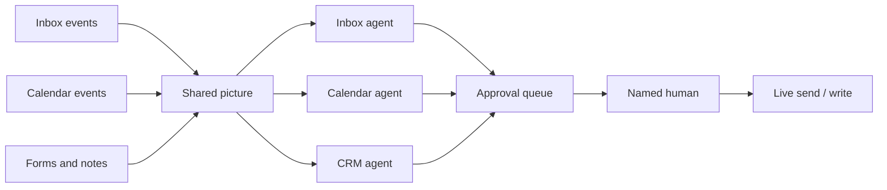

# What an Agentic OS Means for Running Your Business Day to Day

**An agentic OS is the standing operating layer that watches your inbox, calendar, and CRM every day, drafts the next move, and waits for a named human on anything that sends, spends, or promises — it is not a chatbot you babysit and not a search product that pings you about sneakers.** If you want the definition of agentic AI itself, start with [what agentic AI is and why businesses are excited about it in 2026](/blog/what-is-agentic-ai-and-why-are-businesses-excited-about-it-in-2026). This post is the day-to-day layer on top of that definition: how the business actually runs on a Tuesday.

I'm William Spurlock — founder, AI Systems Architect, and Fractional AI CTO. I've built 600+ automations with 500+ still live, spent 20,000+ hours on agentic systems, and helped clients delete 35,000+ hours of busywork. I do not run my week as a pile of one-off chats. I run it as a small set of standing agents with jobs, a shared picture of the business, and an approval queue.

The change is boring on purpose. Overnight mail is already ranked. The double-book is already flagged. The three CRM records that would have sat in "I'll enter it later" are already drafted. I spend the first half hour deciding, not digging.

That is the OS. Not a platform ranking. Not "best agent tools 2026." The operating system is the jobs, the shared picture, and the rules for when a human has to touch it.

---

## What is an agentic OS and how does it change day-to-day business operations?

**An agentic OS is a small set of standing agents that share one operating picture — inbox, calendar, CRM, and an approval log — and run every workday without you opening a chat to start them.** Day to day, that means triage, scheduling conflicts, record hygiene, and draft follow-ups happen before you sit down. You still own sends, spend, and promises.

I use "OS" on purpose. An operating system is not a demo. It boots whether you remembered to prompt it. A chatbot waits. A one-off automation fires once and forgets context. A standing agent has a job description, a schedule, a tool list, and a place to write what it did.

The four pieces I actually install:

| OS piece | What it is | What it is not |
|----------|------------|----------------|
| Standing agents | Named jobs that run on a clock or on an event (new mail, new booking, new form) | A chat tab you open when you feel behind |
| Shared picture | One source of truth for contacts, commitments, and open loops | Five tools with five "latest" versions of the same customer |
| Approval layer | A human gate before send, spend, or a customer-facing promise | Hope plus a Slack dump |
| Audit log | Who drafted, who approved, what changed | A model that "probably did the right thing" |

If those four are missing, you do not have an OS. You have AI sprinkled on the same chaos.

The day-to-day change is a shift in *when* you work. Knowledge workers still burn a huge slice of the week on mail and coordination. McKinsey's [2012 Social Economy report](https://www.mckinsey.com/industries/technology-media-and-telecommunications/our-insights/the-social-economy) put interaction workers at about **28% of the week on email** — old, still the benchmark nobody replaced with a cleaner number. Asana's [Anatomy of Work Index (March 8, 2023)](https://investors.asana.com/news-releases/news-release-details/asana-anatomy-work-global-index-2023-smart-collaboration-and) put **"work about work" at 58% of the day** (status chasing, app switching, talking about the work). An agentic OS does not delete that tax. It moves the tax onto machines that draft, and leaves you the decisions.

Microsoft's field experiment — NBER working paper [w33795, dated May 2025](https://www.nber.org/papers/w33795) — randomly assigned 7,137 knowledge workers across 66 firms to a generative AI tool inside the apps they already used. In the second half of the six-month run, the treated workers who actually used the tool spent **two fewer hours per week on email**. That is a copilot inside Outlook, not an OS. It is still the best dated evidence I have that standing assistance on the inbox returns real hours. An OS is that idea applied to inbox *plus* calendar *plus* CRM, with a human still on the send button.

What changes on a normal day if the OS is in:

1. **Morning starts with a brief, not a hunt.** You open a ranked inbox and a conflict list, not 40 unmarked threads.
2. **CRM stops being a guilt project.** Records get drafted when the event happens, not on Friday at 4:50.
3. **Approvals become the job.** You are not typing the first draft. You are accepting, editing, or killing it.
4. **Exceptions get a name.** Anything the agent cannot classify goes to you with the reason, not into a silent miss.

If you are still fuzzy on agent vs automation, I already split that in [AI agents vs AI automation](/blog/ai-agents-vs-ai-automation-what-s-the-difference-and-which-do-you-need). The OS uses both: fixed rails for "always do Y when X," agents for "look at this mess and draft the right next step."

---

## How is an agentic OS different from a chatbot, a search agent, or a one-off automation?

**A chatbot answers when you type; a search agent watches the public web; a one-off automation fires a fixed path; an agentic OS is the private, always-on layer that runs *your* tools and waits for *your* approval.** Mix those four up and you will buy the wrong thing and blame the model.

Here is the split I use with owners who already have ChatGPT open and think they are "doing agents":

| Surface | Who starts it | What it can see | What it can change | When I use it |
|---------|---------------|-----------------|--------------------|---------------|
| Chatbot (ChatGPT, Claude.ai, Gemini chat) | You, every time | Whatever you paste | Nothing unless you copy-paste | Thinking, one-off drafts, research |
| Google AI Mode information agent | You set a watch once | The public web + Google's live data | Notifications and links — not your CRM | Competitive watch, vendor news, listing alerts |
| One-off / fixed automation | An event you predefined | The fields you mapped | Exactly the write you designed | Invoices, tags, "when form submitted, create row" |
| Agentic OS standing agent | A clock or a business event | Your inbox, calendar, CRM, via scoped tokens | Drafts by default; writes only after approve | Daily ops: triage, scheduling, record hygiene |

Google's information agents are a **search surface**, not my product and not your operating system. At I/O 2026 on [May 19, 2026](https://blog.google/products-and-platforms/products/search/search-io-2026/), Google said it is starting Search agents with information agents that run in the background, scan the web, and send a synthesized update. [9to5Google reported on June 12, 2026](https://9to5google.com/2026/06/12/google-information-agents/) that those agents started rolling out in AI Mode for AI Ultra subscribers. Fine for "keep me updated when a competitor ships." Useless as the thing that files your invoices or books your install window. Do not confuse a watch on the public web with write access to HubSpot.

A chatbot fails the OS test for one reason: **you are still the runtime.** If you get sick, the chat does not triage overnight mail. If you forget to paste the thread, the model invents a polite summary of nothing.

A fixed automation fails the OS test for a different reason: **it cannot choose.** "New form → create CRM row" is correct until the form is a rant, a spam lead, or a change-order that should have gone to a human. That path belongs on rails. The messy remainder belongs to an agent that drafts and escalates.

The OS sits above both. I still want boring automations. I still use a chat window when I am thinking. I still might set a Google information agent on a public topic. None of those replace the standing jobs that keep the studio's inbox, calendar, and CRM honest while I am in a build.

If you want the business-owner definition of an agent itself, read [what an AI agent means](/blog/what-is-an-ai-agent-a-business-owner-s-guide-to-autonomous-ai). Come back here for the layer that makes those agents a daily habit instead of a demo.

---

## What does a Tuesday look like when the OS is actually running?

**A working Tuesday starts with a brief you did not assemble: ranked inbox, calendar conflicts, CRM drafts, and a short approval queue — then you decide for 30–45 minutes and the agents execute what you approved.** If Tuesday still starts with "let me just check email real quick," you do not have an OS yet. You have a chat habit.

I run a solo studio. The pattern below is how *I* structure the day, and the same skeleton is what I install for owners who still live in inbox and calendar. No invented client names. No fake ROIs.

| Clock (ET) | What the OS already did | What I do | What I do **not** do |
|------------|-------------------------|-----------|----------------------|
| 6:30–7:00 | Inbox agent labeled overnight mail: clients, money, time-sensitive, FYI, junk. Calendar agent flagged any overlap, missing prep, or a meeting with no agenda. | Scan the brief. Kill obvious junk. Star the three threads that actually move money or a deadline. | Open every message in arrival order. |
| 7:00–7:45 | CRM agent drafted records from last night's forms and call notes. Approval queue holds anything that would send or write live. | Accept / edit / reject drafts. Approve only the writes I would have made myself. | Let the agent email a client "to save time." |
| 7:45–8:00 | Morning brief lands in Slack or a note: open loops, invoices aging, meetings that still lack a human owner. | Pick the one ops fire for the morning. Park the rest. | Rebuild the same list from memory. |
| Work blocks | Agents keep watching new mail and new bookings. They draft; they do not send. | Deep work. I check the queue on a timer, not on every ping. | Context-switch into the inbox every 11 minutes. |
| 4:00–4:20 | End-of-day pack: what got approved, what is still waiting, what the agent could not classify. | Clear the leftover queue or explicitly roll it to tomorrow. | Leave 27 drafts rotting with no owner. |
| After hours | Inbox agent keeps labeling. Nothing customer-facing goes out. | Phone down unless the brief tags a true emergency rule I wrote. | Give the agent "just answer them, I trust you." |

That table is the product. Not a dashboard wallpaper. If a vendor cannot show you this loop — brief, decide, approve, log — they are selling a chat window with a calendar plugin.

What I watch for on a real Tuesday:

- **The brief is shorter than the inbox.** If the morning note is just a dump of every subject line, the agent is not triaging. It is forwarding.
- **The approval queue is countable.** Five to fifteen items is a morning. Fifty items means you skipped scoping and the OS is now a second job.
- **Unclassified has a bucket.** "I don't know" is a valid agent output. Silence is not.
- **Sends have a name.** Every outbound has an approver. If the log says "system," you already lost.

The NBER Copilot study is useful here and easy to over-read. Two hours back from email is real. It is also *individual assistance inside one app*. An OS is the same instinct across the three systems that actually run a small business day: mail, time, and records. If only mail is assisted and calendar plus CRM stay manual, Tuesday still breaks at 10:00 when the meeting you forgot had no brief and the lead from yesterday has no owner.

For the first automation I want most owners to build *before* they romanticize agents, I already wrote [the first AI automation every small business should build](/blog/the-first-ai-automation-every-small-business-should-build). Rails first. Standing agents second. OS is both, on a clock.

## Which standing agents should own inbox, calendar, and CRM first?

**Start with three standing agents — inbox, calendar, CRM — because those three systems are where a normal business day actually lives, and because they produce drafts you can reject without wrecking money.** Do not start with a "strategy agent." Do not start with a payer. Do not start with a customer-facing closer.

I treat the first trio as the boot sequence. Everything else is an add-on after the brief is trustworthy.

| Standing agent | Job | Reads | Drafts | Never (day one) |
|----------------|-----|-------|--------|-----------------|
| Inbox | Label, rank, extract action, draft a reply | Mail + the CRM record for that sender if one exists | Reply, forward-to-human, "no action" | Send, unsubscribe-all, delete archives |
| Calendar | Conflict check, prep gap, agenda stub, travel/buffer | Calendar + inbox threads tied to the event | Agenda, reschedule options, "this meeting has no owner" | Accept/decline on your behalf, move other people's holds |
| CRM | Create or update the record when a real event happened | Forms, call notes, closed-won mail, booking confirmations | New record, field fills, next-step note | Mass overwrite, merge duplicates without review, auto-sequence |

Why this order, and not "connect everything":

1. **Inbox is the firehose.** If you do not rank it, the other two agents drown in noise. The NBER May 2025 experiment is inbox-shaped for a reason: that is where hours hide.
2. **Calendar is the scarce resource.** Time is the thing you cannot refund. A double-book or a naked meeting (no agenda, no owner) costs more than a messy label.
3. **CRM is the memory.** Without it, inbox and calendar agents hallucinate who the person is. With it, they stop asking you to re-explain the same account every morning.

What I do **not** stand up in week one:

- A "relationship" agent that writes warm outbound.
- A collections agent that emails invoices past due.
- A refund agent that credits cards.
- A hiring agent that emails candidates.
- A social agent that posts as you.

Those can exist later. They are not the OS. They are products you bolt on once the OS already produces a brief you trust.

If a standing agent later drafts a public-page FAQ or a brand answer you will publish, that copy has to be citation-ready — I already wrote [what to keep, drop, and add for AI visibility in 2026](/blog/ai-visibility-vs-traditional-seo-what-to-keep-drop-and-add-in-2026). The OS can draft it. Send and publish stay locked.

Model routing on my own stack, as of September 5, 2026: high-volume labeling and field extraction go through [Claude Sonnet 5](https://www.anthropic.com/news/claude-sonnet-5) (shipped June 30, 2026 — Anthropic's workhorse for tool use). Messy judgment — "is this a change-order or a complaint?" — goes through Claude Opus 5. Google's Gemini 3.8 Flash is the current Flash I treat as a search surface, not as the brain of my CRM agent — 3.7 Flash stays on cheap search loops. I do not pick a model because a launch video was loud. I pick it because shadow-mode agreement on *my* mail is high.

If you want a first agent with fewer moving parts than this trio, start with [how to build your first AI agent](/blog/how-to-build-your-first-ai-agent-a-no-nonsense-setup-guide) and keep it read-only. The OS is what you get when that first agent has siblings that share a picture.

A standing-agent prompt I actually reuse for inbox (strip the brand voice and keep the rules):

```
You are the inbox standing agent for this business. Run on a schedule.

Inputs: new unread threads since last run; CRM match if the sender email exists.
Output JSON only:
- thread_id
- label: client | money | time-sensitive | fyi | junk | unknown
- rank: 1-5 (1 = I must see this before 8am)
- draft_reply: empty unless label is client or money
- needs_human: true if unknown, legal, refund, or any promise
- reason: one sentence

Never send. Never invent a CRM record. If the sender is unknown, label unknown.
```

That is a job description, not a vibe. If your "agent" cannot emit that shape, it is still a chatbot.

---

## Where do approvals sit so nothing sends or spends without you?

**Approvals sit in a named queue between "draft" and "the world" — one human, one action, one log line — and they stay there until a task has a boring miss rate.** If the agent can reach send, spend, or a customer promise without that queue, you do not have an OS. You have an intern with admin keys.

I am blunt about this because owners skip it. They see a good draft, grant send, and then spend a weekend apologizing. The August ops post I wrote already covers read-only-first for analysis agents. Same rule here, applied to the daily loop.

The approval map I install:

| Action class | Example | Default | Promote only after |
|--------------|---------|---------|-------------------|
| Internal draft | Slack status note, CRM note, agenda stub | Auto-write to a *draft* surface | 2 weeks of "I would have written that" |
| Customer-facing send | Reply, quote, apology | Human approve | Clean streak on that *template*, not "the agent in general" |
| Spend | Refund, PO, ad budget, contractor payout | Human approve, always | I almost never promote this to autonomy |
| Record merge / delete | Duplicate CRM, kill a contact | Human approve | Never fully autonomous on my builds |
| Calendar mutate | Accept, decline, move | Human approve | Maybe auto-decline obvious spam holds later |

Who is "the human"? Write the name. "The team" is how things send at 11pm on a Saturday. On my studio, I am the human. On a shop, it is usually the owner or the ops lead — one role, not a group DM.

What the queue must show, or I will not let the agent near a live send:

- The original artifact (thread, event, form).
- The proposed action in plain language.
- The fields that would change.
- Why the agent thinks this is safe.
- One-click: approve, edit, reject, escalate.

A reject is a gift. It is training data. If you only approve, you never learn where the agent is drunk.

Kill switch, non-negotiable: a single toggle that stops *sends* without stopping *drafts*. When something looks wrong, you want the firehose of drafts to keep so you can see the failure. You want the outbound pipe closed. I have used that toggle more than I have used any "autonomy" setting.

If you are taking an agent from laptop demo to something that can touch production systems, read [how to deploy an AI agent without breaking everything](/blog/how-to-deploy-an-ai-agent-to-production-without-breaking-everything). The OS version of that advice is simpler: **draft is on, send is off, until the miss log is boring.**

---

## How do the agents share one operating picture instead of five disconnected chats?

**They share one picture when inbox, calendar, and CRM resolve to the same person, the same commitment, and the same open loop — usually through scoped APIs and MCP, not through you pasting screenshots into three chats.** If each agent only sees its own app, you built three chatbots with a schedule. That is not an OS.

The failure mode I see constantly: an inbox agent that does not know the sender is a current client, a calendar agent that does not know the call was a sales follow-up, a CRM agent that creates a second contact because the email on the form does not match the email on the last invoice. You then spend the hours you "saved" reconciling the mess.

The picture I want, in one sentence: **who is this, what did we promise, what is next, and who owns the next human action.**



How I wire that without turning this post into a platform bake-off:

- **One identity key.** Email address first. Phone second. I do not let the CRM agent invent a new contact when the domain already exists unless a human says so.
- **One commitment object.** A meeting, a quote, an install window, an invoice. Calendar and CRM both point at it.
- **Scoped tokens.** The inbox agent can read mail and read CRM. It cannot wipe the pipeline. The CRM agent can draft records. It cannot export the whole base to a random webhook.
- **MCP when the model needs to choose a tool.** Anthropic open-sourced the [Model Context Protocol on November 25, 2024](https://www.anthropic.com/research/model-context-protocol). I use it so a standing agent can call "lookup contact" and "draft CRM note" as tools, not as a pile of custom glue per model. The longer explainer is [MCP explained](/blog/model-context-protocol-mcp-explained-why-every-ai-agent-will-run-on-this). If you want the no-developer version of standing up a server, use [your first MCP server](/blog/your-first-mcp-server-without-a-developer-what-it-takes-and-what-it-does).

I also use n8n as the clock and the rails: "every 15 minutes, pull new mail, run the inbox job, write drafts to the queue." That is plumbing. It is not the OS. The OS is the jobs and the picture. If you swap the plumber later, the jobs should still make sense on a whiteboard.

A cheap test that you do **not** have a shared picture yet:

| Symptom | What is actually broken |
|---------|-------------------------|
| Agent asks you who a regular client is | CRM is not in the context window |
| Two records for one human | Identity key is fuzzy |
| Agenda stub ignores the last email | Inbox and calendar do not share the thread |
| Morning brief contradicts the CRM stage | No source-of-truth rule |
| You re-paste the same facts into chat | You are still the integration layer |

If that last row is you, you do not need a bigger model. You need the picture.

For the one-person version of this stack — same OS, fewer humans — I already wrote [running a one-person business with AI](/blog/running-a-one-person-business-with-ai-the-stack-that-replaces-a-part-time-hire). This post is the operating layer that stack sits on.

## What stays human every single day?

**You stay human on anything that spends money, binds the company, or changes how a customer feels about you — plus the 30–45 minutes where you actually decide.** The OS is allowed to make that window smaller. It is not allowed to delete it.

Owners ask me if the point is "I never touch email." No. The point is you touch email *as a judge*, not as a clerk. If you disappear from that role, the OS becomes an unsupervised intern with your letterhead.

The daily human list I will not automate away:

| Must stay human | Why | What the agent may do |
|-----------------|-----|------------------------|
| Pricing, discounts, "we can do that" | You own margin and reputation | Draft options with the last quote attached |
| Refunds, credits, chargebacks | Money plus policy plus exception | Recommend against a written policy |
| Legal, HR, medical, anything you'd call a lawyer about | Liability | Flag and stop |
| New relationship first reply (sometimes) | Tone sets the account | Draft; you send the first one |
| Hiring yes/no | You live with the person | Score a rubric; you decide |
| Strategy: what we stop doing | The OS cannot want things | Surface the time sink; you cut it |

The human job on a healthy OS day is four verbs:

1. **Accept** the drafts that match how you would have written them.
2. **Edit** the ones that are directionally right and off in tone or fact.
3. **Reject** the ones that would have created a mess, and say why in one line.
4. **Escalate** the unknown bucket before it becomes a silent miss.

That is also how I keep taste in the studio. I still write the first client-facing note on a new relationship. I still take the call when someone is angry. I still decide what we will not build this month. The agents do not get a vote on those.

If your plan is "fire the coordinator and let the OS run," you will recreate the same chaos with fewer people who can fix it. A standing agent replaces repetitive hours. It does not replace ownership. I said the same thing about ops agents in [AI agents for operations](/blog/ai-agents-for-operations-replacing-the-repetitive-tasks-that-drain-your-team); the OS does not change that math.

Customer-facing work has its own split — what to automate, what to keep human — in [AI customer service automation](/blog/ai-customer-service-automation-what-to-automate-what-to-keep-human). Use that when the inbox agent starts touching support tickets. Until then, keep the daily human list short and written on a wall.

---

## How do you measure whether the OS is returning hours this month?

**Measure hours returned on the three jobs, minutes you spend in the approval queue, miss count, and time-to-a-decision-ready brief — not tokens, not "tasks completed," not which model logo sat in Slack.** If those four do not move in 30 days, you do not have an OS. You have a hobby.

I am allergic to vanity metrics here. Completing a wrong brief faster is worse than a slow Monday. A model that labeled 400 threads "FYI" when 40 were money is not productive. It is confident.

The scoreboard I keep:

| Metric | How I count it | Healthy first-month signal |
|--------|----------------|----------------------------|
| Hours returned | Time you used to spend assembling inbox + calendar + CRM before 9am, minus time in the queue | Down, even if only 3–5 hours/week |
| Queue minutes | Timer on the morning approval pass | Under 45 minutes for a solo shop |
| Miss count | Wrong label, bad draft, missed conflict, invented contact | Trend down; every miss has a reason code |
| Brief ready-by | Clock time the morning pack is usable | Before you would have finished "just checking email" |
| Silent failures | Actions that hit the world with no log | Must stay zero |

The NBER May 2025 paper is the dated inbound for "email hours can actually fall." Two hours a week from a copilot inside one app is the floor I cite, not the promise I sell. An OS that also drafts CRM and calendar should return more than that *if* the queue stays short. If the queue is an hour and a half of rework, you are paying the tax twice.

How I run the first 30 days:

- **Week 1:** Read-only / draft-only. Log agreement: "would I have done this?" Yes/no.
- **Week 2:** Same, plus you start timing the morning pass. If it is longer than your old inbox ritual, the labels are wrong.
- **Week 3:** Promote *internal* writes that already look boring (CRM notes to a draft field, Slack status note).
- **Week 4:** Still no unsupervised customer send. Review the miss log like you would a new hire's error list.

If you want the pre-build ROI math — hours × loaded cost, before anyone writes a workflow — use [how to calculate the ROI of AI automation](/blog/how-to-calculate-the-roi-of-ai-automation-before-you-build-anything). The OS version is the same spreadsheet with three rows: inbox, calendar, CRM.

What I ignore on purpose:

- Token spend as a success metric (it is a cost control, not an outcome).
- "The agent completed 212 tasks" with no quality score.
- Employee happiness surveys as the only number (nice; pay the hours bill first).
- Which vendor won a launch-week benchmark.

---

## What breaks first when you skip the OS layer and just buy more tools?

**What breaks first is the picture: five new chat products, five new "assistants," and the same owner still pasting context between them — then a premature send that you cannot unsend.** Tool sprawl is not an operating system. It is a tab problem with a credit card.

I watch the same sequence on builds that skip the OS:

1. **Someone buys a chatbot seat** and calls it transformation.
2. **Someone connects a calendar plugin** that suggests times and knows nothing about the CRM stage.
3. **Someone turns on a CRM "AI field fill"** that overwrites good data with a guess from an old email.
4. **Someone grants send** because the draft looked sharp once.
5. **The first bad outbound** teaches the whole company that AI is unsafe, so they go back to the spreadsheet and now they have *two* messes.

Google information agents make this worse if you treat Search as ops. A watch on the public web is useful. It will not file your change-order. It will not see the private Slack thread where you already promised Friday. If you let a search agent set your morning agenda, you will optimize for the open web and starve the actual business.

The break list I walk owners through before they add a fourth tool:

| Skip | What breaks first | Tell |
|------|-------------------|------|
| Shared identity | Duplicate contacts, wrong "who" | Two records, one human |
| Approval queue | Premature send / spend | "It just went out" |
| Source of truth | Brief contradicts CRM | You argue about which number is real |
| Kill switch | Incident with no off button | Everyone DMs the contractor |
| Standing jobs | Demo energy, no Tuesday | You only run it when you remember |
| Scoped tokens | One leaked key becomes the whole company | Admin on everything |

The fix is not "buy the platform that claims to be an OS." The fix is write the three jobs, the picture, and the queue on a whiteboard, then connect the least number of tools that can support that. I will use n8n, MCP, and whatever CRM you already pay for. I will not rank n8n against every other builder in this post. That is a different article and a different question.

If you want automation in plain English before you touch agents, start with [what AI automation actually is](/blog/what-is-ai-automation-a-plain-english-guide-for-business-owners). If you want the ops-task ranking (what to hand an agent first vs never), stay with the [operations agents post](/blog/ai-agents-for-operations-replacing-the-repetitive-tasks-that-drain-your-team). This post owns the daily layer those two sit under.

---

## How do I stand up an agentic OS this week without boiling the ocean?

**This week you write the three jobs, connect read-only inbox + calendar + CRM, ship a morning brief and an approval queue with send locked off, and you time the queue for five workdays.** That is an OS in skeleton form. Everything else is expansion.

I do not let a first week include "autonomous outbound" or "the agent runs the company." If a vendor needs write keys on day one, that is a sales motion.

The five-day build I actually run:

| Day | Done when | Exit test |
|-----|-----------|-----------|
| 1 | Jobs on one page: inbox / calendar / CRM. Named approver. Kill switch described. | You can read the page out loud in three minutes |
| 2 | Read-only tokens. Identity key chosen (email). Source-of-truth rule written ("CRM wins on stage; calendar wins on time"). | A lookup returns the same contact from mail and CRM |
| 3 | Inbox agent drafts labels + ranks. Calendar agent flags conflicts. Nothing sends. | Morning brief exists, even if ugly |
| 4 | CRM agent drafts records into a holding view. Approval queue has approve / edit / reject. | You process yesterday's drafts in one sitting |
| 5 | You time the queue. You log five misses or "would I have done this?" scores. Send still locked. | You know if week two is worth doing |

A week-one prompt for the calendar agent (again: rules, not vibes):

```
You are the calendar standing agent. Run every morning at 6:15 America/New_York.

Inputs: events in the next 72 hours; related inbox threads if the title or attendees match.
Output:
- conflicts (overlap or missing buffer)
- naked meetings (no agenda and no owner)
- prep gaps (external meeting with no attached brief)
- suggested agenda stub (draft only)

Never accept, decline, or move an event.
```

If day 5 fails — brief is a dump, queue is longer than your old ritual, identity is a mess — you do not add a fourth agent. You fix the picture. I have killed week-two scope more often than I have expanded it. That is the job.

After a clean week, *then* you add one promotion: internal CRM notes, or auto-label junk, or a Slack status note that you no longer write by hand. Still no unsupervised customer send.

If you want help turning that five-day skeleton into a build with a kill switch and a scoreboard, that is Fractional AI CTO work: standing agents, send locked, a named approver. If you already know the three jobs and need the team wired with MCP and an approval queue, that is an autonomous agent-team build. Either way, the OS is the layer. The chat window is not.

---

## Frequently Asked Questions

### Is an agentic OS a product I can buy off the shelf?

**No — an agentic OS is the jobs, the shared picture, and the approval rules you run every day, wired through tools you already pay for.** You can buy pieces (a model seat, a workflow host, a CRM). You cannot buy "Tuesday" as a SKU. If a landing page says it *is* your operating system, ask it to show the morning brief, the queue, and the kill switch on *your* data.

### How is an agentic OS different from ChatGPT with plugins?

**ChatGPT with plugins still starts when you type; an agentic OS starts on a clock or a business event and writes into a queue you approve.** Plugins can reach tools. They do not give you a standing inbox job, a named approver, or a Tuesday that runs when you are on a plane. If you have to remember to open the chat, you are still the runtime.

### Can Google AI Mode information agents replace my ops stack?

**No — Google's information agents are a search watch on the public web, announced at I/O 2026 on [May 19, 2026](https://blog.google/products-and-platforms/products/search/search-io-2026/) and rolling out in AI Mode for Ultra subscribers per [9to5Google on June 12, 2026](https://9to5google.com/2026/06/12/google-information-agents/).** They can ping you when a competitor ships. They cannot own your CRM, your private inbox, or your approval log. Use them as a search surface. Do not hand them your operations.

### Do I need n8n, or can I stay in the tools I already use?

**You need a clock and a place to put drafts — n8n is how I host that clock, but the OS is the jobs, not the host.** If your CRM already has a holding view and your mail host can label on a schedule, start there. I will not turn this post into a builder bake-off. Pick the plumber that can hit your APIs and keep send locked.

### What model should standing agents use in 2026?

**Use a workhorse for high-volume labels and a stronger reasoning model for messy judgment — on my stack that is Claude Sonnet 5 and Claude Opus 5.** Re-test on *your* mail in shadow mode. Launch-week rankings do not survive a real inbox. Gemini 3.8 Flash is a search-surface Flash; that is not your CRM brain.

### How many standing agents should I start with?

**Three: inbox, calendar, CRM.** A fourth agent before those three share a picture is how you get duplicate contacts and a queue you hate. Add collections, support, or outbound only after the morning brief is boring.

### Can the OS send email on my behalf?

**It can draft; it should not send until a named human approves, and I keep customer-facing send off through the first month.** Internal status notes are a different class. If you grant send because one draft looked sharp, you are betting the brand on a sample size of one.

### What if an agent writes a bad CRM note?

**The note sits in a holding view until you accept it — a bad draft is a miss you log, not a live record you spend Friday cleaning.** If your CRM agent writes straight to the canonical fields on day one, you skipped the OS and installed corruption. Reject, write the reason, tighten the identity key.

### How much does an agentic OS cost to run?

**The expensive line is setup attention and the human who owns approvals; model fees on three standing jobs are usually small next to a coordinator's loaded hours.** I will not invent a package price here. Do the ROI sheet first — [hours × loaded cost](/blog/how-to-calculate-the-roi-of-ai-automation-before-you-build-anything) — then decide if a build is worth it.

### Do I need a developer to run an agentic OS?

**You need someone who can connect scoped tokens, write the jobs, and set the kill switch — a technical founder, an automation specialist, or a Fractional AI CTO — not a six-person engineering team.** Day to day, the named approver should be able to reject a draft and turn sends off. If only one contractor understands the setup, document the off switch before you expand.

### How is this different from hiring a virtual assistant?

**A VA is a human with judgment and a calendar; an OS is standing software with a queue.** I have used both. A VA still needs a brief. An OS *is* the brief, then a human (sometimes that VA) approves. Replacing a VA with unsupervised send is how you buy a cheaper way to make the same mistake faster.

### Will an agentic OS replace my ops coordinator?

**No — it replaces the hours they spend assembling the morning, not the person who owns exceptions and customers.** Redeploy them onto the queue and the misses. If your plan is to delete the only person who knows how the shop runs, you do not have an OS problem. You have a single point of failure.

---

If your Tuesday still starts with a blank inbox and a guilty CRM, that is the signal. Book an [AI automation strategy call](/contact) as Fractional AI CTO work: we stand inbox, calendar, and CRM agents with send and spend locked, plus a named approver — not another chat tab. If you already know the jobs, we scope [autonomous agent teams](/contact) with approval gates. I have built 600+ automations with 500+ still live. The win is almost never more AI. It is fewer hours burned on work a machine should draft and a human should approve.
