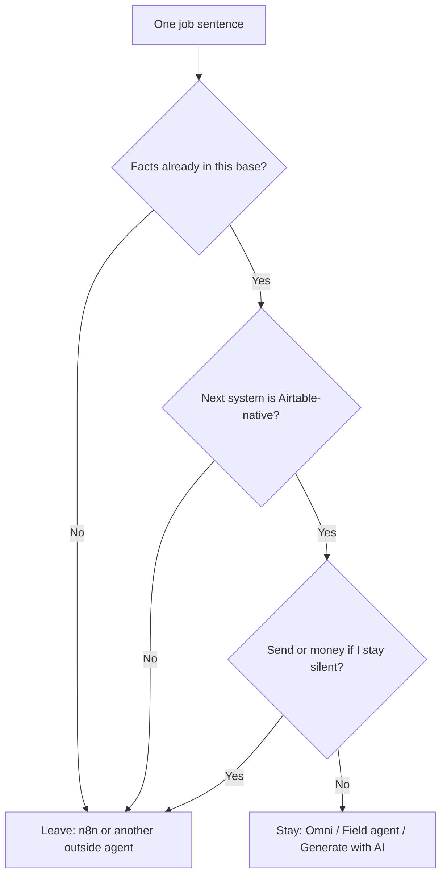

# When Airtable AI Is Enough — and When You Need an Outside Agent

**Airtable AI is enough when the job lives in one base, writes a draft you will read, and the next step is already on Airtable's action list. You need an outside AI agent — usually n8n plus a model you call — when two systems must join on a clock you do not sit in, or when send and money need a gate Airtable will not hold.** That is the whole boundary. The rest of this page is how I test a real job against it.

I am **William Spurlock**, founder of **Spurlock Studios LLC**, AI Systems Architect, and Fractional AI CTO. I have shipped **600+ automations** with **500+ live**, logged **20,000+ hours** inside agentic systems, and deleted **35,000+ hours** of client busywork across that book of work. I do not invent a payback, a client name, or an Airtable SKU the help center does not use.

This spoke owns one operating question: **When is Airtable AI enough and when do I need an outside AI agent?** The August 30 parent,
[the AI already inside your tools](/blog/the-ai-already-inside-your-tools-and-why-most-owners-never-turn-it-on),
owns the unused-switch audit across the stack. This page does not repeat that tour. It draws the Airtable line only.

I write the product names as Airtable writes them in mid-September 2026 help: **Omni**, **Field agents**, **Generate with AI** inside Automations, and **AI credits**. Labels move. I cite the help URL in the sentence. I do not invent a second product called "Airtable Agent Hub."

If the money question is "what does the spine cost after I leave the base," that is
[what AI automation actually costs in 2026](/blog/what-does-ai-automation-actually-cost-a-realistic-breakdown-for-2026).
This page stays the yes / no cut.

---

## When is Airtable AI enough?

**Airtable AI is enough when every fact the model needs already sits in the base (or in an attachment, Drive folder, or URL you pointed at), the output lands back on a record or an Airtable-native next step, and a human still owns send, money, and anything a customer will read.** If you can finish the job without leaving Airtable except to read the draft, stay.

As of the week I am writing this (10 September 2026), Airtable's own help names three in-product surfaces. I treat them as one lane, not three products to shop.

| Surface | What Airtable's help says it is | Enough for |
| --- | --- | --- |
| **Omni** | [Integrated AI assistant](https://support.airtable.com/docs/using-omni-ai-in-airtable) that builds apps, researches the web, analyzes data and documents, creates or updates records, and answers questions in plain language | "What's late this week in this base?" "Add a Status field." "Sketch the interface." "Write a first automation." |
| **Field agents** | [AI-powered fields](https://support.airtable.com/docs/using-airtable-ai-in-fields) that retrieve, analyze, or generate at the cell. Owners or Creators add them. Editors can click Generate. Last updated in Airtable help **6 days before this draft** | Classify, summarize, extract, translate, or suggest a linked record **on this row** |
| **Generate with AI** | An [Automations action](https://support.airtable.com/docs/airtable-automation-actions-generate-with-ai) (`Generate text` or `Generate structured data`) after a trigger, then a later step that writes a record, sends email, or posts to Slack | A Monday summary that already lives in a view, then Airtable's own Send email / Slack step |

That table is the yes-lane. I do not need a second login to use it. I do need **workspace AI on** and **AI credits** for the runs that consume them. Airtable's [AI billing help](https://support.airtable.com/docs/airtable-ai-billing) (Team, Business, and Enterprise Scale; last updated about a month before this draft) is explicit: **building apps and agents with Omni does not consume AI credits**. Asking Omni a question, running a Field agent, launching an AI automation, analyzing a document, or generating an image does.

I do not quote a payback on those credits. Packs and included monthly allotments change by plan. I send the operator to that billing page the week they flip the switch, then I watch the balance after ten real runs.

### The four jobs I will leave inside Airtable

I stay in-base when the job matches one of these four shapes.

1. **Ask the base a question you could have filtered for.** "Which retainers have no update this week?" Omni can answer if the dates live here. That is not an outside agent. That is a view you were too tired to build.
2. **Fill or classify a cell from other cells on the same record.** Sentiment on `{customer_feedback}`. A one-line summary of `{Meeting Notes}`. A Status select from a closed list. A number the model should only compute from fields you named. Field agents are built for this. Airtable's field help even shows a sentiment example with Do / Do not rules and `{field}` tokens.
3. **Extract from a file you already attached.** Airtable documents [document extraction](https://support.airtable.com/docs/using-airtable-ai-in-fields) as a Field agent that can read an attachment — contract clauses into columns, form fields off a PDF, a translation of text that is already in the cell. The file is in the base. The output is in the base. Stay.
4. **Generate, then take an Airtable-native next step.** [Generate with AI](https://support.airtable.com/docs/airtable-automation-actions-generate-with-ai) can summarize last week's meeting view and hand the response token to Send email or Slack. Airtable's own examples include a Monday email and a Slack post after negative feedback. That is still the Airtable lane. It is not n8n.

If your "agent idea" is one of those four, you do not need me to stand up a workflow. You need workspace AI on, a tight instruction, and ten rows you will actually read.

### Clocks that still count as in-base

Airtable can fire **on a schedule**. The Generate with AI walkthrough uses "every 1 week on Mondays at 6:30 a.m." plus a Find records step. That is a clock. It is not automatically an outside agent.

I stay when the clock only looks at **this base** and then takes an Airtable action:

| Clock | Stay | Leave |
| --- | --- | --- |
| Monday 06:30, find this week's view, write `{Digest}`, Slack an internal room | Yes | If that Slack message is the customer-facing status |
| Record enters a view, Field agent fills `{Tag}` | Yes | If the same trigger must also open a ticket in another app |
| Form (Airtable form) submitted, Generate structured data, create child records | Yes | If the form is on your site and never wrote the row |
| "When I'm asleep, watch Stripe" | No | The clock is not Airtable's |

A scheduled digest of a view you already trust is the most common **false leave** I see. Operators hear "cron" and buy n8n. They needed a view and Generate with AI.

### Permissions are a stay condition, not a reason to leave

Omni [mirrors the user](https://support.airtable.com/docs/using-omni-ai-in-airtable). Interface-only collaborators can create, update, and delete data only if the base setting **Allow Omni to create, update, and delete data for interface-only collaborators** is on (Airtable defaults it on). Field and table permissions still win. If Omni refuses a field, that is usually your permission model doing its job.

I do not treat a permission miss as "we need n8n so it can write anyway." An outside agent with a personal access token that ignores the same rule is a worse outcome. Fix the permission, or accept that the field is human-only. Leave for n8n when the **other app** is the blocker, not when your Creator seat was the blocker.

### What "enough" is not

**Enough is not "Omni is now my company."** Omni [mirrors your permissions](https://support.airtable.com/docs/using-omni-ai-in-airtable). It can only do what you can do in that base or interface. It cannot set up table syncs, export the base, configure permissions, or run the kind of statistical work Airtable lists as out of scope (sums and variances sit on pre-computed fields; Omni can count records). Owners or Creators set Omni's base toggles. Internet access is a setting, not a default I leave on for price or legal fields.

Enough is also not "Run automatically on 4,000 rows and walk away." Airtable's field-agent help warns that **Run automatically** on a large table will keep consuming credits, and some rows will error when the pool runs out. Human-edited cells are not auto-overwritten. That is a credit and overwrite rule. It is not a reason to buy n8n. It is a reason to keep Generate manual for week one.

### A Field agent instruction that stays in-lane

This is the shape I use when the job is classify-in-place. Tokens are Airtable field names. The model is whichever Airtable-hosted option the workspace allows — I do not pick Claude Opus 4.8 or GPT-5.5 inside Omni. Airtable documents that **you cannot plug in your own API key**; [Omni runs on Airtable-hosted models](https://support.airtable.com/docs/using-omni-ai-in-airtable). Enterprise admins pick families in the admin panel.

```text
You are filling {Support_tag} for this record only.

Use only {Ticket_body} and {Customer_plan}.
If either field is empty, write NEEDS_HUMAN and stop.

Allowed tags: Billing, Access, Bug, How-to, Other.
If two tags fit, pick the one the customer asked to resolve first.
Do not invent a product name that is not in {Ticket_body}.
Do not write an email. Do not mention a refund amount.
```

That instruction is enough when `{Support_tag}` is the whole job. The second it also has to create a Zendesk ticket, refund Stripe, and email the customer from Gmail, this prompt is still useful — as a cell. The join is the outside agent.

### Omni is enough for build. It is not enough for "talk to five vendors."

Airtable's Omni help is honest about this, and I repeat it because owners skip it. **Use Omni** for quick analysis, new tables and fields, content from existing data, and simple automation creation. **Prefer classic Airtable features** for multi-step workflows that need precise control, bulk updates with validation, or an approval path you can audit. Omni can create or update an automation. It cannot become the approval path.

I use Omni to **build the first structure**. I do not use Omni as the Monday spine. If the sentence is "make me the base I described," Omni is enough. If the sentence is "when Stripe pays, write Airtable, then wait for me, then send Gmail," Omni is the table. n8n is the pipe.

---

## When do I need an outside AI agent?

**You need an outside AI agent when the job has to join Airtable to a system Airtable does not own, fire while you are not in the tab on a clock you control, hold a human gate before send or money, or call a model and tools you picked.** A second ChatGPT tab is not that agent. n8n (or Make, or Zapier) plus a model call is.

I use **outside agent** on purpose. Airtable's marketing page talks about [Field Agents and custom agents you spin up in the table](https://www.airtable.com/platform/ai-agents). Airtable billing talks about **building apps and agents with Omni**. Those are still in-base. They run in Airtable's permission model, on Airtable's credits, on Airtable-hosted models. An outside agent is a workflow or loop you own that treats Airtable as one node.

| Signal | Stay in Airtable AI | Leave for an outside agent |
| --- | --- | --- |
| Where do the facts live? | This base, this attachment, a Drive/OneDrive folder you scoped, a URL you named | Stripe, Gmail, a second CRM, a website form, a calendar you do not sync into this base |
| What happens next? | Write a field, create a record, Airtable Send email, Airtable Slack | A vendor Airtable has no action for, or a sequence with retries you own |
| Who is in the tab? | You clicked Generate, or a record change in this table | A weekday 06:30 job while you are offline |
| What is the gate? | You read the cell before anyone else sees it | Send, refund, or production write cannot run unless you click |
| Who picks the model? | Airtable-hosted list (plan / admin) | You call Claude Sonnet 5 for the cheap classify, Claude Opus 4.8 for the ugly edge case, GPT-5.4 mini for bulk, Gemini 3.5 Flash when latency wins |

If three of those five rows sit in the right column, I do not "give Omni one more prompt." I draw the pipe.

### Native email and Slack do not make Airtable your spine

This is the cut owners miss. Airtable **can** send email and post to Slack from an automation after Generate with AI. The [Generate with AI help](https://support.airtable.com/docs/airtable-automation-actions-generate-with-ai) says so in the first screen: write a record, send an email, post to Slack, even draft a Google Doc and share it. I do not pretend those actions are missing.

I still leave when any of these are true:

- **The inbox is Gmail or a domain Airtable is not sending as.** "Send email" from Airtable is not the same job as "reply in the thread the customer wrote, from the mailbox they already trust, with the signature and BCC my lawyer wants."
- **The trigger is not an Airtable record.** A website webhook, a Stripe event, a mailbox rule, a calendar hold — those start outside the base. Omni cannot subscribe to Stripe. A Field agent cannot see a form that never wrote a row.
- **The send needs a wait.** Airtable automations fire when the trigger fires. A gate that means "do not send if I do not click" is a graph you build. Silence is not consent. I have written that rule on other work; it applies here. If the Send email action can run without you, you do not have a gate. You have a delay you hope you will notice.
- **Failure has to be loud.** A Field agent that writes a polite wrong tag looks finished. An n8n node that 500s is a red execution. I want the red one on money and customer send.

### The jobs I will not keep inside Omni

I move these out on the first scoping call. I do not "try Omni harder."

| Job | Why Airtable AI loses | What I use instead |
| --- | --- | --- |
| Website form → CRM row → confirmation email from your domain | The form is not the base. The mailbox is not Airtable Send email | n8n webhook in, Airtable node, Gmail/SMTP out. The hour-one pattern is in [how to connect n8n to CRM, email, and website](/blog/how-to-connect-n8n-to-your-crm-email-and-website-in-under-an-hour) |
| Stripe paid → entitlement row → "don't email until I approve" | Money plus a gate. Omni is not the approver | n8n + Slack/email approve node. Airtable holds the row. The agent does not send |
| Nightly join of Airtable + a second CRM + a sheet the client will not migrate | Two systems of record. Omni only sees this base | n8n. Maybe a sync later. Not a Field agent with internet search |
| Model must use a tool I wrote (MCP, internal API, a deny-list I control) | [You cannot bring your own API key](https://support.airtable.com/docs/using-omni-ai-in-airtable) into Omni | n8n HTTP / MCP. Claude Opus 4.8 or Sonnet 5 on my key, or GPT-5.5 when the prompt is already a spec |
| Cross-base work Airtable will not sync for you | Omni [cannot set up table syncs](https://support.airtable.com/docs/using-omni-ai-in-airtable) | n8n reads both bases, or you build the sync with a feature Omni does not own |

Notice what is **not** on that list: "summarize this table," "tag this ticket," "extract the renewal date from the PDF we attached," "ask what slipped this week." Those stay. Buying n8n for those is how you pay twice.

### n8n is my default outside agent. It is not the only legal one.

When the job has left Airtable, I still have to pick the pipe.
[n8n vs Make vs Zapier in 2026](/blog/n8n-vs-make-vs-zapier-in-2026-which-automation-tool-is-right-for-your-business)
owns that comparison. Short version I use on this boundary: **n8n** when I want self-host, code nodes, and an AI agent I can attach tools to. **Make** when the operator already lives there and the scenario is a visual map. **Zapier** when the client will only click a Zap and accept per-task math. The boundary post does not reopen the bake-off. It only says: once you have left Omni, you are in that post's world.

I call Claude Sonnet 5 for most classify-and-draft steps on that pipe. I spend Claude Opus 4.8 on the one step that can invent a refund. I use GPT-5.4 mini or Gemini 3.5 Flash when the volume is boring and the schema is tight. Llama 4 only when the box has to stay off a US host. None of those names are Airtable SKUs. If I need them, I have already left Omni.

### False leaves — jobs I will not take to n8n

Leaving too early is how you pay for a workflow that reprints a Field agent. I send these back.

| What the operator said | What the card actually is | Stay move |
| --- | --- | --- |
| "We need an AI agent on the CRM" | Tag and summarize rows that already live here | One Field agent. Closed select. Manual Generate |
| "Omni should email the client the recap" | Internal Monday digest | Generate with AI → Airtable Slack or email to **you**. You send the client |
| "The PDF extractor isn't an agent" | Attachment is on the record | Document-extract Field agent. Read ten contracts |
| "We have to research the company" | URL is already a field | Field agent with internet on **that URL only**. Still not a send |
| "n8n will be cleaner for tags" | No second system | Stay. Cleaner is not a join |

If the only pain is "the tags are messy," the fix is the instruction and a closed list. It is not a new runtime.

### Generate structured data is still the Airtable lane

[Generate structured data](https://support.airtable.com/docs/airtable-automation-actions-generate-with-ai) is the action I use when the model must return an object or an array Airtable can loop. Airtable documents arrays as input to a repeating group, a 64,000-character prompt cap, and a four-level nest limit on arrays and objects. Internet-off plus a schema that asks for a web lookup is a documented fail (`could not find values`).

That action is enough when the loop still writes **Airtable records** (or feeds an Airtable email/Slack step). It becomes a leave the moment the loop's next hop is an API Airtable does not offer. I do not rebuild JSON schema in n8n just to feel like I left. I leave when the hop exists.

---

## How do I test the boundary on one job this week?

**Write the job as one sentence with a trigger, a fact source, an output, and a next system. If all four stay inside one Airtable base plus an Airtable action, stay. If any of the four names a second product you do not sync here, leave.** Twenty minutes. One job. Not a stack redesign.

I do not start from a vendor landing page. I start from a sentence the operator already says out loud.

### The one-sentence card

Fill this. If a blank stays empty, the job is not ready for either lane.

| Slot | Prompt I ask | Stay if | Leave if |
| --- | --- | --- | --- |
| **Trigger** | What event starts this? | A record created/updated, a view, a scheduled Airtable automation | A webhook, a mailbox, a payment, a calendar, a file drop outside Airtable |
| **Facts** | What is the model allowed to see? | Named fields, one attachment, a scoped Drive folder | Anything Omni cannot see unless you paste it |
| **Output** | What must exist when it is done? | A field, a record, a draft in a cell | A sent email in *their* thread, a charge, a ticket in another app |
| **Next system** | What app has to change besides this base? | None, or Slack/email via Airtable's action | A second CRM, Stripe, the site, a mailbox you own |
| **Gate** | What must not happen if you are silent? | Nothing customer-facing | Send, money, delete, production write |

If **Next system** is "none" and **Gate** is "nothing customer-facing," Airtable AI is enough. Turn on one Field agent or one Generate with AI action. Read ten outputs. Stop.

If **Next system** is named, I do not care how good Omni's last chat was. We are building a pipe.



That diagram is the post. Everything else is receipts so you do not talk yourself around it.

### A 45-minute test I actually run

I do not enable five Field agents. I pick **one** job the operator already does by hand this week.

1. **Write the card.** Five slots. No adjectives.
2. **Score the card.** Stay or leave. If I hesitate, I score leave on Gate. Hesitation means a customer can get hurt.
3. **If stay:** workspace AI on. One Field agent or one Generate with AI action. Instruction names the source fields. Internet **off** unless the job is literally "look up this URL." Manual Generate on ten rows. I read all ten.
4. **If leave:** I do not "try Omni as the pipe." I open n8n (or the pipe they already pay for) and I treat Airtable as a node. The hour-one wiring is the CRM / email / website post I already linked. The Field agent can still fill a draft column that n8n reads. That is a split, not a failure of Omni.
5. **Log the miss.** Wrong tag, invented number, empty cell, credit error. If I cannot name the miss, I do not turn on Run automatically and I do not attach a send.

### Two worked cards

**Card A — stay.** Trigger: new Support row. Facts: `{Ticket_body}`, `{Customer_plan}`. Output: `{Support_tag}` from a five-option select. Next system: none. Gate: none; a human still replies. **Airtable AI is enough.** Field agent. Manual Generate. I do not buy n8n for a select field.

**Card B — leave.** Trigger: Stripe `checkout.session.completed`. Facts: Stripe payload plus the Airtable SKU row. Output: entitlement written, then an email from `hello@their-domain.com` in the customer's thread. Next system: Stripe + Gmail. Gate: do not send if the SKU field is empty. **Outside agent.** Omni can hold the SKU table and even draft `{Email_body}`. It cannot subscribe to Stripe or hold the gate.

I have watched operators try to smash Card B into Omni with internet search and a pasted Stripe receipt. That is not a boundary test. That is a paste ritual. Paste rituals are the tell that you already need the pipe.

### What I refuse to test this week

- Five Field agents on day one. Credit burn will look like "Airtable AI failed." It failed because you ran a factory.
- Internet search on a price, a legal clause, or a customer's plan. Airtable will pull the web if you let it; [sources show up in the output](https://support.airtable.com/docs/using-airtable-ai-in-fields). I still do not want a stale page writing a number a human will treat as booked.
- "Run automatically" on a table you have not scored. Airtable warns you. I believe them.
- Omni with internet on, pointed at "update every competitor price." That is a research toy. It is not an ERP.

If the operator wants all four of those, they do not have an Airtable-AI question. They have an outside-agent question they are trying to hide inside a base.

### Score the maybe without inventing a third lane

Some cards come back **maybe**. I do not invent a third product for them. I pick stay with a tighter gate, or I leave.

| Maybe | My call | Why |
| --- | --- | --- |
| Generate with AI → Slack, room is internal, no customer | Stay | Next system is Airtable-native. Gate is "nobody outside this room" |
| Same digest, Slack room includes the client | Leave or stay-and-you-send | The client can read a wrong week. I would rather you paste |
| Field agent reads Google Drive (Airtable documents up to 100 folders; large trees can stop early) | Stay if the folder is the brief for **this row** | Leave if Drive is the real CRM and Airtable is a mirror you do not maintain |
| Omni chat that updates 20 records you are staring at | Stay | You are the gate. Undo exists on Omni build/update replies |
| Omni chat that updates 20 records while you grab coffee | Leave or stop | Unattended bulk write is a graph. Use an automation you tested, or n8n with a dry run |

"Maybe" that lasts more than a week is a leave I am avoiding. Pick.

### What I write down after the 45 minutes

I keep four lines in the same place I keep the miss log. If I cannot fill them, the test did not happen.

1. **Job sentence** (one line).
2. **Stay or leave** (one word).
3. **Surface** (Omni / Field agent / Generate with AI / n8n).
4. **First miss I will accept** (wrong tag, empty `NEEDS_HUMAN`, failed credit, failed webhook). If the answer is "no miss, it should just work," I do not turn it on.

That log is how I know next Monday whether the boundary moved or I just got bored.

---

## What stays in Airtable after I add n8n?

**The base stays the system of record. Omni and Field agents stay on draft, classify, and extract. n8n takes trigger, join, gate, and send.** I do not rip out Airtable AI because the spine left. I stop asking Omni to be the spine.

This is the split that keeps the credit bill honest and the graph readable.

| Still in Airtable | Moved to the outside agent |
| --- | --- |
| Tables, interfaces, the row the human opens | Webhooks, cron, Stripe, mailbox, second CRM |
| Omni for "build me the field / view / simple automation" | The automation that must not silently send |
| Field agents on draft columns the human reads | Model calls where I pick Claude Sonnet 5 / Opus 4.8 / GPT-5.5 / Gemini 3.1 Pro |
| Generate with AI when the next step is still an Airtable action you accept | Retries, dead-letter, a miss log I can open without Admin panel |
| AI credits for in-base runs | API usage I can attribute to one workflow |

Owners want a winner. There is not one. **Omni wins the base. n8n wins the join.** If you force one tool to take both jobs, you will either burn credits on Run automatically across a table that should have been a webhook, or you will rebuild Airtable inside n8n and hate your life.

### A clean split I keep drawing on paper

```text
[Website form / Stripe / Mailbox]
        |
        v
   n8n (trigger + gate)
        |
        +--> Airtable: create/update the row
        |
        +--> Field agent or Generate with AI: draft {Summary} / {Reply}
        |
        v
   Human reads the draft in the base
        |
        v
   n8n: send only after the approve node
```

The Field agent is still doing useful work. It is not the agent. The agent is the graph that can refuse to send.

A webhook n8n can accept from the site looks like this. I keep the schema boring on purpose. Airtable gets a row. The model does not get a send.

```json
{
  "path": "intake",
  "method": "POST",
  "responseMode": "onReceived",
  "expected": {
    "email": "string",
    "sku": "string",
    "source": "string"
  },
  "next": [
    "airtable:createOrUpdate",
    "waitForHumanApprove",
    "gmail:sendOnlyIfApproved"
  ]
}
```

That is not a full workflow export. It is the contract. If your n8n graph cannot say those three next steps out loud, you are not ready to leave the base — and you are also not ready to pretend Omni will send the mail.

### Omni can build the first automation. I still rewrite the join.

Airtable tells you to [consider having Omni create the automation](https://support.airtable.com/docs/airtable-automation-actions-generate-with-ai). I do that for the in-base half: find last week's records, Generate text, write `{Weekly_summary}`. I do not ask Omni to invent the Stripe trigger. I do not ask Omni to hold an approve node. If Omni drafts an automation that Send-emails a customer on the first test, I turn it off before I leave the room.

Enterprise and Business admins also pick model families. Airtable's Omni FAQ is blunt: **if the org only enabled Gemini, Meta, IBM, or Amazon Titan/Nova, Omni may not be available**; OpenAI or Amazon-hosted Anthropic families have to be on. That is an admin-panel problem, not an n8n problem. If Omni is missing, I check [workspace AI](https://support.airtable.com/docs/using-omni-ai-in-airtable) and the admin AI settings before I sell a pipe.

---

## How do I know I crossed the line?

**You crossed it when you are pasting between Airtable and a second app to finish one job, when a customer can get mail or a charge if you stay silent, or when the fact you need cannot be a field in this base.** Credit exhaustion is not the line. A second ChatGPT window is not the line. The join is the line.

I keep a short miss list. If two items are true in the same week, we leave.

| Tell | What it actually is | Move |
| --- | --- | --- |
| You export CSV, run ChatGPT, re-import | The model you wanted is not the Airtable-hosted one, or the prompt does not fit a cell | Outside agent with the model named, or a tighter Field agent — pick one, stop the CSV loop |
| You keep Slack-DMing yourself the Omni answer so you can paste it into Gmail | Next system is Gmail. Omni already did its job | n8n after a draft field. Do not ask Omni to "just send it" |
| Run automatically dies halfway down a 3,000-row table | Credits and word limits, which Airtable already documents (~12k words on lower-powered models, ~90k on higher-powered; prompt cap 64k characters on Generate with AI) | Batch, or move the factory to n8n. Do not buy a new chat app |
| Omni says it cannot sync / export / set permissions | [Documented Omni limits](https://support.airtable.com/docs/using-omni-ai-in-airtable) | Use the real Airtable feature, or n8n. Stop re-prompting |
| A Field agent with internet writes a price you cannot defend | You pointed the web at a money field | Internet off. Facts from fields. If you need live web, that is a researched draft — still not a send |
| The job starts when you are asleep | Clock + join | Outside agent. Airtable scheduled automations can cover *in-base* clocks. They cannot cover Stripe-at-2am plus Gmail |

### Credit burn is a budget event, not a boundary event

Operators treat an empty credit pool as proof they "need a real agent." Sometimes they do. Often they turned on Run automatically, internet search, and document analysis on a table that should have been ten manual Generates.

Airtable's billing help gives **typical** Omni costs I treat as order-of-magnitude only: about **10 credits** for a simple question, about **200 credits** to extract from a 10-page contract, **0 credits** to build with Omni. A 50-plus-page document can land in the **500–1,500** band. Those are Airtable's examples, not my invoice. They reset monthly (or on the billing cycle, depending on plan). I do not turn that into an ROI slide. I turn it into a question: **did this run belong in a cell?**

If the run belonged in a cell, buy the credit pack Airtable sells or cut the automatic toggle. If the run belonged in a join, stop feeding it to Field agents.

### The line I will not let a demo move

Vendors will show Omni building a pretty interface in one chat. That demo is real. I use it. It does not answer the PrimaryQuery.

**Pretty base ≠ outside agent.** A working team-member story is a different post, and it is not this one. This page is the cut: **one base, draft, Airtable next step** versus **two systems, clock, gate.** If a demo only shows the first column, it has not earned the second.

When I am hired after the demo, I ask for last week's actual job list. I score five cards. Two stay. One is a maybe (usually Generate with AI plus Slack, which I will allow if the Slack room is internal). Two leave. We build those two in n8n. We do not "activate agents" as a personality. We ship two graphs with names.

### A week-two check that does not reopen the shop

After seven days I only ask four questions. If the answers are boring, the boundary held.

| Question | Stay still winning | You already crossed |
| --- | --- | --- |
| Did anyone send a customer the raw cell? | No, or they edited it first | Yes, twice |
| Did you paste into another app to finish the same job? | No | Yes, every time |
| Did credits die on a job that should have been ten rows? | You cut Run automatically | You added a second tool instead of cutting the toggle |
| Did a trigger fire from a system Omni cannot see? | No such trigger | You kept asking Omni to "watch" it |

I do not use week two to add features. I use it to see whether I lied on the card. If I lied, I redraw. I do not "give the Field agent more internet."

---

## Frequently Asked Questions

### When is Airtable AI enough and when do I need an outside AI agent?

**Airtable AI is enough when the facts, the output, and the next step stay in one base (or on Airtable's own email/Slack/record actions) and a human still owns anything a customer will see. You need an outside agent when a second system, a clock you own, or a send/money gate shows up.** Omni, Field agents, and Generate with AI are the in-base lane. n8n is the default pipe I reach for after that. Score one job on the card above before you buy either a credit pack or a new workflow tool.

### Does Airtable Omni replace n8n?

**No. Omni builds, asks, and edits inside Airtable. n8n joins Airtable to the rest of the stack.** [Omni's help](https://support.airtable.com/docs/using-omni-ai-in-airtable) is about apps, interfaces, records, questions, and simple automations in one product. Building with Omni is documented as credit-free. The moment Stripe, Gmail, and a second CRM have to agree at 06:30, I still use n8n. That is also the line I drew on the parent unused-switch post; this page is the Airtable-only version of that sentence.

### Are Field Agents the same as an outside AI agent?

**No. Field agents are AI columns. An outside agent is a graph you own.** Airtable's [field help](https://support.airtable.com/docs/using-airtable-ai-in-fields) (all paid plans; Owners/Creators configure, Editors can Generate) says Field agents retrieve, analyze, or generate **at the cell**. They can run when inputs change. They can search the web or a Drive folder if you turn that on. They still live in the table. They do not subscribe to Stripe and they do not hold a "do not send if I am silent" node.

### Can Airtable automations send email and Slack without n8n?

**Yes. Generate with AI can hand its response to Airtable's Send email or Slack actions.** The [automation help](https://support.airtable.com/docs/airtable-automation-actions-generate-with-ai) uses a Monday meeting-summary email as the walkthrough. That is enough for an internal digest from Airtable. It is not enough when the send must come from the customer's existing Gmail thread, wait for your click, or follow a payment event Airtable did not see.

### Do I need n8n if all my data already lives in Airtable?

**Not for classify, extract, and ask. Yes the first time a trigger or a send lives somewhere else.** A base that is truly the only system can stay on Omni and Field agents for a long time. Most operators who say "it's all in Airtable" still have Gmail, a site form, and a Stripe account. Those three are the usual leave conditions. If they really do not exist, stay. I will not invent a spine so the stack looks serious.

### Does building with Omni consume AI credits?

**No. Airtable's [billing help](https://support.airtable.com/docs/airtable-ai-billing) says building apps and agents with Omni is free, even after the monthly credit allotment is gone.** Questions, Field agent runs, AI automations, document analysis, web pull, and image generation consume credits. Allotments are pooled. They reset on the calendar month or the billing cycle depending on plan. I do not treat "Omni is free to build" as "runs are free."

### Can I use my own OpenAI API key with Omni?

**No. Omni only runs on Airtable-hosted models.** That is a direct FAQ on the [Omni help page](https://support.airtable.com/docs/using-omni-ai-in-airtable). OpenAI also ships an Airtable integration *inside ChatGPT* that can query and update a base — that is the other direction, and it is not Omni. If I need Claude Opus 4.8, Claude Sonnet 5, GPT-5.5, GPT-5.4 mini, Gemini 3.1 Pro, Gemini 3.5 Flash, or Llama 4 on my key, I am already on the outside-agent side of this page.

### Why is Omni missing even though I pay for Airtable?

**Workspace AI is off, Omni is off on that base, credits for credit-consuming tasks are gone, or the admin panel only enabled model families Omni will not boot on.** Airtable says AI is on by default for most plans (EU / GDPR workspaces can be opt-in). Org admins must enable AI and, for Omni to function, **OpenAI or Amazon models**. A Gemini-only or Llama-only allow-list can leave Omni unavailable. Check workspace settings and admin AI settings before you assume you "need n8n because Omni is broken."

### When should I use a Field agent instead of Generate with AI?

**Use a Field agent when the answer belongs on the record as a column people will filter and edit. Use Generate with AI when a trigger should produce a payload for a later automation step.** Columns are for tags, summaries, extracts, suggested links. Automations are for "Monday 06:30, find this view, write a digest, post Slack." If you build a Field agent and then an automation that only exists to copy that cell into Slack, you may have wanted Generate with AI first. If you Generate every time someone opens a row, you wanted a Field agent.

---

## Get the boundary scored on a real job

I do not sell a mystery "Airtable agent package." I score five job cards against this page. The ones that stay get a Field agent or a Generate with AI action with internet off and Generate manual. The ones that leave get an n8n graph with Airtable as a node and a gate in front of send.

If you want that cut drawn on your actual base — not a second chat demo — use [/contact](/contact). Bring one job sentence: trigger, facts, output, next system, gate. If you cannot fill the card, we fill it on the call. If the card stays in-base, I will tell you to turn Omni on and send me away.

Founder, AI Systems Architect, Fractional AI CTO. **600+ automations built, 500+ live.** The question is not whether Airtable has AI. It is whether this week's job still fits in one base.
