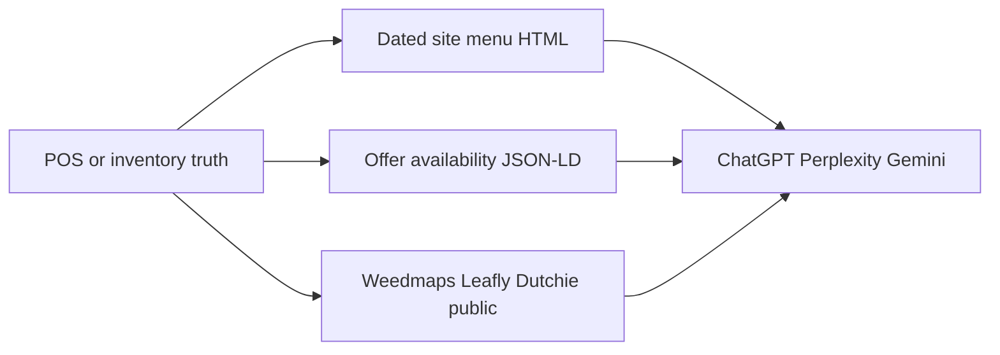

# When ChatGPT Still Recommends Yesterday's Sold-Out Strain

**ChatGPT still recommends yesterday's sold-out strain because it is reading a frozen public copy — a marketplace menu, a cached page, or JSON-LD that still says InStock — not the POS you updated this morning.** The shop looks dishonest. The jar is gone. The answer is still selling it.

I'm William Spurlock — Founder, AI Systems Architect, and Fractional AI CTO. I've built 600+ automations, with 500+ still live. I've spent 20,000+ hours on agentic systems, and those builds have saved clients 35,000+ hours of busywork. I've been SEO-certified since 2021 (now AEO / AIO / GEO). I do not invent client names or inventory-software prices here. I will tell you what I actually check when GPT-6 Astra, Claude Sonnet 5, Gemini 3.8 Flash, or Perplexity names a licensed one-door shop for a SKU that hit zero last night.

This is not the ecommerce product-recommendation pillar. That catalog, feed, and entity stack lives in [AI visibility for e-commerce](/blog/ai-visibility-for-e-commerce-getting-your-products-recommended-by-ai). Offer fields and identifiers live in [product schema for AI catalogs](/blog/product-schema-for-ai-making-your-catalog-machine-readable). Come back here for one failure: a licensed shop or craft brand gets recommended for a strain that sold out yesterday, so the buyer shows up to an empty case and assumes you lied.

I write for licensed operators only. I do not make medical claims. I do not write consumption how-tos. If/when federal rescheduling happens, marketplace rules may move. That change does not put last night's eighth back on the shelf, and it does not make a stale answer honest.

---

## Why does ChatGPT still recommend a strain that sold out yesterday?

**ChatGPT still recommends a strain that sold out yesterday because the answer is assembled from public copies that were true when they were captured, not from your live inventory count.** Search, shopping metadata, and training residue can all name a SKU after the jar is gone. Your POS being current is not the same as the public row being current.

OpenAI is explicit that freshness is not a contract. In [offline web search for ChatGPT workspaces](https://help.openai.com/en/articles/20001203-offline-web-search-for-chatgpt-workspaces), OpenAI says coverage and freshness vary by site and page, there is **no refresh SLA for a specific URL**, and a page in the index or cache "may be older than the live web version." That article is about a workspace mode that prefers the cache on purpose. The same stale-copy problem shows up in ordinary ChatGPT Search whenever the model cites a menu it already has instead of re-reading your POS.

Shopping answers have a second freeze. OpenAI's [Shopping with ChatGPT Search](https://help.openai.com/en/articles/11128490-shopping-with-chatgpt-search) help page says product and merchant lists can come from **structured metadata from first-party and third-party providers**, plus model text written before new search results are considered. Merchants get ranked on factors that include availability. OpenAI still tells the buyer to verify the product before purchase. A licensed cannabis shop should not assume it can onboard a conventional OpenAI product feed the way a Shopify apparel brand can. The stale strain rec I see is usually a **web-menu citation**, not a shopping carousel you applied for.

How [ChatGPT and Perplexity decide which businesses to recommend](/blog/how-chatgpt-and-perplexity-actually-decide-which-businesses-to-recommend) is a separate post. Here the mechanism is narrower: once your shop is already namable, the engine still has to decide **which SKU is in stock today**. That decision fails when any public copy still says yes.

| Frozen copy | Why it survives overnight | What the buyer hears |
|---|---|---|
| Marketplace menu (Weedmaps, Leafly, a public Dutchie page) | Directory HTML plus a sync clock that is not ChatGPT's clock | "They still have it near me" |
| Your site menu with no as-of stamp | `lastmod` never moves, so crawlers treat last week as current | "The shop page agrees" |
| JSON-LD `Offer.availability` left on `InStock` | Engines extract the offer, not the greyed-out button | A machine-readable lie |
| Last-harvest blog or drop post | Evergreen "we have" language with no sold-out note | "The brand is talking about a live jar" |
| Training residue, no live search | The model names a strain it already associates with you | A last-season recommendation with no URL to argue with |

The shop does not look "out of stock." It looks empty on purpose. A buyer who asked "what's in stock near me" got a name, drove or placed a pickup, and met a budtender who has to apologize for a machine. That is an honesty problem before it is a ranking problem.

I do not treat this as a generic PDP freshness ticket. A t-shirt SKU can sit at `out_of_stock` for a week and the brand still exists. A one-door craft menu turns over by the jar. If the public row cannot flip the same day the count hits zero, ChatGPT will keep selling yesterday.

Perplexity is not automatically safer. It retrieves live sources more often, but it will happily cite a Weedmaps card or a drop post that still reads as current. Gemini 3.8 Flash and Google AI Overviews do the same when the extracted offer still says in stock. The engine is not your inventory clerk. It is a reader of the copies you left on the public web.

### Dishonest or empty — what the buyer actually concludes

**The buyer does not conclude "the model is stale." They conclude the shop is dishonest or the case is empty.** That is why this is an AI-visibility problem with a reputation cost, not a ranking curiosity. I split the miss the way the closer hears it.

| Buyer query | Stale answer | What they believe at the door |
|---|---|---|
| "What's in stock near me today?" | Names a sold-out eighth | You advertised a jar you do not have |
| "Does [shop] still have [strain]?" | Yes, citing Weedmaps | Your own staff is lying when they say no |
| "Who has [shared strain name] that isn't sold out?" | You, for grower A's dead lot | The menu is a mess and not worth a second trip |
| "Pickup vs delivery, what can I get right now?" | Mixes the two pools | The shop cannot keep its own doors straight |

I do not diagnose every bad answer as this problem. If ChatGPT never names the shop, you have a recommendation gap — go to the [ChatGPT / Perplexity recommendation playbook](/blog/how-to-get-chatgpt-and-perplexity-to-recommend-your-business). If it names you and the hours are wrong, that is NAP drift. If it names a competitor with a denser menu, that is the ecommerce catalog problem. This post starts only after the engine already knows you and still sells yesterday's SKU.

Three ways the yes survives:

1. **No live search.** The model already pairs your shop with a strain from training or an old chat. There is no URL to correct.
2. **Live search of a dead copy.** ChatGPT Search, Perplexity, or Gemini 3.8 Flash cites a directory or drop post that still reads as current.
3. **Extracted offer.** JSON-LD or third-party metadata still says `InStock`. The prose on the page can say sold out and the machine will still prefer the offer.

I care which of those three fired, because the fix is different. You cannot "prompt" a directory into updating. You cannot schema-your-way out of a harvest post that still says we have it. You cannot train the model overnight. You can make every public copy agree by tonight.

---

## Which menu, marketplace, and schema surfaces freeze yesterday’s inventory into the answer?

**Yesterday's inventory freezes into the answer on every public menu the engine can cite: your HTML menu, your `Offer` JSON-LD, Weedmaps, Leafly, a public Dutchie page, leftover harvest posts, and any feed that still says in stock.** POS is not a surface. If ChatGPT cannot fetch it, it does not count.

I map the surfaces before I touch copy. Getting [ChatGPT and Perplexity to recommend the business](/blog/how-to-get-chatgpt-and-perplexity-to-recommend-your-business) is useless if the recommendation is a SKU you cannot sell.

| Surface | What actually gets cited | Typical freshness when healthy | How it freezes |
|---|---|---|---|
| Site menu HTML | The `/menu` (or equivalent) URL | As fresh as your publish + crawl | A weekly export left live with no date |
| `Product` + `Offer` JSON-LD | `availability`, `sku`, `seller`, price if you publish one | As fresh as the HTML it sits on | `https://schema.org/InStock` after the count is zero |
| Weedmaps listing | A structured directory menu the model already trusts | POS sync, then Weedmaps HTML | Wrong room, stale API key, or a listing nobody owns this week |
| Leafly menu | Same shape: a third-party menu graph | Dutchie documents Leafly pulls every **6–10 minutes**, sometimes **15** ([Leafly + Dutchie POS guide](https://support.dutchie.com/hc/en-us/articles/18650302383251-Leafly-Dutchie-POS-integration-guide)) | Healthy poll ≠ ChatGPT recrawl. A stalled integration is worse |
| Public Dutchie / ecommerce menu | The customer-facing menu URL, not the back-office | Dutchie documents integrated menus auto-sync about every **10 minutes** and tells you to read **Last Sync** ([Flowhub / Dutchie menu troubleshooting](https://support.dutchie.com/hc/en-us/articles/12883595439123-Flowhub-Dutchie-E-Commerce-Troubleshoot-Integrated-Menu)) | Hours-long stalls happen. A [June 18, 2026 Dutchie menu-sync incident](https://isdown.app/status/dutchie/incidents/609016-menu-sync-distruption) was reported as menus not reflecting current inventory for about two hours |
| Google-facing availability | Landing page, checkout, structured data, and any feed you are allowed to run | Google's clock, not yours | Mismatch gets the item yanked, not gently updated |
| Last-harvest leftovers | Blog URLs, Instagram embeds, "still available" sentences | Until you edit or noindex them | The lot is gone; the sentence is not |
| Same strain name, two growers | The marketing name without `sku` / brand / lot | Forever, if you never disambiguate | ChatGPT collapses "Gelato" into one jar that is not yours |

Google's availability rules are the cleanest public spec even when your category never gets a conventional Merchant Center path. [Merchant listing structured data](https://developers.google.com/search/docs/appearance/structured-data/merchant-listing) requires a nested `Offer` and an `availability` value such as `https://schema.org/InStock`, `https://schema.org/OutOfStock`, `https://schema.org/SoldOut`, or `https://schema.org/InStoreOnly`. Google says **do not specify more than one value**. [schema.org/OutOfStock](https://schema.org/OutOfStock) means the item is out of stock. [schema.org/SoldOut](https://schema.org/SoldOut) means it has been sold out. Pick the one that matches the page. Do not leave `InStock` because the template defaults to it.

[Merchant Center availability](https://support.google.com/merchants/answer/6324448) is blunter: if the landing page or checkout is out of stock and the data still says `in_stock`, Google disapproves the product. The inverse mismatch also fails. Many licensed cannabis operators will never run that feed. The consistency rule still applies to the copies you *do* publish. If the visible menu says sold out and the JSON-LD says in stock, you taught the machine to prefer the lie.

Google also tells merchants **not to delete a product for a temporary sellout**. [Availability troubleshooting](https://support.google.com/merchants/answer/9773127) says to submit `out_of_stock` instead of deleting, because adding the offer back after deletion takes a long time to show again. I use that as the default for a living menu: keep the URL, flip availability, stamp the time. Deleting the row is how you create a 404 that still lives on Weedmaps.

Marketplace rooms are a second freeze. Dutchie's Weedmaps setup docs require an ecommerce room and, if rooms are assigned to menus, Weedmaps selected on that room ([Weedmaps with Dutchie POS](https://support.dutchie.com/hc/en-us/articles/13554804969619-Set-up-Weedmaps-with-Dutchie-POS)). A jar can sell out in the floor room and stay visible on the menu room. ChatGPT does not know you have two rooms. It knows the listing still lists the strain.

I do not treat "the POS is right" as a freshness argument. The POS is the private truth. The answer is built from the public graph. If those disagree, the public graph wins.



If one arrow is stale, the answer can still name yesterday's jar. I do not "pick a winner" among those surfaces. I make them agree.

### Google cache, sitemap, and a profile card are not the POS

A Google cached copy of `/menu` will keep last Tuesday's InStock row until the live page changes *and* the cache is recrawled. I do not wait on that. I change the live HTML, move `lastmod` in the sitemap if you have one, and make the as-of stamp visible so a later crawl has something new to extract. I do not treat "Google will notice" as a publish step.

Google Business Profile hours and a photo of last week's case do not update SKU availability. If you pasted a product onto the profile, treat that card as another marketplace copy. Either it matches today's table or it comes down. I have watched a profile product outlive the jar by a week while the site menu was already honest.

Structured data that sits only in a tag manager and never in the HTML the crawler fetched is not a living menu. [How structured data helps AI understand and cite your business](/blog/how-structured-data-helps-ai-understand-and-cite-your-business) is the entity version of that rule. Here the rule is meaner: if the offer is not in the document, ChatGPT will take the directory's offer instead.

### Who owns each copy this week

I write names on the copies. If nobody owns Weedmaps this month, that listing is a stale-answer machine.

| Copy | Owner I want named | Check after a sellout |
|---|---|---|
| POS / truth table | Inventory or closer | Count is zero, timestamp moved |
| Site menu HTML | Whoever can publish the site | As-of line matches the sellout hour |
| JSON-LD on that URL | Same publisher | One availability value, not the theme default |
| Weedmaps | The person with the listing login | Room, API key, visible row |
| Leafly | Same, plus the POS mapping | Strain / brand / online title fields |
| Public Dutchie menu | Ecommerce admin | Last Sync after the sellout, not "it usually works" |
| Harvest / drop posts | Whoever publishes the blog | Sold-out line or noindex |

If two people "kind of" own Weedmaps, ChatGPT will keep the leftover row. Shared ownership is how last week's eighth stays public.

---

## How do I publish a living menu that answer engines can re-read without a five-figure PIM?

**You publish a living menu by keeping one inventory truth and three matching public copies — dated HTML, `Offer` availability, and the marketplace rooms — without buying a catalog platform to do it.** I am not quoting PIM, Dutchie, Weedmaps, or Leafly plan prices. Those quotes move by seat, location, and year. A living menu is a public page an engine can re-read today, not a five-figure product-information suite.

The ecommerce pillar is where I send people who need Merchant Center, GTIN strategy, and Amazon-dense records. [Product schema](/blog/product-schema-for-ai-making-your-catalog-machine-readable) is where I send people who need identifier fields. This section is the licensed-shop version of freshness: **the row must die the same day the jar dies.**

### One truth, three publishes

I start with a table the owner already has. That can be POS, a spreadsheet the closer updates, or a menu CMS. I do not care which tool holds the count. I care that every public copy is generated from that table and can flip the same day.

| Publish | What I put on it | What I refuse |
|---|---|---|
| HTML menu | Strain, grower / brand, SKU or lot, pickup vs delivery, visible **as-of** timestamp, sold-out rows still listed as sold out | A pretty grid with no date and no grower |
| JSON-LD | `Product` + one `Offer`, one `availability` URL, `sku`, `seller` as the licensed shop, `itemCondition` if you sell new packaged goods | Template `InStock` on every card |
| Marketplace | Same rooms as the public promise, same sellout, same name string | A second handwritten menu "for Weedmaps" |

The as-of stamp is the part most shops skip. "Menu as of 2026-09-18, 16:40 ET — pickup." That sentence is extractable. It gives ChatGPT a reason to distrust a week-old crawl. A menu with no date looks current forever.

I keep sold-out rows on the page for the lots people still ask about. I do not pretend the SKU never existed. I mark it sold out in the HTML and in the offer. That is the same advice Google gives for temporary unavailability, applied to a jar instead of a toaster.

### Availability the machine can extract

[How structured data helps AI understand and cite your business](/blog/how-structured-data-helps-ai-understand-and-cite-your-business) covers the broader entity stack. On a living menu I only insist on the offer fields that stop a stale yes:

```text
Product name: visible strain + grower
sku: shop-unique, not the marketing name alone
offers.@type: Offer
offers.availability: https://schema.org/OutOfStock
  or https://schema.org/SoldOut
  or https://schema.org/InStoreOnly
  (one value)
offers.seller: the licensed shop name that matches NAP
offers.url: the menu or SKU URL you want cited
```

Google's merchant-listing spec is the dated source for those availability enums. I do not invent extra ones. I do not publish `InStock` and `OutOfStock` on the same offer. I do not hide availability only in CSS.

`InStoreOnly` is the honest value when pickup exists and delivery does not. Do not mark a delivery-only leftover as a storewide yes. Delivery vs pickup is a different count. The FAQ below is the longer version.

Cannabis pages often cannot carry review stars or a conventional shopping feed. That is fine. I still want the offer. FAQ pairs on the same URL help the engine extract "is X in stock" without inventing a jar. The citation-focused FAQ playbook is [FAQ schema and AEO for AI citation](/blog/faq-schema-and-aeo-the-highest-l%65verage-move-for-ai-citation). Keep the questions about the menu, not about consumption.

### What I do not buy to solve this

I do not tell a one-door shop to purchase a PIM because ChatGPT named a dead SKU. A PIM can help a multi-state catalog. It is not the control. The control is:

1. **One truth table** with SKU, grower, count, door (pickup / delivery), and a last-changed time.
2. **A public menu URL** that reprints that table and shows the time.
3. **JSON-LD that matches the table**, not the theme default.
4. **Marketplace rooms** pointed at the same table, with Last Sync checked after a sellout.
5. **Harvest posts** that lose "we have" language the day the lot is gone.

If you already pay Dutchie or another menu host, use it. Check Last Sync after the sellout, not next week. If Last Sync is hours old, you have a pipe problem, not a prompt problem. Dutchie's own troubleshooting starts there. I do not quote their support SLAs as if they were mine.

### Name the jar so the engine cannot collapse it

Same strain name across growers is how a living menu still lies. "Wedding Cake" is not a SKU. "Wedding Cake / [grower] / lot [id] / 3.5g pickup" is a row. I put the grower in the visible cell and in `brand` / `sku`. If three growers used the same marketing name this month, ChatGPT will pick the leftover sentence unless you force the split.

Last-harvest leftovers are the other collapse. A blog post from last drop that still says the shop has the cut will outrank a sold-out menu row because it is prose and it is confident. I edit that post the day the lot hits zero: dated sold-out line at the top, or noindex if the post has no other job. I do not leave "available now" on a URL I spent money to rank.

A rewrite prompt I actually use. It is a template, not a workflow dump:

```text
Task: rewrite this harvest or drop post so a licensed shop does not look in-stock after the lot is gone.

Keep: grower, strain marketing name, pack size, the original drop date.
Add first: "Sold out as of [ISO date, shop timezone]. Not on the pickup or delivery menu."
Remove: "we have," "in stock," "come grab," "still available," any medical claim, any consumption how-to.
Do not invent a restock date.
Do not invent a price.
Output: title + first 80 words + a one-line menu pointer to the dated /menu URL.
```

That is freshness work. It is not a new content engine.

### Make the page worth re-reading

Engines re-read pages they can fetch and that look changed. I keep `/menu` out of `robots` blocks. I let `lastmod` move when the table moves. I do not put the live menu behind a store-locator widget the crawler cannot open. A widget is not a document. If the only current count lives in a JavaScript drawer, ChatGPT will keep the last HTML it understood.

I do not need a five-figure feed stack to do that. I need the public HTML to be the menu, and I need it to change the same day the jar does.

### Same-day is the SLA, not real-time

I do not promise ChatGPT will recrawl in ten minutes. Dutchie and Leafly document minute-level polls when the pipe is healthy. OpenAI documents **no refresh SLA** for a cached URL. Those are different clocks. The shop's job is the same-day public flip. The engine's job is to have something true to read the next time it looks.

| Cadence | What I expect | What I do not expect |
|---|---|---|
| Last jar sells | POS hits zero before the closer leaves the count | A model update in the same hour |
| Same day | HTML, JSON-LD, and marketplace rows agree | Perplexity already recrawled |
| Next morning | Re-run the two sold-out prompts | A perfect zero across every engine |
| After a stalled Last Sync | Support ticket plus a manual hide on the directory | "The POS is right, so we wait" |

A living menu is not a real-time ticker you owe the internet. It is a public document that does not advertise a jar you already sold. If you want faster directory polls, that is a vendor conversation. I still will not quote their prices.

### What the closer does at the last jar

I write this as a human checklist, not an automation tour. This batch is not an n8n receipt post.

1. Mark the SKU zero in the truth table. Include grower and door.
2. Confirm the site menu reprints that row as sold out and the as-of stamp moved.
3. Confirm JSON-LD on that URL is `OutOfStock` or `SoldOut`, one value.
4. Open Weedmaps, Leafly, and the public Dutchie menu. If the row is still yes, hide or wait for the next poll and check Last Sync.
5. Open the last harvest post that names the lot. Stamp it or noindex it.
6. Add the SKU to tomorrow morning's prompt panel.

If step 4 fails and Last Sync is hours old, you have a pipe incident. Dutchie already tells you to treat a hours-old Last Sync as a support problem. I do not invent a workaround that hides inventory from a regulator. I only hide or correct the **public marketing copy**. State systems stay on their own clock, with a human in the loop, which is not this post.

Craft brands without a full POS still get the same checklist. A dated spreadsheet published as HTML beats a beautiful menu that nobody updates. I have seen a one-door shop win the honest answer with a single `/menu` page and lose it with three marketplaces and no owner.

---

## How do I audit “what’s in stock near me” queries this week?

**Audit "what's in stock near me" by freezing a small prompt panel, running it logged-out on ChatGPT Search, Perplexity, and Gemini 3.8 Flash, and scoring the cited URL against this morning's POS — not against your memory of the menu.** If the engine names a sold-out strain, you lost. If it names you with no SKU, you are only halfway there. If it cites a marketplace copy you do not control this week, that copy is now on the fix list.

The weekly method for citations vs recommendations is in [how to track when AI tools cite or recommend your business](/blog/how-to-track-when-ai-tools-cite-or-recommend-your-business). This is the inventory slice of that panel. I do not reuse a generic "best dispensary" list. I ask the engine to name **what is in stock**.

| Prompt I actually run | Pass | Fail |
|---|---|---|
| "What is in stock for pickup today at [licensed shop], [city]?" | Cites your dated menu; SKUs match POS | Names a sold-out strain, or cites last month's drop post |
| "Does [shop] still have [exact SKU / grower + strain] in stock?" | Says no, and the cited URL says sold out | Says yes from Weedmaps after Last Sync is stale |
| "Which licensed shop near [zip or neighborhood] has [strain] that is not sold out?" | Names a shop whose public row is live | Names you for a jar at zero |
| "Pickup vs delivery: what can I order from [shop] right now?" | Splits the two counts | Treats delivery leftovers as storewide stock |
| "Is [marketing strain name] at [shop] the [grower A] lot or the [grower B] lot?" | Keeps them split | Collapses the name into one ghost jar |

I run the panel the same way every time:

1. **Freeze ten to twelve prompts.** Shop name, city, two live SKUs, two SKUs you sold out in the last 48 hours, one shared strain name, one pickup prompt, one delivery prompt.
2. **Logged-out, no memory, no custom instructions.** You are testing the public graph, not your chat history.
3. **Three engines.** ChatGPT Search, Perplexity, Gemini 3.8 Flash. Google AI Overviews if the query triggers one. I do not treat Grok 4.6 as a substitute for the buyer engines.
4. **Record the cited URL**, the SKU named, and the as-of time on that URL. Screenshot is optional. The URL is the receipt.
5. **Diff against POS at the start of the hour.** Pass / fail only. I do not invent a percentage.
6. **Fix the losing surface the same day.** If Weedmaps is the cite, fix the room and the sync. If JSON-LD is the cite, flip availability. If a harvest post is the cite, stamp it sold out.

A prompt I keep next to the panel:

```text
You are checking public inventory copies for a licensed shop.
Ask: what is in stock for pickup today at [shop], [city]?
Return: shop name, SKU or strain+grower, cited URL, and whether the page shows an as-of timestamp.
If the cited page is a directory, say which directory.
Do not invent a restock. Do not give consumption advice.
```

I re-run the two sold-out SKUs the next morning. A one-day lag on a marketplace is a pipe. A one-week lag is an unowned listing. Training-only answers with no URL are a different miss: the shop is namable and the menu is invisible. That sends you back to the recommendation pillar, not to a new POS vendor.

I do not audit "best strain for sleep" or any medical-shaped query. I audit stock. The buyer who got burned asked a stock question. Meet them there.

### A seven-day log I can actually keep

I keep the log ugly on purpose. A dated table beats a slide. One row per engine per sold-out SKU.

| Day | Engine | Sold-out SKU named? | Cited URL | Surface to fix |
|---|---|---|---|---|
| Mon | ChatGPT Search | | | |
| Mon | Perplexity | | | |
| Mon | Gemini 3.8 Flash | | | |
| Tue | same three | | | |
| … | … | | | |
| Sun | same three | | | |

I score three fail types. They are not the same job.

| Fail | Meaning | Same-day fix |
|---|---|---|
| Directory cite | Weedmaps / Leafly / public Dutchie still says yes | Room, Last Sync, manual hide |
| Own-URL cite | Your menu or JSON-LD still says InStock | Flip the offer and the as-of stamp |
| Post cite | Harvest or social embed still says we have it | Sold-out line or noindex |
| No URL | Training residue | You cannot patch it today; starve it by making the live copies boringly true |
| Wrong door | Delivery leftover sold as pickup | Split the offers |

If Monday through Wednesday all fail on your own URL, the living menu is not publishing. Fix the site before you argue with Weedmaps. If the site is clean and the directory is the cite through Friday, the listing is unowned or the pipe is stalled. If Sunday still names the SKU with no URL, leave the public copies true and re-check in a week. I do not buy a monitoring SaaS to learn that. The [citation-tracking spoke](/blog/how-to-track-when-ai-tools-cite-or-recommend-your-business) is the wider panel. This log is the inventory strip.

I run the panel in the shop timezone. "Yesterday" is meaningless if the closer sold the last jar at 8:50 p.m. and you tested at 9:10 a.m. in another zone. I write the sellout time on the log. I write the as-of time from the cited page next to it. The gap is the story.

---

## FAQ

### Does Weedmaps beat my own site menu when ChatGPT names a strain?

**Yes, often — Weedmaps is already a structured menu graph, so ChatGPT will cite it when your site menu is a pretty grid with no date and no offer.** That does not make Weedmaps the source of truth. It makes it a publish target. If the listing is stale, the answer is stale even when your HTML is current. Own the room, the API key, and the sellout. Then keep the dated site menu in agreement so you have a URL you control.

### If Dutchie already shows the sellout, why is ChatGPT still recommending the jar?

**Because ChatGPT is not reading Dutchie back-office. It is reading a public URL that may still be last sync, last crawl, or last marketplace copy.** Dutchie documents ~10-minute menu polls and tells you to check Last Sync when the public menu is wrong. A June 18, 2026 incident report described about two hours when menus did not reflect current inventory. Your POS can be right and the cited page can still be yesterday. Fix the public copy, then re-run the sold-out prompt.

### Does Leafly freeze last week's eighths after my POS goes to zero?

**It can. Leafly's Dutchie poll is documented at 6–10 minutes, sometimes 15, and that clock is not ChatGPT's recrawl clock.** A healthy integration still leaves a window where the directory says yes. A broken mapping, a room that is not marked for Leafly, or a stalled key leaves last week's eighths up much longer. I treat Leafly as a third publish, not as proof the answer will update.

### Should I mark OutOfStock schema or delete the product URL?

**Mark `OutOfStock` or `SoldOut` on the living URL. Do not delete a temporary sellout.** Google's merchant docs say not to delete a product you will offer again, because bringing the offer back is slow, and they want landing page, checkout, and structured data to match. [schema.org/OutOfStock](https://schema.org/OutOfStock) and [schema.org/SoldOut](https://schema.org/SoldOut) are the enums. Use one. Keep the row visible as sold out so the engine has something true to extract.

### Should I leave last-harvest leftovers on the blog after the lot is gone?

**Not with "we have" or "still available" language. Stamp the post sold out the same day the lot hits zero, or noindex it if the post has no other job.** Harvest posts are confident prose. Engines like confident prose. A dated sold-out line at the top is enough. Do not invent a restock date. Do not turn the post into a consumption guide to keep it "useful."

### What if three growers sell the same strain name on my menu?

**Publish grower, lot or SKU, and pack size in the visible row and in `sku` / `brand`. The marketing name alone will collapse into one ghost jar.** ChatGPT does not walk your case. It matches strings. If grower A's Wedding Cake sold out and grower B's is live, the answer will pick whichever public sentence still says yes. Split the rows. Do not rely on a budtender to explain the difference after the recommendation.

### Should ChatGPT cite delivery inventory or pickup inventory?

**It should cite the door the buyer named. Pickup and delivery are different counts, and a leftover on one door is not storewide stock.** If the query says pickup, `InStoreOnly` or a pickup-only row is the honest offer. If the query says delivery, do not advertise a floor jar you will not send. If the query says "near me" and you only do pickup, say pickup. Mixing the two pools is how a sold-out pickup still looks available.

### Do I need FAQ pairs on the living menu page?

**Yes — a short, visible FAQ on the menu URL gives the engine a stock answer it can lift without inventing a jar.** Ask the questions buyers actually type: is [SKU] in stock, pickup vs delivery, what "sold out" means today. Two to four sentences, lead fact first, as-of date in the answer. The deeper FAQ-on-page method is [FAQ schema and AEO for AI citation](/blog/faq-schema-and-aeo-the-highest-l%65verage-move-for-ai-citation). Skip medical and consumption questions. Those do not belong on a licensed-shop menu.

### Does updating Google Business Profile hours fix a sold-out strain in ChatGPT?

**No. Hours and a case photo do not publish SKU availability.** ChatGPT can still cite Weedmaps, Leafly, or your `InStock` offer after you fix Monday hours. If a product card on the profile names a lot, treat that card as another public copy and take it down when the jar is gone. Profile hygiene is NAP work. This post is menu work.

### If/when federal rescheduling happens, will stale menus stop?

**No. If/when rescheduling happens, marketplace rules may change. It does not flip yesterday's eighth back to in stock, and it does not recrawl your listing.** A living menu is still one truth and three matching publishes. Do not wait on Washington to make ChatGPT honest about a jar you already sold.

---

## Book a living-menu AI visibility build

If ChatGPT is still naming a strain you sold out yesterday, the site is not "done." The public copies disagree. I build the living menu as part of an AI-visibility-ready site: dated HTML, matching `Offer` availability, marketplace rooms that do not freelance, and a weekly "in stock near me" panel you can re-run without a five-figure PIM story.

I am William Spurlock. I ship AI visibility the same way I ship the rest of the work: 600+ automations built, 500+ live, 20,000+ hours in the seat, AEO / AIO / GEO on top of SEO since 2021. If you want that build, use [the contact form](/contact) and say you need a living menu for a licensed shop. This is an AI-visibility working session, not a medical consult and not a marketplace-ads retainer.
