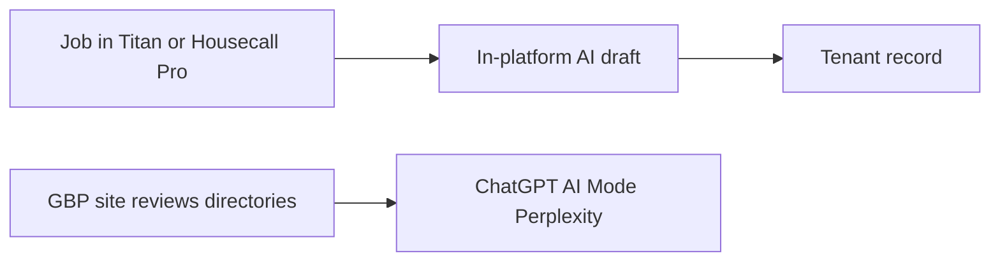

# When ServiceTitan AI Still Leaves You Invisible in ChatGPT

**You stay invisible in ChatGPT after turning on ServiceTitan or Housecall Pro AI because that AI writes inside the tenant — dispatch notes, estimate copy, call logs, review drafts — and answer engines only name shops they can fetch on the open web.** A paid in-platform add-on is an operations tool. It is not a ChatGPT listing, a Google AI Mode source, or a Perplexity citation.

I am **William Spurlock**, founder of **Spurlock Studios LLC**, AI Systems Architect, and Fractional AI CTO. I have shipped **600+ automations** with **500+ live**, logged **20,000+ hours** inside agentic systems, and deleted **35,000+ hours** of client busywork across that book of work. I have been SEO-certified since 2021; the work now sits under AEO, AIO, and GEO. I do not invent a ServiceTitan SKU, a Housecall Pro add-on price, a shop name, or a "we turned on Titan and ChatGPT named us" receipt you cannot open.

This spoke owns one problem: **Why am I still invisible in ChatGPT after turning on ServiceTitan or Housecall Pro AI?** The parent,
[the AI already inside your tools](/blog/the-ai-already-inside-your-tools-and-why-most-owners-never-turn-it-on),
owns the unused-switch audit across Notion, Airtable, HubSpot, Slack, Shopify, and Workspace. The Airtable cut —
[when Airtable AI is enough and when you need an outside agent](/blog/when-airtable-ai-is-enough-and-when-you-need-an-outside-agent) —
is a different product line. I am not retelling either. I am drawing the field-service line: Titan / Housecall Pro AI versus ChatGPT invisibility.

If you still want the five field jobs — dispatch, missed-call follow-up, estimate follow-up, review ask, parts/status — that playbook is
[an HVAC owner's AI agent stack](/blog/an-hvac-owner-s-ai-agent-stack-and-why-it-transfers-to-other-trades).
I will not rebuild it here. This page is visibility, not a second dispatch architecture.

The owner I am writing for already pays for a 7- or 8-figure home-service book and a serious FSM. You did not skip software. You skipped the public layer ChatGPT and AI Mode can actually open.

I will also say this once so the comments stay clean: this is not a hit piece on ServiceTitan or Housecall Pro. Those products run the trucks. I want them on. I want the generate button used with a human review. I want the night-shift phone answered. I do not want you to confuse any of that with being named in ChatGPT.

If a vendor deck showed you a ChatGPT screenshot next to Titan Intelligence, ask where the public URL is.

If there is no URL, the screenshot was a demo prompt with your brand pasted in.

That is not visibility. That is a sales slide.

---

## Why am I still invisible in ChatGPT after turning on ServiceTitan or Housecall Pro AI?

**You are still invisible because ChatGPT search and Google AI Mode retrieve public URLs, maps, and review surfaces — not the job record your tech just saved.** ServiceTitan's own help calls [Titan Intelligence](https://help.servicetitan.com/docs/titan-intelligence-overview) "AI for the trades" that lives on ServiceTitan data. Housecall Pro's help says the [AI Team](https://help.housecallpro.com/en/articles/9311875-ai-team-overview) is "built directly into your account." Both sentences are the tell. Built into the account is the opposite of published to the web.

OpenAI's [ChatGPT Search](https://help.openai.com/en/articles/9237897-chatgpt-search) help is blunt about inclusion: ranking uses several factors, placement is not guaranteed, and you need to let **OAI-SearchBot** crawl a site. Google's [AI features documentation](https://developers.google.com/search/docs/appearance/ai-features) (last updated **10 December 2025**) says a page must be **indexed and snippet-eligible** to show as a supporting link in AI Overviews or AI Mode, and it tells you to keep **Business Profile** information up to date. None of those sentences mention a field-service login.

I run the same stranger test with owners who already flipped the AI add-on. I open a clean ChatGPT or AI Mode session and type the prompt a homeowner actually uses — "best HVAC company near [city] that can replace a 3-ton condenser this week" — without the shop name. If the shortlist is three competitors you already lose jobs to, the add-on did not fail at dispatch. It never had a path into that answer.

| What you paid for | What it does | What ChatGPT can do with it |
| --- | --- | --- |
| **Titan Intelligence / Atlas** | Insights, recommendations, and a conversational sidekick *inside* ServiceTitan ([Atlas help](https://help.servicetitan.com/docs/atlas)) | Nothing, unless a human copies a fact onto a public URL |
| **Dispatch Pro** | Assignment recommendations from Titan Intelligence ([Dispatch Pro](https://www.servicetitan.com/features/pro/dispatch)) | Nothing. The board is not a local pack. |
| **AI estimate name / summary** | Drafts estimate copy in the Field Mobile App ([TI estimate release](https://help.servicetitan.com/release-hub/docs/generate-estimate-names-summaries-titan-intelligence-field-mobile-app)) | Nothing, unless that PDF later becomes a public page — it almost never does |
| **Housecall Pro AI Team** | Reports, coaching, marketing drafts, optional CSR phone/chat ([AI Team overview](https://help.housecallpro.com/en/articles/9311875-ai-team-overview)) | Nothing until a human posts a review reply, a service page, or a GBP update |
| **CSR AI (paid add-on)** | Answers calls and books jobs inside Housecall Pro ([CSR AI](https://www.housecallpro.com/features/ai-team/csr-ai/)) | The call log is tenant data. ChatGPT does not sit on that trunk. |

The failure mode I keep seeing is a category error. The owner bought "AI" the way they once bought "we're on Google." The FSM vendor sold a faster note, a smarter board, a night-shift phone. Those are real. They do not create an entity a retrieval system can corroborate.

How the two systems actually decide who to name is
[how ChatGPT and Perplexity decide which businesses to recommend](/blog/how-chatgpt-and-perplexity-actually-decide-which-businesses-to-recommend).
I am not rewriting those retrieval mechanics. The one-line version for a Titan shop: **if the evidence is behind your login, you are not in the pile.**

There is no arrow from the tenant box to the engine box. That missing arrow is why a shop with a full AI add-on still loses the "who should I call" prompt.

### Two invoices owners treat as one

I make the owner put two invoices on the table. One is the FSM plus the in-platform AI add-on. That invoice buys the board, the job, the estimate, the after-hours ring. The other is the public packet: website, GBP, review destination, directory hygiene. Owners who already write 7- or 8-figure checks for Titan often treat the first invoice as if it covered the second. It never did. The AE did not lie. You asked a visibility question and bought an operations seat.

The mix-up is easy because both invoices say "AI" in 2026. ChatGPT is a consumer product a homeowner already has open. Titan Intelligence is a contractor product your dispatcher already has open. Same word. Different reader. Same week I will hear "we turned AI on" from an owner whose GBP still lists last winter's hours and whose `/services` page is a paragraph copied from the franchise binder.

I also hear the inverse: "ChatGPT is random, so the add-on is the only AI that matters." That is also wrong. ChatGPT Search is not a lottery you cannot affect. OpenAI says placement is not guaranteed. It also says crawl access and relevant public sources are how you get in the pile. Randomness is what you get when the pile has no page with your NAP on it.

A useful split when the office argues:

| If the pain is… | Buy / keep | Do not expect |
| --- | --- | --- |
| Missed calls after 6 p.m. | CSR AI or the Titan voice agent you actually have | A ChatGPT shortlist slot |
| Techs writing empty estimate titles | TI generate name/summary, with a human review | That PDF becoming a citation |
| Dispatcher drowning in the board | Dispatch Pro / Atlas, with a human override | AI Mode naming the shop |
| Homeowners asking ChatGPT who to call | GBP, site, public reviews, third-party URLs | The in-platform add-on to "sync" you there |

I do not need a new vendor to draw that table. I need the owner to stop grading Titan on a ChatGPT exam.

---

## What does in-platform field-service AI actually write, and who can see it?

**It writes operator copy next to the job: assignment suggestions, estimate names and summaries, call notes, report answers, and marketing drafts — and the audience is your dispatcher, your tech, and your office, not ChatGPT.** I will only name modules the vendors publish. If your AE called something else on a pricing call, treat it as "the in-platform AI add-on" until you can open a dated help URL.

ServiceTitan documents three objects I actually see in shops:

1. **Titan Intelligence** as the data engine — insights, recommendations, and features powered by ServiceTitan data ([TI overview](https://help.servicetitan.com/docs/titan-intelligence-overview); marketing page: [Titan Intelligence](https://www.servicetitan.com/features/titan-intelligence)). Data-use toggles sit under **Settings > Titan Intelligence > Data Preferences** ([TI data preferences](https://help.servicetitan.com/docs/titan-intelligence-data-preferences)). That settings screen is about *your* data feeding *their* product. It is not a publish switch.
2. **Atlas** as the chat interface on top of TI. ServiceTitan's [Atlas help](https://help.servicetitan.com/docs/atlas) says TI is the engine and Atlas is the sidekick, available in mobile, Field Pro, Help Center, and some private-preview surfaces. Atlas "may generate inaccurate, incomplete, or outdated responses." You review it inside the app. ChatGPT never gets that transcript.
3. **Estimate name and summary generation** in the Field Mobile App. The [release note](https://help.servicetitan.com/release-hub/docs/generate-estimate-names-summaries-titan-intelligence-field-mobile-app) is specific: the tech taps Generate, picks job summary / forms / estimate items, reviews, then saves onto the estimate. The reader is the office identifying the job. The homeowner may see the PDF. The open web does not.

Dispatch Pro is the same pattern one layer up. The [Dispatch Pro page](https://www.servicetitan.com/features/pro/dispatch) says it uses Titan Intelligence to score skills, recent sales, location, drive time, and predicted job value, then suggests or auto-assigns. The page also prints selected-customer deltas (dispatcher efficiency, ticket size, drive time) with a cohort caveat. I am not repeating those percentages as your forecast. I am repeating the audience: **a dispatcher**. A better assignment is money. It is not a knowledge-graph node.

ServiceTitan's **Max** package is a separate, limited-release story. The [24 June 2026 press note](https://www.servicetitan.com/press/servicetitans-max-drives-ai-powered-growth-for-contractors) describes voice agents that answer inbound calls and an agent that generates quotes in the field. ServiceTitan says Max was still limited release, with locations on Max more than doubling in the fiscal quarter ended **30 April 2026**. If you are not on Max, do not pretend you are. If you are, those agents still write into ServiceTitan. They do not file a GBP update or a city service page.

Pricebook Pro **Smart Recommendations** is another TI-powered object I will name because ServiceTitan published it. The [mobile help](https://help.servicetitan.com/docs/pricebook-pro-smart-recommendations-in-st-mobile) says it suggests commonly sold services and products on estimates and invoices, and that turning off Titan Intelligence data preferences turns off TI-powered features. That is an upsell helper on the tablet. ChatGPT does not read your pricebook.

I do not invent a "Titan Review AI" SKU. If your office uses an in-platform draft for a review reply, treat it as the add-on until you have a dated help URL. The visibility rule does not change with the label. A reply that never lands on a public profile is still a draft.

Housecall Pro is clearer about the teammate names and just as closed:

| Housecall Pro teammate | Vendor-stated job | Who sees the output |
| --- | --- | --- |
| **Analyst AI** | Reports from your real job data ([AI Team overview](https://help.housecallpro.com/en/articles/9311875-ai-team-overview)) | You, in the account |
| **Coach AI** | Hiring and growth advice | You |
| **Marketing AI** | Emails, service descriptions, review responses ("Write it for me") | You, until you paste it onto a public profile or a site |
| **Help AI** | How to use Housecall Pro | You |
| **CSR AI** | Calls, chats, booking; 24/7 phone is a paid add-on ([CSR AI](https://www.housecallpro.com/features/ai-team/csr-ai/)) | Caller + your call log. Not a crawler. |

Housecall Pro's help says Marketing AI, Analyst AI, Coach AI, Help AI, and CSR *chat* ship with the account and default on; **CSR AI 24/7 call answering is the paid exception**. I will not invent that add-on price. I will say this: a booked job in Housecall Pro is a win for the office. It is not a sentence Perplexity can cite.

### Who can see a Titan note

I split the audience on purpose, because owners collapse it:

- **Tech and dispatcher** — the people the vendor built for.
- **Customer** — the estimate PDF, the booking SMS, the invoice. Those are private messages, not indexable pages.
- **Vendor model** — whatever the data-preference checkboxes allow inside that product. That is a privacy setting, not a citation.
- **ChatGPT / AI Mode / Perplexity** — only what later lands on a fetchable URL or a public profile they already read.

If you want a dated rule: OpenAI's academy page on [search and deep research](https://openai.com/academy/search-and-deep-research/) says ChatGPT search pulls from the **public internet**, and it will not replace specialized or proprietary databases. Your FSM *is* that proprietary database.

Atlas help also says conversations may be stored to improve the service and may be shared with third-party providers under ServiceTitan's privacy policy. That is a data-handling sentence, not a distribution sentence. Stored-for-the-vendor is still not indexed-for-the-homeowner.

### What I ask a CSR to show me

When I sit with the office, I do not ask for a feature tour. I ask for four artifacts from last week:

1. **One Atlas or Help answer** a tech actually used on a job.
2. **One generated estimate name** that got saved, plus the human edit if there was one.
3. **One CSR or voice-agent booking** and the call log the office kept.
4. **One Marketing AI or office-written review reply** and the URL where it was posted — or the empty stare when it was not posted.

Items 1–3 almost always exist in a shop that already pays for the add-on. Item 4 is where visibility dies. The writing quality inside Titan can be fine. The publish step never happened.

I do not tell owners to turn the add-on off. I tell them to stop scoring it as a visibility program. Score it as minutes back on the board and cleaner estimate titles. Score ChatGPT on whether a stranger prompt names you.

---

## Which public pages and entities do answer engines read that Titan never publishes?

**They read your Google Business Profile, crawlable service and city pages, matching structured data, public reviews, directories, and third-party listicles — the surfaces Titan and Housecall Pro never emit as public HTML.** ServiceTitan will hold the cleanest job history you have ever paid for. It will not publish a `LocalBusiness` node.

Google is the most explicit of the three engines on local. Search Central's [AI features guide](https://developers.google.com/search/docs/appearance/ai-features) lists the same fundamentals as classic Search, then adds a local line: keep **Merchant Center and Business Profile** information current. Think with Google's [AI Search-era note](https://business.google.com/en-all/think/search-and-video/ai-search-era-brand-authority-strategy/) says generative responses can include local-business information, and that **Google Business Profile** can help those services show in AI responses *and* in other Search results. [GBP local ranking help](https://support.google.com/business/answer/7091) still names relevance, distance, and prominence — including reviews and how often other sites refer to you. Titan is not on that list.

ChatGPT search is a web retrieval product. The [ChatGPT Search](https://help.openai.com/en/articles/9237897-chatgpt-search) article says responses may include inline citations and a Sources panel, and that local-ish queries can use location. The crawl agent is **OAI-SearchBot**. A `noindex` estimate portal, a login wall, and a PDF sitting in a customer's email client all fail that test.

The owner playbook for getting *named* — third-party proof, NAP consistency, answer-ready pages — already lives in
[how to get ChatGPT and Perplexity to recommend your business](/blog/how-to-get-chatgpt-and-perplexity-to-recommend-your-business).
This section is only the Titan-shaped hole in that playbook: **which public objects the FSM never writes for you.**

| Public object | Why an engine can use it | What Titan / Housecall Pro AI does instead |
| --- | --- | --- |
| **Google Business Profile** | Google says AI features and local results use a current profile | Stores the office address for routing. Does not own the GBP. |
| **Service + city pages on your site** | Indexed HTML with a first-sentence answer | Writes the estimate *name* onto the job. Does not ship a `/ac-repair-charlotte` URL. |
| **`LocalBusiness` JSON-LD that matches visible text** | Google wants structured data to match the page ([AI features](https://developers.google.com/search/docs/appearance/ai-features)); [schema.org/LocalBusiness](https://schema.org/LocalBusiness) is the type | Has a customer record. Has no public graph node. |
| **Google / Yelp / BBB reviews** | Third-party sentences a crawler can open | Can draft a reply or send an in-app ask. Public stars only exist after a human (or your review tool) posts them *off* the FSM. |
| **Directories and "best of" pages** | Corroboration ChatGPT and Perplexity can cite | Never files the listing. |
| **News, association, or manufacturer pages** | Named mentions that survive a stranger test | Job notes stay job notes. |

I treat those six as the entity packet a 7- or 8-figure shop still has to maintain by hand, or with a site + GBP program that is not the FSM. Titan Intelligence data preferences will never sprout a Yelp page.

### What "entity" means when the trucks already have a name

An **entity** here is the machine-readable identity of one shop as one thing in the world: same legal name, same phone, same address or service area, same category, repeated on enough public surfaces that a retrieval system can bind them. Titan already has a customer entity. That is not this. ChatGPT is trying to bind *you* as a recommendable business, not bind last Tuesday's water-heater job as a record.

The bind fails in three boring ways I see on almost every 7-figure book:

1. **Name drift.** The trucks say one DBA. GBP says the LLC. The site H1 says a shorter brand. Titan's business unit says a city code. Those are four strings. Models do not get a memo that they are one shop.
2. **Category drift.** GBP primary category is "HVAC contractor." The site sells "comfort solutions." A directory still has you as "appliance repair" from 2019. The stranger prompt is "AC replacement." The engine picks the shop whose public category matches the job.
3. **Proof drift.** The office has 400 five-star notes inside Housecall Pro. Google has 27 reviews, last one 11 months ago. ChatGPT and AI Mode can see the 27. They cannot see the 400.

None of that is a reason to rip out Titan. It is a reason to stop pointing at Titan when I ask "where does a stranger verify you?"

### Google already told you the local objects

I am not inventing a secret AI Mode API. Google published the objects:

- Search Central: indexed, snippet-eligible HTML; structured data matching visible text; current Business Profile ([AI features](https://developers.google.com/search/docs/appearance/ai-features), 10 December 2025).
- Think with Google: generative responses can include local businesses; GBP (and Merchant Center, if you sell products) can help those services show in AI responses and other Search results ([AI Search-era note](https://business.google.com/en-all/think/search-and-video/ai-search-era-brand-authority-strategy/)).
- GBP help: local results lean on relevance, distance, and prominence, including reviews and how often other sites refer to you ([local ranking](https://support.google.com/business/answer/7091)).
- AI Mode local help: when facts are missing online, Google may **call the business** to ask ([AI Mode local availability](https://support.google.com/websearch/answer/17104441)). That is Google treating your public info as incomplete — not Google opening Housecall Pro.

If Google would rather phone you than read your FSM, you do not have a Titan problem. You have a public-facts problem.

### The objects owners keep handing me that are not public

I get these four every time. They feel like "we published." They did not.

1. **The estimate PDF.** Emailed or texted from the job. The customer can open it. Googlebot and OAI-SearchBot cannot find a stable public URL. A PDF behind a signed link is still private mail.
2. **The review that died in the app.** Marketing AI or an office script drafted "thanks for the 5 stars." Nobody posted it on Google. ChatGPT cannot quote a draft.
3. **The CSR call that booked the job.** Revenue. Still a phone call. Google's own [AI Mode local help](https://support.google.com/websearch/answer/17104441) even describes Google *calling businesses* when facts are missing online — which is the opposite of Google reading your Housecall Pro log.
4. **The "we use AI" banner on the homepage.** That is a marketing claim. It is not a service-area fact, a license number, a review corpus, or a reason to be the shortlist.

If your site is a logo, a van photo, and a form, Titan did not fail you. The site did. Answer engines extract sentences. A slogan is not a sentence they can ground.

A service page that works for this job looks boring on purpose:

- **H1** is the job + the city, not a vibe.
- **First sentence** answers who you send, what you replace, and whether you take that call after hours.
- **A short table** of what is included versus what is a change-order — the kind of constraint a model can lift.
- **A visible NAP** that matches GBP.
- **An FAQ block** with real homeowner questions ("Do you pull permits?", "Do you work on [brand]?") and two-sentence answers.
- **JSON-LD** that repeats those facts, not a second invented category.

That is extractable. Your Titan job summary can feed the first draft of those sentences. A human still has to put them on a URL. The generate button in the Field Mobile App does not ship HTML.

---

## How do I keep the ops AI and still become citable in ChatGPT this quarter?

**Keep Titan Intelligence, Atlas, Dispatch Pro, and the Housecall Pro AI Team running for the office. Spend the next 90 days publishing the public packet those tools will never write: GBP, answer-first pages, schema that matches the page, and reviews that leave the platform.** Do not rip out the add-on to "focus on SEO." That is how you lose the board and still lose the prompt.

I run this as two scoreboards on the same Monday.

| Scoreboard | Question | Tool |
| --- | --- | --- |
| **Ops AI** | Did the add-on save minutes or catch a miss on the job? | Titan / Housecall Pro reports you already pay for |
| **AI visibility** | Did a stranger prompt name us, with a reason a human can open? | A frozen prompt panel — see [how to measure AI visibility](/blog/how-to-measure-ai-visibility-the-metrics-that-actually-matter-in-2026) and [how to track citations](/blog/how-to-track-when-ai-tools-cite-or-recommend-your-business) |

If you only watch the first board, you will congratulate the AE and stay off every shortlist.

### Days 1–14 — stop scoring the add-on as a listing

1. **Leave the in-platform AI on.** Dispatch suggestions and estimate drafts are not the enemy. Confusing them with ChatGPT is.
2. **Claim and complete Google Business Profile.** Hours, service area, categories, photos, booking link if you use one. Google's [AI features](https://developers.google.com/search/docs/appearance/ai-features) and [Think with Google](https://business.google.com/en-all/think/search-and-video/ai-search-era-brand-authority-strategy/) both point at a current Business Profile. Titan's company record is not a substitute.
3. **Diff the NAP.** Legal name, phone, address, and service category must match across GBP, the site footer, schema, and the top three directories. A "Titan name" that does not match the GBP name is two entities.
4. **Run ten stranger prompts.** ChatGPT search, one Perplexity pass, one AI Mode pass. City + job + constraint. No shop name in the prompt. Write down who got named and which URL a citation pointed at.
5. **List the five public URLs a stranger could use to prove you exist.** If you cannot name five, you do not have an evidence pile. You have an FSM.

The ten prompts I actually write down — swap the trade and the city, keep the shape:

| # | Prompt shape | Why it exists |
| --- | --- | --- |
| 1 | Best [trade] near [city] | Default shortlist |
| 2 | [Trade] that can [specific job] this week in [city] | Constraint + urgency |
| 3 | Who should I call for [brand] [equipment] in [city] | Brand + skill |
| 4 | [Trade] that pulls permits in [city] | Trust / compliance |
| 5 | Emergency [trade] after hours in [city] | Hours as a public fact |
| 6 | [Trade] for [neighborhood / ZIP] | Distance / service area |
| 7 | Alternatives to [named competitor] in [city] | The list you already lose |
| 8 | [Trade] with recent reviews in [city] | Recency of public proof |
| 9 | Flat-rate vs diagnostic [trade] in [city] | Offer language |
| 10 | Who do homeowners recommend for [job] in [city] | Review-shaped query |

Write the named shops and any source URLs. If you never appear, the add-on is not the next purchase. The public packet is.

### Days 15–45 — publish what Titan will not

1. **One money page per service you actually sell in the cities you actually run.** First sentence answers the query. Hours, license, brands you touch, typical timeline. No doorway spam. Thin city clones get ignored and sometimes punished.
2. **`LocalBusiness` (or the more specific subtype) JSON-LD that repeats the visible NAP.** Google says structured data should match the page. Do not mark up a service you do not offer.
3. **Allow OAI-SearchBot and Googlebot.** OpenAI's search help makes crawl access a condition of inclusion. A security plugin that blocks unknown bots will also block the bot you just paid a content team to impress.
4. **Move the review ask off the tenant.** The ask can still trigger from the job — Housecall Pro and ServiceTitan both know when a job closed. The *destination* has to be Google or the public review site your buyers already read. A 5-star that lives only in the FSM is a private compliment.
5. **Post the Marketing AI / office draft on the public profile, or do not count it.** A reply that never leaves Housecall Pro is still a draft.

I steal usable sentences from last month's jobs — the ones Atlas or TI already drafted — and I rewrite them as public facts. "Replaced a 3-ton condenser, pulled the permit, back in by Friday" becomes a service-page paragraph and an FAQ. It does not become a case study with a customer name. It does not become a dump of the estimate PDF. The job record stays in Titan. The pattern becomes a page.

If you run two brands or a franchise plus an independent book, split the packets. One GBP per location. One NAP per legal entity. Titan business units are not websites.

### Days 46–90 — corroborate, then re-measure

1. **Earn one third-party URL that already ranks for your category.** Manufacturer locator, association directory, local news, a "best of" page that is not a paid dump. One real mention beats twenty farm listings.
2. **Re-run the same ten prompts.** Monthly is enough. Weekly is anxiety. The tracking post owns the scorecard; do not invent a sixth dashboard.
3. **Fix the miss, not the model.** If ChatGPT names a competitor whose GBP is complete and whose service page states the condenser tonnage, copy the *public* pattern. Do not buy a second FSM AI seat.

The miss usually lands in one of four buckets. I write the bucket on the scorecard so the office stops blaming "the algorithm."

| Miss pattern | What I do next |
| --- | --- |
| Never named, competitor always named | Mirror that competitor's public URLs for 60 minutes. Fix GBP and one service page first. |
| Named only when I include my brand | Entity exists. Shortlist proof does not. Reviews + a third-party page. |
| Named with the wrong city or trade | Category / NAP drift. Align strings. Kill the extra category in schema. |
| Named last month, gone this month | Thin evidence. One page changed. Add a second witness URL so a single edit cannot erase you. |

Measurement stays a frozen panel, not a vibe check after a sales meeting. The metrics post owns what "named" versus "cited" versus "recommended" means. The tracking post owns the weekly habit. I will not rebuild those scorecards here.

I will take a side: **for a 7- or 8-figure shop, the in-platform AI add-on is usually worth keeping, and the "we have AI" homepage claim is usually worth deleting.** The add-on returns minutes. The claim returns nothing a crawler can use. Put the hours into GBP, three honest service pages, and a review destination that is not your login screen.

If you want the site layer designed so those pages extract — question headings, first-sentence answers, FAQ blocks, entity-clear schema — that is the AIO/AEO website job. The FSM stays the system of record for the truck. The site becomes the system of record for the prompt.

### What I will not build this quarter

I write this list so the office does not spend the same 90 days on the wrong ticket.

- **A second FSM.** Switching Titan for Housecall Pro, or the reverse, to "get into ChatGPT" is a six-month ops project wearing a visibility costume.
- **A homepage chatbot.** A widget answers people who already found you. It does not put you on the shortlist for people who asked ChatGPT first.
- **A public dump of job PDFs.** That is customer data on a URL. I will not do it, and you should not either.
- **A paid "ChatGPT listing."** OpenAI's search help says placement is not for sale as a guaranteed slot. If someone sold you one, you bought a screenshot.
- **The HVAC agent stack again.** Dispatch, missed call, estimate follow-up, review ask, parts — already written. Wire those jobs if you need them. Do not relabel them as citations.

The 90-day packet is smaller than any of those projects. That is the point. You already paid for the heavy software. The missing work is public and boring.

---

## FAQ

### Do reviews that never leave ServiceTitan or Housecall Pro help ChatGPT recommend my shop?

**No. A review that stays in the tenant is a private CSAT note. ChatGPT and AI Mode quote public review surfaces they can fetch.** Housecall Pro's [Marketing AI](https://help.housecallpro.com/en/articles/9311875-ai-team-overview) will draft a reply. That draft is useful the day someone posts it on Google or Yelp. It is worthless as a ChatGPT signal the day it dies in the job. Trigger the ask from the closed job. Point the homeowner at the public profile. Same rule if your office uses a Titan-adjacent reply draft I will not invent a SKU for: the destination is the public surface, or the review does not exist for retrieval.

### Is Google Business Profile the same entity as my ServiceTitan or Housecall Pro account?

**No. GBP is the public local entity Google tells you to keep current for Search and AI features. Titan and Housecall Pro are the operating system of record for jobs.** They can share a phone number and still disagree on the legal name, the category, or the service area. Engines resolve *you* by matching public facts. A clean Titan customer record does not create that match. Align NAP on GBP first, then force the site and schema to say the same words. If the trucks, the invoices, and the GBP disagree, ChatGPT is not "wrong." It is looking at three shops.

### Do estimate PDFs emailed from a job count as public pages ChatGPT can cite?

**Almost never. An emailed PDF is a message to one customer, not an indexed URL.** ChatGPT search cites pages OAI-SearchBot can crawl. Google AI Mode needs snippet-eligible indexed HTML. Your estimate may be the best writing Titan Intelligence produced this week. It still sits in a thread. If a price range or a service definition belongs on the open web, put it on a service page in prose. Do not expect the PDF to do that job. Do not upload last week's customer estimates to a public `/estimates` folder either — that is a privacy hole, not a citation strategy.

### If my website says we have AI, will ChatGPT name my shop?

**No. "We have AI" is a slogan. Recommendation is retrieval plus corroboration.** OpenAI says there is no way to guarantee placement in ChatGPT Search. Google says there is no special AI schema that buys an Overview or AI Mode slot. A homepage badge that you turned on Dispatch Pro or CSR AI tells a human you bought software. It does not tell an engine you are the shop that replaces condensers in that ZIP. Delete the badge. Write the service sentence. If you want a receipt, keep it operational ("after-hours booking is on") and keep it off the H1.

### Does Housecall Pro AI get me cited when ServiceTitan AI does not?

**No. Both write inside the account. Neither publishes a public entity packet.** Housecall Pro names the teammates in help — Analyst, Coach, Marketing, Help, CSR. ServiceTitan names Titan Intelligence, Atlas, Dispatch Pro, and (for some tenants) Max. The product words differ. The visibility failure is identical: tenant output, login wall, no crawl. Switch FSMs for ops reasons if you must. Do not switch FSMs to get into ChatGPT. I have watched shops migrate and stay invisible because the site and GBP never moved.

### Does a franchise location inherit ChatGPT visibility from the national brand?

**No. The national brand may get named for a generic query. Your location still needs a distinct public footprint.** A franchise site that repeats the corporate paragraph with a city swapped in is a thin page. GBP must be the location, not the franchisor's HQ. Reviews must name the local crew. Schema must carry the local NAP. Independent shops have less leftover brand equity and a cleaner job: one entity, one packet, no corporate template fighting the location. If corporate SEO forbids local pages, you still own GBP and the review destination. That is the floor.

### Can ChatGPT see dispatch notes if I export them to a private spreadsheet?

**No. A private spreadsheet is a second tenant, not a public page.** Exporting Atlas output or Dispatch Pro notes into Google Sheets you did not publish changes nothing about OAI-SearchBot or Googlebot. If you paste a customer name into a public doc, you also created a data incident. Keep job notes in the FSM. Publish only the facts that belong on a service page: what you sell, where, and how a stranger verifies you. A published sheet of job addresses is not "being transparent." It is leaking.

### Should I turn off Titan Intelligence or Housecall Pro's AI Team until the site is ready?

**No. Turn off the fantasy that the add-on is a listing. Leave the ops AI on.** Dispatch recommendations, estimate titles, and after-hours booking are office work. The 90-day public packet is a different workstream: GBP, pages, schema, reviews that leave. Killing TI or the AI Team to "focus on ChatGPT" is how you slow the trucks and still lose the prompt. Run both. Score them on different boards. If a teammate is writing junk into customer-facing PDFs, that is a review-habit problem inside the FSM — not a reason to pause GBP work.

---

## Get the public layer Titan will not publish

The in-platform AI add-on is doing the job the vendor sold: faster notes, a tighter board, a night-shift phone. **ChatGPT, Google AI Mode, and Perplexity are still looking for a shop they can fetch.** If the only clean writing you have lives on a job record, you will keep losing the stranger prompt to the competitor with a complete GBP and three boring service pages.

I build **Premium AIO/AEO websites** for operators who already paid for the FSM and still do not appear in the answer. The offer is the extractable site — question-led service URLs, first-sentence answers, FAQ blocks, entity-clear schema — not a second ServiceTitan seat and not a "we have AI" homepage.

Bring to the call:

- The ten stranger-prompt results (ChatGPT, Perplexity, AI Mode).
- The GBP URL and the three service URLs you think are "done."
- A screenshot of the in-platform AI add-on you already pay for — Titan Intelligence, Atlas, Dispatch Pro, Housecall Pro AI Team, CSR AI, or Max if you actually have it.
- One review that never left the tenant, if you have one. That screenshot ends the argument faster than I can.

If you want that layer built, use [/contact](/contact). I keep the ops AI. I publish the packet it cannot see.

Founder, AI Systems Architect, Fractional AI CTO. SEO-certified since 2021. The job this quarter is not another in-app generate button. It is a short list of public URLs an answer engine can open — while the trucks keep rolling on Titan.
