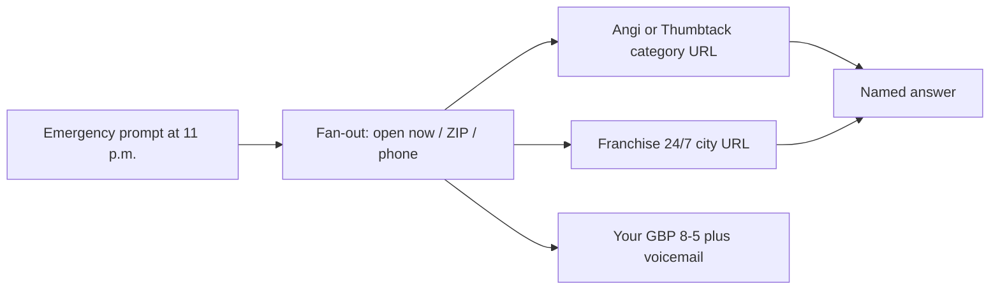

# Why AI Sends the Emergency Call to Angi and the Franchise

**ChatGPT, Perplexity, and Google AI Mode send the after-hours emergency to Angi, Thumbtack, or the national franchise because those entities already publish a machine-readable “open now, we cover this city, here is a phone” record — and your independent shop usually publishes office hours, a voicemail, and a county-wide slogan.** The model is not punishing independents. It is answering “who can take this job tonight” with the densest, least-conflicting record it can fetch.

I am **William Spurlock**, founder, AI Systems Architect, and Fractional AI CTO. I have been SEO-certified since 2021; the work now sits under AEO, AIO, and GEO. I have shipped **600+ automations** with **500+ live**, logged **20,000+ hours** inside agentic systems, and deleted **35,000+ hours** of client busywork. I do not invent shop names, lead prices, or marketplace fees. I will tell you why the 11 p.m. burst-pipe prompt names a directory or a franchise instead of the 7–8 figure HVAC, plumbing, or electrical shop that actually owns the trucks.

This spoke sits under [how to get your local business into AI-generated recommendations](/blog/how-to-get-your-local-business-into-ai-generated-recommendations). That page owns NAP, citations, and the generic “get named in the city.” The city-wide stack lives in [AI visibility for local businesses](/blog/ai-visibility-for-local-businesses-getting-recommended-in-your-city). I am not rewriting either. **This page owns one failure: the after-hours / emergency query.**

If you want the typed recommend-me playbook, use [how to get ChatGPT and Perplexity to recommend your business](/blog/how-to-get-chatgpt-and-perplexity-to-recommend-your-business). If you want AI Mode as a conversation, use [Google AI Mode explained](/blog/google-ai-mode-explained-how-to-rank-when-search-becomes-a-conversation). The five-job HVAC agent stack — dispatch, missed-call follow-up, estimate follow-up, review ask, parts/status — is [an HVAC owner’s AI agent stack](/blog/an-hvac-owner-s-ai-agent-stack-and-why-it-transfers-to-other-trades). **That is the ops stack. This is the answer-engine problem.** Wiring a missed-call text does not put your name in ChatGPT at 11 p.m.

---

## Why does ChatGPT or Google AI Mode send the after-hours emergency to Angi or the national franchise instead of my shop?

**It sends the job there because the emergency prompt is a retrieval problem, not a “best plumber in town” beauty contest — and Angi, Thumbtack, and the franchise already look like the only entities that are open, licensed, and reachable right now.** Your Maps rank at 2 p.m. on a Tuesday does not transfer to “emergency plumber open now near [ZIP]” inside ChatGPT, Perplexity, or [Google AI Mode](/blog/can-local-businesses-show-up-in-google-ai-mode-yes-here-s-how).

Google describes AI Mode as a **query fan-out**: it splits one question into subtopics and searches them at the same time, then writes one answer from those fetches ([Google Search Help](https://support.google.com/websearch/answer/16011537)). An after-hours emergency fan-out is ugly for an independent:

- Who is open *now*, not Monday–Friday 8–5?
- Who actually serves this ZIP, not “the metro”?
- What phone gets a human, not a mailbox?
- Who has a page that states those three facts in one crawlable block?

Angi already built a page for that shape. Their [emergency plumbers near-me hub](https://www.angi.com/nearme/emergency-plumbers/) asks for a ZIP and matches “up to 3 pros.” Their [how Angi works](https://www.angi.com/landing/how-it-works) page says homeowners request quotes or book, and that **service professionals pay to advertise**. I will not invent a dollar-per-lead. The mechanism is enough: the marketplace is a national emergency landing page with local slots.

A franchise does the same job with branded city URLs. Roto-Rooter’s [24-hour emergency plumbing page](https://www.rotorooter.com/plumbing/emergency-plumber/) says they are available **24/7, 365 days a year**. The [Chicago emergency plumber URL](https://www.rotorooter.com/chicago/emergency-plumber/) repeats “Open 24/7” and names Cook County. That is a fetchable record. Your homepage that says “family owned since 1998” is not.

| Record the engine needs | Marketplace (Angi / Thumbtack) | National franchise | Typical independent |
|---|---|---|---|
| Open *now* | Category page + pro hours, written for “emergency” | 24/7 / 365 copy on a national URL and city URLs | GBP set to Mon–Fri 8–5; Saturday closed |
| Service area | ZIP form. “Near you” is the product | City + county page (“across Cook County”) | “We cover the metro” in the hero, no ZIP list |
| Phone that answers | Marketplace connect or a national 800 | National 800 plus a local number on the city page | Office line that becomes voicemail at 5:01 |
| Entity density | One brand, thousands of city/category URLs | One brand, a template on every city | One site, one about page, three mismatched directories |
| Confidence | Clean, repeated, national | Clean, repeated, national | NAP drift + “call us anytime” that the hours contradict |

ChatGPT with search and Perplexity are not reading your truck wraps. They fetch pages. Perplexity will show the URL. ChatGPT will name whoever those pages make easy to say in one sentence. GPT-6 Astra, Claude Sonnet 5, Gemini 3.8 Flash, and Grok 4.6 do not invent a 24/7 independent that never published 24/7.

Google will go further. In supported cases, [AI Mode can check local availability and pricing](https://support.google.com/websearch/answer/17104441) by gathering web facts — and **calling businesses when the facts are not online**. If your after-hours line is a mailbox, that call is a miss. The next shop in the fan-out is the franchise 800 or the Angi match form.



I think the independent loses this query **before** the homepage loads. The shortlist is built from records. If you want the generic “can a local shop appear in AI Mode” answer, that is already written. Come back here when the query has the words **emergency**, **after hours**, **burst**, **no heat**, or **open now**.

### What each engine actually fetches on an emergency prompt

**The three engines do not share a ranking formula, but they share a hunger for an open-now record they can quote without arguing with itself.** I score them as three different retrieval styles, not as “AI search.”

| Engine | What I see it do on emergency prompts | Why Angi or the franchise is easy | Why you disappear |
|---|---|---|---|
| **Google AI Mode** | Fan-out plus Maps/Knowledge Graph; may [call the business](https://support.google.com/websearch/answer/17104441) when the web is thin | Category hubs + 24/7 city URLs + a phone that completes | GBP says closed; the call hits voicemail; the next row in the fan-out wins |
| **ChatGPT** (search on) | Fetches a handful of pages and names the ones it can say in one sentence | Angi / franchise titles already contain “emergency” and “24 hour” | Your title is “about us.” Your hours live in an image. |
| **Perplexity** | Shows the source list. The winner is usually a URL it can open, not a vibe | Marketplace and franchise URLs are public, fat, and dated | A JS-only hours widget is not a document. |

Reviews do not rescue a closed clock. A 4.9 with 800 reviews and Saturday marked closed is still closed. I have watched Perplexity cite the Angi emergency hub and a franchise city page in the same answer while the independent — the one the homeowner actually wanted — never appears in the source rail. That is not a review problem. That is a missing after-hours document.

The control prompt matters. If “is [Your Shop] open tonight in [ZIP]?” returns a hedge or a wrong close time, you do not have an entity problem. You have a **hours-record** problem. Fix that before you argue about city-wide recommendations.

---

## What “always open / we cover the city” claims do marketplaces and franchises publish that you do not?

**They publish a specific open-now claim, a specific geography, and a specific next action on a URL that exists for that intent — you usually publish a vibe.** “Family owned,” “we’re local,” and “call anytime” are not claims an answer engine can check at 11:07 p.m. “Available 24/7, 365, Cook County, 1-800-…” is.

Angi does not need to be a plumber. Angi needs to be the **page a panicked homeowner already types**. The emergency-plumber hub is a match form: ZIP in, “up to 3 pros” out. Their how-it-works page also sells instant booking and upfront pricing for some categories, plus a Happiness Guarantee. Whether your shop is even in that match set is a paid-pro question. The page still wins the *query*, because the query was “get me someone tonight,” not “name the independent I used in 2019.”

Thumbtack publishes the same shape from the other side of the counter. The [Thumbtack Pro](https://www.thumbtack.com/pro) page (copyright 2026) says there is **no subscription fee**, that the customer picks you, and that you pay when you get a lead you chose to pursue. I will not invent Instant Book as a current product — Thumbtack’s own community staff said Instant Book was rolled back in **2024** and that matching after that is by day, not by hour ([Thumbtack Community](https://community.thumbtack.com/discussion/2199/blocking-just-a-time-period-not-the-entire-day-on-the-calendar)). The profile still carries **business hours** a customer (and a crawler) can see. That is enough for “available nearby pro” even if you never bought a lead this month.

Franchises publish the claim you are afraid to write because you would have to staff it:

- **Always-on hours.** Roto-Rooter’s emergency URL is literally titled “24 Hour Emergency Plumbing” and repeats 24/7/365.
- **City coverage, not a slogan.** The Chicago page names the city, the county, and building types. That is `areaServed` in prose.
- **A phone that is allowed to be national.** 1-800-GET-ROTO sits on the national page; a local number sits on the city page. Both resolve to dispatch.
- **A same-sentence promise.** “Licensed,” “insured,” “nights and weekends,” “no extra charge for holidays” — whether you like the marketing or not, it is extractable.

| Claim they publish | Where it lives | What you usually publish instead | What the model hears |
|---|---|---|---|
| 24/7 / 365 / nights and holidays | Franchise emergency URL; some marketplace category copy | “Call anytime” in the footer, GBP closed Saturday | Closed. Pick the open one. |
| We cover this city / county | Franchise city URL; Angi ZIP matcher | “Greater [metro] and surrounding areas” | Geography too vague. Prefer the ZIP form. |
| Book or match in this session | Angi quote / book; Thumbtack request | “Request a quote” that emails the office | No one is reachable tonight. |
| Licensed + screened + badge | Angi Approved copy; Google Verified on Local Services Ads | A license number buried in the footer | The badge entity is easier to trust in one pass. |
| One brand, many local URLs | rotorooter.com/chicago/… | One URL trying to rank for 40 towns | The city URL wins the city prompt. |

Do not copy the lie. If you are on-call, not staffed 24/7, **say on-call**. If you only roll trucks inside a 20-mile ring, **list the ZIPs**. If Saturday is on-call and Sunday is dark, **publish that**. The franchise wins because the claim is specific. You lose when your claim is both vaguer *and* louder than the hours on your [Google Business Profile](https://support.google.com/business/answer/15300403).

I would rather lose the 2 a.m. job I cannot take than win it in ChatGPT and send a human to a mailbox. False 24/7 is how you get the one-star “they never came” review that then poisons the daytime queries too.

### The three claim stacks I actually see

**Marketplaces sell a match. Franchises sell a 24/7 brand. Independents sell a personality. Only the first two are shaped like an emergency answer.** I do not need you to become a franchise. I need you to publish the third stack as facts.

**Marketplace stack (Angi, Thumbtack):**

- A national URL already titled for the job (“emergency plumbers,” “HVAC,” “electrician”).
- A ZIP or city field. Geography is a form, not a paragraph.
- A next action that does not wait for Monday: match, request, or book.
- Pro-side hours on a profile the marketplace, not you, hosts.
- Screening language (Angi Approved, background checks) that a model can lift as trust copy.

**Franchise stack (Roto-Rooter is the one I can quote):**

- A national emergency URL that repeats 24/7/365.
- A city URL that repeats the same claim and names the county.
- A national 800 and a local number that both mean dispatch.
- Service lists a panicked person recognizes: burst pipe, backup, no heat, no cool.
- The same sentence on every city. Density is the strategy.

**Independent stack (what I keep finding):**

- Hero: “Your neighbors’ HVAC / plumbing / electrical company.”
- Hours: in the footer, or only on GBP, or only as a JPEG of the van.
- Area: “Greater [metro] and beyond.”
- Phone: the office line. After 5, a 90-second greeting and a “leave a message.”
- Emergency: a sentence on the homepage that contradicts Saturday “Closed.”

The fix is not “sound more national.” The fix is to steal the **shape** of the franchise card — hours, geography, phone, next action — and fill it with the truth of your shop. If the truth is “on-call 5 p.m.–10 p.m., ZIPs 49855 and 49801, this number,” that card still beats a marketplace paragraph that cannot name *you*. A card that says 24/7 when you are in bed will get you named once and reviewed into a hole.

I do not need you to out-publish Angi on every category hub. You will not. I need one URL that is more specific than their hub for *your* ZIPs and *your* clock. Specific beats national when the facts are true. National beats specific when your facts are missing.

---

## How do I make emergency hours, service area, and dispatch phone machine-readable without lying?

**Publish three matching facts — when a human answers, which ZIPs you roll, and which number to dial — on GBP, on one emergency URL, and in LocalBusiness schema, using the hours you actually staff.** Do not type yourself as a fire station. Do not set Saturday to 00:00–23:59 because a franchise did.

Google’s own Business Profile hours article tells you to keep a normal week in **main hours**, use [Special hours](https://support.google.com/business/answer/6303076) for a holiday or a stretch of **six days or fewer**, and use **More hours** when a service runs on a different clock than the office (their examples are senior hours, delivery, takeout). The [Business Information API](https://developers.google.com/my-business/reference/businessinformation/rest/v1/locations) stores `regularHours`, `specialHours`, `moreHours`, `serviceArea`, and `phoneNumbers` as separate fields. If main hours say closed and the hero says “24/7 emergency,” you taught the machine to distrust you.

On the site, use the most specific [schema.org LocalBusiness](https://schema.org/LocalBusiness) subtype you actually are. [HVACBusiness](https://schema.org/HVACBusiness) is “a business that provides Heating, Ventilation and Air Conditioning services” — schema.org’s own page still showed that definition against Google’s **August 2026** index snapshot. [Plumber](https://schema.org/Plumber) and [Electrician](https://schema.org/Electrician) exist for the same reason. Google’s [Local Business structured data](https://developers.google.com/search/docs/appearance/structured-data/local-business) (updated **2026-09-08**) tells you to pick the most specific subtype, put a real `telephone` with country code, and spell hours with `OpeningHoursSpecification`.

**Do not mark an HVAC shop as `EmergencyService`.** Schema.org’s [EmergencyService](https://schema.org/EmergencyService) type is “an emergency service, such as a fire station or ER.” That is a firehouse. It is not your on-call tech. Lying in `@type` is the structured-data version of putting 24/7 on a closed Saturday.

Use two clocks when you have two clocks:

| Clock | What it means | Where it should live | What I refuse to publish |
|---|---|---|---|
| Office / showroom | Humans at desks, estimates, walk-ins | GBP main hours; `openingHoursSpecification` on the LocalBusiness | 24/7 because the answering service exists |
| On-call / emergency | A dispatcher or owner will pick up and may roll a truck | One `/emergency` (or `/after-hours`) URL; `ContactPoint` with `contactType` plus `hoursAvailable`; GBP More hours *only* if Google offers a matching type | “Open 24 hours” when you mean “we will call you back in the morning” |
| Holiday / storm exception | Closed, or shorter, for a dated window | GBP Special hours; `specialOpeningHoursSpecification` with `validFrom` / `validThrough` | A leftover Christmas closure still sitting on the profile in March |
| Service area | ZIPs or towns you actually dispatch | GBP `serviceArea`; `areaServed` as named places, not “the metro” | Forty towns you drive past on the highway |

[OpeningHoursSpecification](https://schema.org/OpeningHoursSpecification) is the typed hours object: `opens`, `closes`, `dayOfWeek`, optional `validFrom` / `validThrough`. Schema.org is explicit: if `closes` is earlier than `opens`, the range spans midnight. Google’s local-business doc gives the 24-hour pattern as `opens: "00:00"` and `closes: "23:59"`, and the closed-all-day pattern as both `00:00`. Use those only if they are true.

The dispatch phone is a field, not a footer flourish. Google wants `telephone` as the **primary contact method**. If the number on the homepage, the GBP, the emergency page, and the schema disagree, you recreated the NAP problem the parent spoke already covers — except this time the conflict is “who do I call at night.” One number. A human or a live answering service. If after-hours is a different number, say so on the emergency URL and in a `ContactPoint`. Do not hide it in a PDF.

I write the emergency URL like a card the model can lift. No brand poetry. No “we’ve got your back.” The page has to survive a stranger test at 11 p.m.:

```text
Write a 200-word emergency service page for an independent [HVAC / plumbing / electrical] shop.
Facts you may use (do not invent others):
- Legal name:
- Dispatch phone (E.164):
- Office hours:
- On-call hours (or “no overnight dispatch”):
- ZIPs or towns we roll:
- What counts as emergency (list):
- What waits until morning (list):
- After-hours fee: state only if we publish it; otherwise write “ask when you call.”
Rules:
- First sentence answers “are you available tonight in [city]?”
- Do not say 24/7 unless office hours and on-call hours are both 00:00–23:59.
- Do not say we cover the metro. Name the ZIPs.
- Do not use EmergencyService schema. Use HVACBusiness, Plumber, or Electrician.
- Include a 6-row FAQ that repeats the phone and the on-call window.
```

That page, the GBP fields, and the JSON-LD have to agree. If they disagree, ChatGPT will believe the marketplace page that does not disagree with itself.

### Publish order I actually use

**I fix the clock, then the map, then the phone, then the page, then the schema. Reversing that order is how you get pretty JSON-LD on a closed Saturday.** This is a one-week job for a shop that already knows its on-call rules. If you do not know the rules, write them on paper before anyone touches GBP.

1. **Write the truth in one box.** Office hours. On-call hours. Dark hours. ZIPs. Dispatch number. What is an emergency. What waits. If the owner and the CSR disagree, stop. The model will pick a side for you, and it will pick the wrong one.
2. **GBP main hours = the door.** [Edit hours](https://support.google.com/business/answer/15300403) until Saturday closed means Saturday closed. Use Special hours for the holiday week you are actually dark. Google is explicit: special hours need main hours set to “Open with main hours,” and a special-hours block cannot exceed 24 hours — split midnight ranges across two dates.
3. **More hours only if the type exists.** Google’s examples are senior, delivery, takeout. If there is no honest after-hours type for your category, do not jam emergency into a takeout slot. Put it on the site and in a `ContactPoint`.
4. **Service area is a list, not a boast.** If you are a service-area business, GBP already has `serviceArea`. Mirror it as named towns or ZIPs on the emergency URL. “We cover the city” is what the franchise already said with a county name.
5. **One dispatch phone, E.164 in schema.** Same digits on GBP, the emergency URL, and `telephone`. If after-hours is a different number, say so in a sentence a crawler can read: “After 5 p.m. call +1-… (on-call). Before 5 p.m. call +1-… (office).”
6. **Ship the emergency URL.** First sentence answers “are you available tonight in [city]?” H2s for hours, area, what counts, what waits, the number. A six-row FAQ that repeats the phone. No hero video that is the only place hours appear.
7. **Mark it up last.** `@type` HVACBusiness, Plumber, Electrician, or an array if you are honestly two trades — Google’s local-business doc allows `["Electrician", "Plumber"]`. `openingHoursSpecification` for the office. `ContactPoint` + `hoursAvailable` for on-call. `areaServed`. `specialOpeningHoursSpecification` when a dated closure exists. Test it in the [Rich Results Test](https://search.google.com/test/rich-results). If the test and the visible page disagree, the page is wrong.

| Field | Honest value | Lie I will not ship |
|---|---|---|
| `@type` | `HVACBusiness` / `Plumber` / `Electrician` | `EmergencyService` (fire station / ER) |
| `openingHoursSpecification` | Office clock, including closed days | 00:00–23:59 because a franchise did it |
| `ContactPoint.hoursAvailable` | On-call window + the night number | A second 24/7 block that the office schema already denied |
| `telephone` | The number a human answers | A tracking number that only lives in ads |
| `areaServed` | Named ZIPs or towns you dispatch | “United States” or forty towns from a radius tool |

Common lies I will not ship, even if a competitor did:

- `EmergencyService` on a trades shop. That type is a fire station or ER.
- 00:00–23:59 on a shop that sleeps.
- Forty towns in `areaServed` because the tech once drove through them.
- A second phone on the emergency page that is not on GBP.
- “No extra charge after hours” when the invoice always has one. If you charge it, say “ask when you call” or publish the rule. Do not invent a dollar amount in schema that is not on the page.

If you cannot staff a night answer, publish that too. “Office 8–5. No overnight dispatch. For burst pipes after 5, shut the water and call at 8.” That sentence will not win the 11 p.m. job. It will stop ChatGPT from sending you a job you will miss, and it will keep the daytime entity clean. Losing a job you cannot take is cheaper than winning it in an answer engine and failing it in a driveway.

---

## How do I audit an emergency query this week and see who won the answer?

**Freeze ten after-hours prompts, run them after close in ChatGPT, Perplexity, and Google AI Mode, and score who got named — you, a franchise, Angi, Thumbtack, or “none.”** Do not audit “best HVAC in [city].” That is a different post. This week’s panel is the job that ruins someone’s basement.

I treat this as a thin slice of [how to track when AI tools cite or recommend your business](/blog/how-to-track-when-ai-tools-cite-or-recommend-your-business). That spoke owns the weekly citation panel. Here I only own the **emergency** rows.

Run the panel **after your published close**, from a phone on cellular if you can, with location on. Incognito is not a personality. It is a way to avoid your own brand cookies. Save the date, the engine, the verbatim prompt, the names in order, and the source URLs Perplexity or AI Mode showed.

Use prompts a homeowner actually says. Not “AEO for trades.” Write them in the language of the trade you run. HVAC, plumbing, and electrical do not share one emergency noun.

| Trade | Prompts I actually run | Words that pull a franchise or Angi | Words that pull a daytime shop |
|---|---|---|---|
| HVAC | no heat tonight, AC died at 11pm, furnace emergency [ZIP] | 24-hour, after hours, no heat, emergency HVAC | tune-up, maintenance plan, new install |
| Plumbing | burst pipe, water in the basement, emergency drain [city] | burst, backup, 24 hour plumber, open now | water heater quote, remodel, fixture |
| Electrical | sparking panel, no power after hours, emergency electrician [ZIP] | sparking, no power, 24-hour electrician | EV charger, lighting, panel upgrade |

If your panel is all “best plumber near me,” you audited the city-recs spoke again. I want the nouns that mean **tonight**.

1. Emergency plumber open now near [your ZIP].
2. After-hours HVAC no heat [city] tonight.
3. Burst pipe [neighborhood] who do I call right now.
4. 24-hour electrician [city] [ZIP].
5. My AC died at 11pm [suburb] — who is actually open.
6. Emergency drain cleaning [city] after hours.
7. Is there a plumber who will come out tonight in [ZIP]?
8. Same prompt out loud in ChatGPT Voice (see [when someone asks ChatGPT out loud](/blog/can-your-business-show-up-when-someone-asks-chatgpt-out-loud)).
9. Google AI Mode: “I have water in the basement in [ZIP], I need someone tonight.”
10. Repeat #1 with your shop name plus “are they open?” as a control.

| Score | What you write down | What it means this week |
|---|---|---|
| **You (recommend)** | Your legal name plus a phone or URL | Keep. Screenshot the sources. |
| **You (mention)** | Name only, no way to call | The entity resolved. The emergency record did not. |
| **Franchise** | Roto-Rooter, Neighborly brand, national 800 | They published 24/7 + city. You did not. |
| **Angi / Thumbtack** | Directory named, or “check Angi,” or a match form | The marketplace page won the fan-out. |
| **Google Verified / LSA leftover** | A Local Services profile, not your organic URL | Paid/verified inventory, not your emergency page. |
| **None / generic advice** | “Shut the water off and call a plumber in the morning” | No entity had a trustworthy open-now record. |

Three nights is enough to see a pattern. One lucky ChatGPT reply on a Wednesday afternoon is not an audit.

If AI Mode offers **Check for me**, let it. Google’s help page says web results can take a few minutes and **calls can take up to 30 minutes** when the facts are not online. That call *is* the audit of your dispatch number. If they cannot reach a human, you were not a candidate. I do not care what your homepage said.

What I change after a losing week, in this order:

1. **GBP main hours match the door.** Special hours for the holiday you are actually closed. No leftover Christmas X.
2. **One emergency URL** with the on-call window, ZIP list, and dispatch phone in the first 80 words.
3. **Schema that matches that URL.** HVACBusiness / Plumber / Electrician. `telephone`. `areaServed`. Hours objects. No `EmergencyService`.
4. **NAP on the night number.** Same digits on GBP, the emergency URL, and the schema. The parent NAP spoke still applies; the conflict here is the after-hours line.
5. **Re-run the ten prompts.** If Angi still wins, you are looking at a density fight, not a missing H1. That is a longer site job, not a new slogan.

I do not buy a marketplace lead to “show AI I exist.” Paying Angi or Thumbtack may get you jobs. It does not write your hours. If you buy the lead and still publish 8–5 plus voicemail, the engine can keep naming the marketplace instead of you — because the marketplace page is still the better emergency record.

### The three-night runbook

**Night one is a baseline. Night two is after you fix the obvious contradiction. Night three is after the emergency URL is live.** I do not wait thirty days for a mythical retraining. ChatGPT and Perplexity can fetch a new public URL once it is crawlable. Google AI Mode can still be slower if Maps and the Knowledge Graph still hold Saturday-closed. That is why I keep the engines in separate columns.

**Night 1 — do not change anything.** Run the ten prompts. Fill the score table. Save source URLs. If you are named, write *which* URL they used. If they used your homepage, you got lucky. If they used a directory you do not control, you do not own the win.

**Night 2 — contradictions only.** Align GBP main hours with the door. Delete the leftover holiday special hours. Make the homepage hours sentence match GBP. Re-run prompts 1, 2, 5, and 9. If the franchise still wins and your hours still say closed, you have not built an emergency record yet. You only stopped lying.

**Night 3 — the emergency URL is indexed enough to fetch.** Confirm the URL opens logged-out. Confirm the first 80 words contain hours, ZIPs, and the phone. Confirm schema validates. Re-run the full ten. Add the Voice pass. Add the AI Mode “Check for me” pass if it appears.

| Night | Allowed change | Pass | Fail |
|---|---|---|---|
| 1 | None | You have a scorecard, not a feeling | You audited “best HVAC” at noon |
| 2 | Hours + NAP digits only | “Are they open?” stops inventing Saturday | Angi still wins and you still have no emergency URL |
| 3 | Emergency URL + schema live | Your name appears with *your* URL or phone | Franchise/Angi still win — density fight, book the site job |

What I refuse to count as a win:

- Your shop in a list of five with no phone.
- A Google Verified Local Services unit you are paying, when the organic emergency URL never appears.
- ChatGPT naming you on the branded control prompt only.
- A Perplexity source rail that cites Angi and “also mentions” you in a clause.

What I do count:

- Unbranded emergency prompt. Your legal name. A phone or a URL a stranger can use. At least one engine, twice in the week.

If night three is still Angi / franchise / none, stop tweaking H1s. The missing object is usually one of: a live answer on the night number, a ZIP list that matches where you actually roll, or a page that is not the homepage. That is a site build. It is not a new slogan on the van.

I also keep a “do not touch this week” list so the audit stays about the emergency record:

- Do not rewrite the homepage hero.
- Do not buy an Angi or Thumbtack package “for AI.”
- Do not turn on a 24/7 GBP flag you will not staff.
- Do not rebuild the dispatch agent. That is the other post.
- Do not add a tenth directory login. One emergency URL beats five new citations that still say 8–5.

---

## FAQ

### Is 24/7 the same as on-call when ChatGPT or Google AI Mode picks a shop?

**No. 24/7 means a staffed line and a truck you will roll; on-call means a human will answer and then decide.** Publish the one you staff. Schema.org and Google both have a real 24-hour pattern (`00:00` to `23:59`). If you use it for an owner who silences the phone after 10, you taught the model a lie. On-call copy should name the window and the number. That is still a better emergency record than “call anytime” on a closed GBP.

### Does an after-hours voicemail kill the emergency recommendation?

**It often does, especially in Google AI Mode, because the engine may call and treat no answer as “not available.”** [AI Mode’s local check](https://support.google.com/websearch/answer/17104441) will gather web facts first and call when the facts are missing. A mailbox is a failed check. ChatGPT and Perplexity cannot hear the mailbox, but they can read “open until 5” and skip you. A live answering service with a written on-call rule is a record. A 90-second greeting is not.

### Why does a national franchise beat an independent shop on the same street?

**Because the franchise published a city URL that says 24/7 and names the county, and you published a homepage that says you are local.** Roto-Rooter’s Chicago emergency page is the example I can cite without inventing a client: open 24/7, Cook County, local number plus a national brand. The independent two streets over may be faster tonight. The model cannot know that if the only crawlable after-hours object is the franchise page. This is not a morality tale. It is a record-density tale.

### Does Thumbtack win emergency queries even if I never buy a lead?

**It can win the query as a category page even when you are not the pro who paid.** Thumbtack’s public Pro pitch is still “customers pick you” and “you pay for the lead,” with no subscription required. Instant Book is not something I will treat as current after their 2024 rollback note. The remaining object is a pro profile with visible business hours plus a national “find a pro” URL. That URL is what ChatGPT can name when your own emergency URL does not exist.

### Does the old Google Guaranteed badge still decide after-hours answers?

**No. Google retired Guaranteed as the Local Services badge and moved eligible advertisers to Google Verified.** Google’s [August 20, 2025 Ads blog](https://blog.google/products/ads-commerce/google-verified-august-2025/) said Verified would replace Guaranteed, Screened, License Verified, and the Money Back Guarantee, with the change starting in October 2025. [Local Services Help](https://support.google.com/localservices/answer/9376654) told existing advertisers the new badge would apply automatically after screening. A leftover “we’re Google Guaranteed” sentence on your site is stale copy. It is not an emergency hours record, and it is not a reason ChatGPT should skip Angi.

### Does NAP still matter when the query is an emergency, not a brand search?

**Yes — and the night number is now part of NAP.** The parent recommendations spoke still holds: mismatched Name, Address, and Phone make you look like three businesses. For an emergency prompt, a fourth mismatch shows up: the dispatch line. If GBP, the emergency URL, and schema show three different phones, the model has no clean call target. It will take the franchise 800 or the Angi form. I am not restating the full citation playbook. I am telling you the after-hours digit has to match.

### What happens when someone asks ChatGPT out loud for an emergency plumber?

**The spoken shortlist gets shorter, so the marketplace or franchise name is even more likely to be the only name that survives.** [ChatGPT Voice](/blog/can-your-business-show-up-when-someone-asks-chatgpt-out-loud) is not a second website. It is a shorter recommendation channel on the same evidence pile. A driver standing in a flooded basement gets one or two pronounceable names. “Check Angi” and “Roto-Rooter” are easy to say. Your legal name plus a confusing DBA is not. If you cannot win the typed emergency prompt, you will not win the spoken one.

### Should I pay Angi or Thumbtack so AI will start naming my shop?

**Pay them if you want marketplace jobs. Do not pay them as an AI-visibility strategy, and do not treat a lead fee as a citation.** Angi says pros pay to advertise; Thumbtack says you pay when you pursue a lead. Fees move, and I will not invent a number. Buying the lead does not write your on-call hours, your ZIP list, or a dispatch phone that answers. If you skip those three facts, ChatGPT can keep sending the *query* to the marketplace while you rent the leftover jobs. Fix the record first. Then decide if the marketplace is still worth the invoice.

---

## Get an emergency record answer engines can name — then staff the number you published

A 7–8 figure independent shop does not lose the after-hours job because Angi is magic. It loses because Angi, Thumbtack, and the franchise already published the only crawlable answer to “who is open in this ZIP tonight.” Your missed-call agent can save the ring you already earned. It cannot put your name in the answer if the record says you closed at 5.

I build **Premium AIO/AEO websites** for operators who want that record designed in: an honest emergency URL, GBP hours that match the door, LocalBusiness schema that does not pretend you are a fire station, and a phone a Google AI Mode check can actually complete. The offer is the site — not a Thumbtack budget, not a franchise conversion, and not a fake 24/7 badge.

If you want an AI-visibility-ready site built so the 11 p.m. prompt can name you without lying, use [/contact](/contact). Bring last week’s ten-prompt scorecard if you ran it. If you did not, we write the panel on the call before anyone talks about directories.

SEO-certified since 2021. Founder, AI Systems Architect, Fractional AI CTO. The job this month is not a better slogan. It is a night-time record — hours, ZIPs, and a number that picks up — that ChatGPT, Perplexity, and Google AI Mode can fetch without inventing a franchise.
