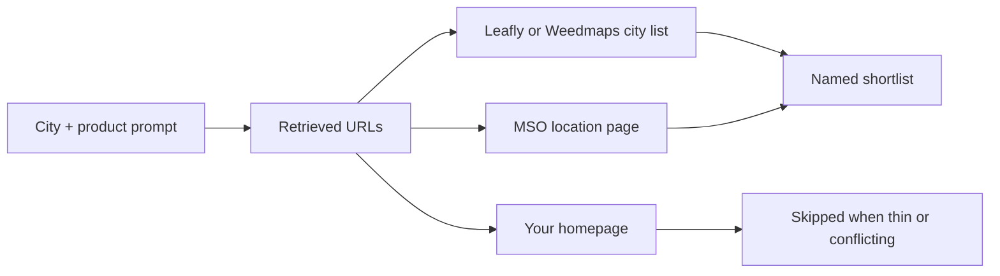

# Why ChatGPT Names the MSO Instead of Your One-Door Shop

**ChatGPT recommends the MSO, the Leafly list, or Weedmaps instead of your one-door dispensary because those entities already exist as dense, repeatable records — store locators, city listicles, menus, filings, and Wikipedia-scale mentions — while your licensed shop often exists as one homepage and three disagreeing directory rows.** The model is not punishing independence. It is naming the URL it can verify.

I am William Spurlock — Founder, AI Systems Architect, and Fractional AI CTO. I have built 600+ automations, with 500+ still live. I have spent 20,000+ hours architecting agentic systems, those builds have saved clients 35,000+ hours of busywork, and the public work sits on ~500M+ impressions. I have been SEO-certified since 2021; the work now sits under AEO, AIO, and GEO. I do not invent shop names, ticket counts, or referral percentages here. I will tell you what I actually see when a licensed one-door owner pastes a city + product prompt into ChatGPT, Perplexity, or Google AI Mode and watches a chain or a marketplace answer first.

This spoke owns one problem: **Why does ChatGPT recommend the MSO or Leafly list instead of my one-door dispensary?** The parent action plan is [how to get ChatGPT and Perplexity to recommend your business](/blog/how-to-get-chatgpt-and-perplexity-to-recommend-your-business). Engine mechanics live in [how ChatGPT and Perplexity actually decide which businesses to recommend](/blog/how-chatgpt-and-perplexity-actually-decide-which-businesses-to-recommend). City-wide local recs live in [AI visibility for local businesses](/blog/ai-visibility-for-local-businesses-getting-recommended-in-your-city) and [how to get your local business into AI-generated recommendations](/blog/how-to-get-your-local-business-into-ai-generated-recommendations). I am not rewriting those. Come back here when the named thing is a multi-state operator, a Leafly city page, or a Weedmaps map — and your legal shop name never appears.

I write this for **licensed** one-door retailers only. No medical claims. No consumption how-tos. If and when federal rescheduling moves, that is a policy event, not an automatic citation.

---

## Why does ChatGPT recommend the MSO or Leafly list instead of my one-door dispensary?

**ChatGPT recommends the MSO or the Leafly list instead of your one-door dispensary because live search retrieves pages that already answer “where to buy in this city,” and those pages are almost never your homepage.** [OpenAI’s ChatGPT search help](https://help.openai.com/en/articles/9237897-searching-the-web-with-chatgpt) says ChatGPT searches the web for current local answers, may estimate a city from IP, and attaches citations you can open. If the openable pages are a marketplace list and an MSO locator, those names win.

[Perplexity’s help center](https://www.perplexity.ai/help-center/en/articles/10352895-how-does-perplexity-work) (last modified September 3, 2026) describes the same retrieval habit in public: it searches the web in real time and prints numbered citations. [Google Search Central’s AI features page](https://developers.google.com/search/docs/appearance/ai-features) (updated December 10, 2025) says **AI Overviews** and **AI Mode** can fan a question out into related searches and then attach supporting links. A city + product prompt fans out into “dispensary near me,” “delivery in [city],” and “[product] [city].” The pages that already exist for those sub-queries are Leafly, Weedmaps, and the chain’s `/locations/[city]` URL.

Your shop is not “invisible.” It is **thin**. One branded homepage, a menu iframe that lives on someone else’s domain, and a Google Business Profile that cannot run the ads a pizza shop can run. [Google’s Dangerous products policy](https://support.google.com/adspolicy/answer/6014299) still blocks recreational cannabis ads in the United States. [Google’s January 15, 2026 cannabis-policy note](https://support.google.com/adspolicy/answer/16851502) extends a **Canada-only** Search pilot through December 31, 2026 for licensed operators there. A U.S. one-door shop does not buy its way onto the shortlist. It has to be the record the model can lift.

I have run the same three prompts on GPT-6 Astra search, Gemini 3.8 Flash in AI Mode, Grok 4.6, and Claude Sonnet 5 with web on. The model name does not change the displacement. Claude Fable 5.1 and Mythos 5.1 (invite) will still name the denser entity if that is what retrieval returns.



| Who gets named | What the engine actually retrieved | Why your shop loses |
|---|---|---|
| **MSO brand** | A `/locations` or city page plus investor or Wikipedia-scale mentions | One legal name, many corroborating URLs |
| **Leafly city list** | A crawlable “dispensaries in [city]” article with hours and menus | One URL already answers the question |
| **Weedmaps map** | A marketplace record with radius, deals, and reviews | The shopper asked “who is near me”; the map is the answer artifact |
| **Your one-door shop** | A homepage, a JS menu, or three NAP variants | Nothing extractable that is uniquely you |

Semrush’s June 2026 site overviews estimated **15.92 million visits** to weedmaps.com and **5.85 million** to leafly.com that month. Treat those as third-party estimates, not a census. The point is scale: those domains are already the pages a retrieval stack finds for “dispensary near me.” Your licensed shop is one row inside that graph until you publish a first-party page denser than the list for **your** city and **your** product.

The generic local playbook still matters — NAP, Google Business Profile, reviews. It does not explain this failure mode. A plumber loses to another plumber. A one-door shop loses to a **category publisher** or a **100-store brand**. That is a different displacement.

### Three ways the answer replaces you

I score the miss before I touch the site. The fix is different for each pattern.

**1. List replacement.** The answer is a Leafly or Weedmaps city page. Your shop may sit on that page as row twelve. The shopper never hears your legal name. The citation is the publisher. This is the most common miss I see on “dispensary in [city]” prompts.

**2. Chain replacement.** The answer names one MSO brand, sometimes with a city qualifier. Retrieval found a `/locations/[city]` URL, a Wikipedia-scale bio, or a press note that already binds the brand to the city. Your homepage cannot compete with that graph on a national “best of” prompt. It can compete on a tighter city + product prompt if you publish the facts.

**3. Conflict skip.** The model hedges. It invents hours. It mixes your DBA with another shop on the same block. Leafly, Weedmaps, and the site disagree, so the engine refuses to pick. Owners read this as “AI does not know cannabis.” It knows the category. It does not trust your node.

A homepage that says “premium local experience” loses all three. That sentence is not a fact a citation can carry. “Licensed retail in [city], pickup only, open 10–8, license [number], flower and pre-rolls on the menu” is a fact. Write the second sentence on a URL you control.

OpenAI is explicit that search results can be incomplete or wrong, and that you should open the cited source. I treat that as the owner’s job too. If the cited source is the list, you lost. If the cited source is the chain’s city page, you lost. If there is no citation and the model still names the chain from memory, you still lost — training data likes the brand that was written down more often.

Cannabis makes this worse than a normal local category because paid discovery is mostly closed. A restaurant can buy the map. A U.S. recreational shop generally cannot buy Google Search ads for the product. The open web that remains is marketplaces, chain locators, and whatever first-party HTML you bothered to ship. If you shipped a theme and an iframe, you shipped the miss.

---

## What entity signals make a multi-state operator easier to cite than a single shop?

**A multi-state operator is easier to cite than a single shop because the same legal name is repeated across location pages, filings, press, Wikipedia-scale biographies, and identical NAP, so the model can resolve one entity instead of three noisy rows.** Entity resolution is the merge step. [How brand consistency and NAP schema build entity authority for AI](/blog/how-brand-consistency-and-nap-schema-build-entity-authority-for-ai) is the general mechanism. Here is the cannabis-specific pile.

Green Thumb Industries reported, in its [February 25, 2026 year-end release](https://www.nasdaq.com/press-release/green-thumb-industries-reports-fourth-quarter-and-full-year-2025-results-2026-02-25), **113 stores across 14 states** at year-end 2025. Trulieve’s [year-end 2025 10-K](https://filecache.investorroom.com/mr5ircnw_trulieve/551/Trulieve%2010-K%202026.02.26.pdf) (filed February 26, 2026) counted **233 dispensaries** as of December 31, 2025. I am not telling you to become them. I am telling you what the model sees: one brand string, hundreds of address-level pages, and a paper trail a crawler can open without guessing.

A one-door shop often publishes the opposite: a DBA on the awning, a legal name on the license, a third string on Leafly, and a suite abbreviation that does not match Weedmaps. The model does not “prefer chains.” It prefers **one name it can merge**.

| Signal | What the MSO usually has | What the one-door shop usually has | Why the engine cares |
|---|---|---|---|
| **Repeatable name** | Same brand on every city URL | DBA / LLC / marketplace title drift | Merge confidence |
| **Location graph** | Dozens or hundreds of address pages | One homepage pretending to be a locator | City queries need an address-level URL |
| **Third-party biography** | Wikipedia, Wikidata, investor pages | Nothing the model can treat as a bio | Training + retrieval both like a stable page |
| **Filings and press** | 10-Ks, earnings notes, city openings | A grand-opening post from 2022 | Dated, openable facts |
| **Review velocity** | Marketplace + Maps volume at brand scale | A thin Google profile and a stale Leafly row | Sentiment needs a sample, not one screenshot |
| **Menu as HTML** | Category URLs the crawler can read | An iframe that renders in one browser | [Google’s AI-features guidance](https://developers.google.com/search/docs/appearance/ai-features) wants important content in text |
| **schema.org** | `LocalBusiness` / `Store` per location, unique `@id` | One sitewide blob, or none | [Google’s Local Business docs](https://developers.google.com/search/docs/appearance/structured-data/local-business) want one type per location |
| **sameAs** | Official profiles that agree | Leafly, Weedmaps, and the site disagree | Conflict drops confidence |

**Wikipedia is an MSO signal, not a one-door homework assignment.** Public chains collect encyclopedia pages because they are notable at a national scale. Your shop does not become citeable by lobbying for a page that will be deleted. You become citeable by being the only licensed operator whose **city + product** facts agree everywhere a crawler already looks.

**Hours, radius, and license number are entity fields.** They are not “about” copy. If Leafly says you close at 9, Weedmaps says 10, and the door says 8, the model has three businesses. If the marketplace radius is 12 miles and your site says you do not deliver, the city + delivery prompt will name the marketplace or the chain that publishes a clean radius.

**Review velocity is a corroboration rate, not a personality contest.** A chain collects reviews because it has more doors and more marketplace SKUs. You will not out-velocity a 200-store brand on Weedmaps. You can out-consistency them in one city: same stars-adjacent facts, same phone, same hours, recent reviews that name the **shop**, not “the industry.”

schema.org still has **no Dispensary type**. [Google tells you to use the most specific `LocalBusiness` subtype you can](https://developers.google.com/search/docs/appearance/structured-data/local-business) — for a storefront that is usually `Store` — and to keep `name`, `address`, `telephone`, `url`, and `openingHoursSpecification` aligned with the visible page. Do not invent a cannabis type. Do not mark up your own star rating. Google’s review properties are for sites that review **other** businesses.

I treat the MSO as a **graph**. I treat the one-door shop as a **node that never got edges**. The work is edges: sameAs, matching NAP, an address page, a menu the crawler can read, and two or three third-party URLs that use your exact legal name.

### Why “we have a Leafly” is not an entity

A Leafly row is a **listing**. An entity is a name the model can merge across listings. If your Leafly title is the DBA, your Weedmaps title is the LLC, and your `<title>` tag is a slogan, you gave retrieval three keys. The MSO gave retrieval one key and a hundred locks that fit it.

Wikidata and Wikipedia are the extreme version of that one key. I do not want a one-door operator spending a quarter on an encyclopedia draft. I do want you to understand why the chain looks “more real” to a model: someone already wrote a stable biography with dates, states, and store counts. Your biography is a hero headline. Dates and store counts beat headlines.

CPG brands the MSO owns are extra edges. A shopper asks for a house pre-roll. Retrieval finds the brand page, then the store locator, then the city. Your shop may sell the same product and still lose the “where can I buy this in [city]” answer because the brand page points at the chain. The counter is a first-party category page that names the product class, the license, and the door — not a claim that you invented the SKU.

**License number is the cannabis-specific identifier.** Most local businesses do not have a public state retail license string. You do. Print it. Put it in visible text. Repeat it on the location page. I have seen models skip two shops with near-identical names on the same avenue and keep the one whose license string matched a state page. That is not legal advice. That is an identifier.

Training-time mentions still help the chain. Live search is how a new one-door shop gets in at all. If your facts are only inside a logged-in menu app, live search has nothing to fetch. Google’s AI-features note is boring on purpose: there is no special AI file to upload. The page has to be indexable, snippet-eligible, and written in text. A cannabis iframe fails that test even when the in-store iPad looks fine.

---

## How do I get my one-door shop named for a city + product query without becoming a chain?

**You get a one-door shop named for a city + product query by publishing a first-party page that is denser than the marketplace list for that city and that product, then making Leafly, Weedmaps, Google Business Profile, and schema repeat the same legal name, hours, radius, and license — not by opening a second state.** Win the local answer. Do not audition for the national “best dispensary” slot the MSO already owns.

This is the opposite of a chain play. The chain wins “best dispensary in America” because it has a graph. You win “licensed [product category] in [city], open tonight, delivers to [ZIP]” because you have the only clean record that answers that prompt.

### The city + product page the list cannot fake

Build one URL you control. Not the homepage. A location or offer page that a stranger can open and quote in seven words.

It needs, in HTML the crawler can copy — not only in a menu widget:

1. **Legal shop name** exactly as it appears on the license and on Google Business Profile.
2. **Street address, phone, and hours** that match Leafly and Weedmaps character-for-character, including suite vs Ste.
3. **State license number** as a visible fact, not a footer riddle.
4. **Delivery radius or “pickup only”** in one sentence. If you do not deliver, say so. Do not let Weedmaps invent a radius.
5. **Product categories you actually sell** — flower, pre-rolls, carts, edibles if licensed — as text on the page, not as a screenshot of Dutchie or Jane.
6. **What you do not sell** if the city prompt will otherwise hallucinate it.
7. **A `sameAs` set** that points at the official Leafly URL, Weedmaps URL, and Maps URL so the model can merge you instead of treating the marketplace as the only entity.

If the menu lives only inside an iframe, the city + product prompt has nothing to cite on your domain. The marketplace already has the SKU. That is why the citation is Weedmaps.

| Menu surface | What a crawler gets | What a city + product prompt can cite |
|---|---|---|
| **HTML category page on your domain** | Product class, license, hours, URL | Your shop |
| **Marketplace menu only** | A Weedmaps or Leafly SKU row | The marketplace |
| **Dutchie / Jane iframe** | Often an empty shell on your URL | Almost never you |
| **PDF or photo of the board** | Little or no text | Nothing stable |
| **Homepage paragraph** | One vague sentence | Weak, easy to skip |

I am not telling you to rip out the ordering widget. Keep the widget for checkout if that is how you take orders. Add a public HTML twin that names categories, not doses, not consumption steps, not medical claims. “Flower, pre-rolls, carts. Pickup only. License on the page.” That is enough for retrieval. Stock counts can stay in the app.

A prompt I actually use when I direct the page build — not a coding tutorial, a content brief:

```
Write a location page for a licensed one-door cannabis retailer.
City: [city]. Legal name: [name]. License: [number].
Hours: [days and times]. Pickup only / delivery radius: [fact].
Product categories we carry: [list]. Categories we do not carry: [list].
Use the legal name in the first sentence.
Do not write medical claims. Do not write consumption instructions.
Do not invent a second location. Do not invent awards.
```

If the draft comes back with “wellness journey” and no license number, it failed. The model writing the page made the same mistake the answer engine will make: it wrote a brand, not a record.

### Do not try to out-entity the MSO nationally

| Move | Chain play (skip) | One-door play (do this) |
|---|---|---|
| Geography | 14-state locator | One city, named neighborhoods, named ZIPs you actually serve |
| Brand | National CPG + retail | Legal name + one DBA, never a third nickname |
| Proof | Wikipedia + 10-K | License, hours, two local press URLs, recent reviews |
| Menu | Brand catalog across states | Crawlable category pages for what is on **this** door |
| Paid | Marketplace featured slots as a media buy | Accurate listings first; paid placement is not a citation |
| Query | “Best dispensary” | “[City] + [product] + licensed + hours / delivery” |

Paid Weedmaps or Leafly placement can send a shopper. It does not mint a ChatGPT citation of **you**. When the model cites the marketplace, it often cites the **list**. You become a bullet inside someone else’s answer. Keep the listing accurate so the list does not lie about you. Then publish the page you want the model to prefer.

### Align the four records before you write more blog posts

I would rather fix four records than ship ten “strain education” articles. Education pages help Leafly. They rarely name your door.

- **Your site** — location page + menu HTML + `Store` JSON-LD with one `@id`.
- **Google Business Profile** — same name, phone, hours, website. Cannabis product photos and ads are a policy fight; the **facts** still have to match.
- **Leafly** — same NAP, hours, and menu truth. Leafly’s strain library is why it ranks for product research. Your job is to be the **store row** that matches.
- **Weedmaps** — same NAP, hours, and radius. Weedmaps is the ready-to-buy map. If this row is wrong, the delivery prompt is wrong.

The NAP spoke — [how to get your local business into AI-generated recommendations](/blog/how-to-get-your-local-business-into-ai-generated-recommendations) — is the general checklist. Here the failure is **category-specific**: three cannabis directories plus a restricted Google profile. A mismatched suite line is enough to split the entity.

Google Business Profile is still a record even when ads are blocked. Keep the name, phone, hours, and website identical to the location page. Do not fight the product-photo policy by stuffing a slogan into the business name. A stuffed name is another split. If Google limits the category you can pick, pick the closest honest retail category and put the license and product classes on **your** HTML. The profile is the pin. The page is the answer.

### Get named off the marketplace once

Third-party proof still matters. The parent pillar is blunt about it. For a one-door shop I want **non-Leafly, non-Weedmaps** URLs that use the legal name and the city in the same sentence: a city paper opening note, a chamber directory, a “best of [city]” that is not a marketplace affiliate page. Two or three of those beat a pile of unmarked “featured dispensary” blog ads.

Do not chase a Wikipedia page. Do not invent a second brand to look bigger. Do not wait on if/when rescheduling to “open ads” and skip the record work. Ads are not the citation.

Spoken answers are shorter. If someone asks ChatGPT out loud for a shop in the car, the model has room for one or two names. That is why a pronounceable legal name and a clean city page matter more than a clever DBA. The spoken channel is [can your business show up when someone asks ChatGPT out loud](/blog/can-your-business-show-up-when-someone-asks-chatgpt-out-loud). I am not retelling that post. I am telling you the MSO’s brand is easier to say than your three-string identity.

### What I refuse to do on this spoke

- I will not tell you to open a second license so you “look like a chain.” That is a capital decision, not an AI-visibility tactic.
- I will not tell you to out-blog Leafly’s strain library. That library exists to keep product queries on Leafly.
- I will not write smoke-session go-to-market math, walk-in conversion stories, or a referral percentage. Those numbers get invented too often. I will not add another.
- I will not promise that a featured marketplace slot becomes a ChatGPT citation of your legal name. It is a bid on their map.
- I will not treat if/when rescheduling as a ship date for this work.

The one-door advantage, when it exists, is **specificity**. You can publish a tighter radius, a tighter hour set, and a tighter product list than a 200-store locator. The chain’s city page is often generic on purpose. Yours should be the opposite: one door, one license, one clock, one ZIP list.

---

## How do I tell if I am losing the answer to Leafly, Weedmaps, or the MSO this week?

**You tell if you are losing the answer this week by freezing a small prompt panel, scoring who got named, and opening the citations — if the source is a Leafly list, a Weedmaps map, or an MSO city page and your legal name is missing, you lost that query.** Do not watch branded search. Watch the prompts a shopper would ask before they know you exist.

The measurement habit is [how to track when AI tools cite or recommend your business](/blog/how-to-track-when-ai-tools-cite-or-recommend-your-business). This panel is the cannabis displacement cut of that ritual. Ten minutes. Same account state. Same city. No “best dispensary in America.”

### Freeze eight prompts

Write them once. Re-run them weekly. Change nothing except the date stamp.

1. “Licensed dispensary in [city] that sells [product category].”
2. “Who has [product category] for pickup in [city] tonight?”
3. “Cannabis delivery in [ZIP] from a licensed shop.”
4. “Hours for a licensed dispensary in [neighborhood].”
5. “Best licensed dispensary in [city] that is not a chain.”
6. “[Your legal name] [city] hours.”
7. The same city + product prompt in ChatGPT Voice or another spoken path.
8. The same city + product prompt in Perplexity and in Google AI Mode.

Prompt 6 is the control. If the model cannot recap your own hours, your entity is split. Prompts 1–5 are the money questions. Prompt 7 is the shortlist. Prompt 8 is the source list you can actually screenshot.

### Score the answer, not the vibe

| Score | What you saw | What you do this week |
|---|---|---|
| **Named** | Legal name in the answer, with a URL you control or a listing that is clearly you | Hold. Recheck hours and radius. |
| **Listed only** | You appear as a bullet on a Leafly or Weedmaps page the model cited | Build or thicken the city + product page |
| **MSO displacement** | A chain brand is the only shop named | Compare their city URL to yours; copy the **facts**, not the brand |
| **Marketplace displacement** | The answer is “check Leafly / Weedmaps” with no shop name | Your first-party page is missing or not crawlable |
| **Conflict skip** | Model hedges, invents hours, or mixes your DBA with another shop | Fix NAP, hours, and radius across the four records |
| **Spoken miss** | Typed answer names you; spoken answer names the chain | Shorten the legal name on the page and in schema to one string |

Open every citation. If Perplexity’s numbered source is leafly.com/dispensaries/[city], that is marketplace displacement even if your row exists on that page. The shopper was not sent to you. They were sent to the list.

### Run the mismatch canary

Once a week I change nothing on the site and I compare four fields:

- **Hours** — site, GBP, Leafly, Weedmaps. Holiday hours count.
- **Phone** — tracking numbers that disagree are a split entity.
- **Address** — suite, directionals, “Street” vs “St.”
- **Radius / pickup** — one sentence, one number, or “pickup only.”

If any field disagrees, I do not write a new blog post. I fix the field. Then I re-run prompts 1, 3, and 6.

Google Search Console will not give you a “ChatGPT named the MSO” report. [Google says AI Overviews and AI Mode traffic rolls into the Search Console Performance report](https://developers.google.com/search/docs/appearance/ai-features) as web search. That is useful later. It is not this week’s tell. This week’s tell is the screenshot of the source list.

I do not use Claude Opus 5, GPT-6 Astra, or Gemini 3.8 Flash as a scoreboard brand. I use them as three retrieval paths. If all three name the same Leafly URL, the problem is the record, not the vendor.

### Keep a one-line weekly log

I want a row, not a deck.

| Week of | Prompt 1 winner | Prompt 3 winner | Prompt 6 hours correct? | First cited host | Action |
|---|---|---|---|---|---|
| 2026-09-15 | Leafly city list | Weedmaps | No — site 8, Leafly 9 | leafly.com | Align hours; ship location HTML |
| 2026-09-22 | MSO city page | Your shop (listed only) | Yes | curaleaf-style locator | Thicken city + product page |
| 2026-09-29 | Your legal name | Your legal name | Yes | your domain | Hold; recheck holiday hours |

Those middle-row brand names are examples of the **pattern**, not a claim about a client. I do not invent a shop that “won in three weeks.” I invent the spreadsheet columns you can fill without me.

If prompt 1 stays on Leafly for a month and prompt 6 is already correct, you do not have an hours bug. You have a missing first-party answer. Write the page. If prompt 6 is still wrong, you do not have a content problem. You have a split entity. Fix the four records.

A named result I will accept: the answer uses your **legal name**, states a fact that is on your page (hours, pickup, license), and the citation is either your URL or a listing that is unambiguously you. A listed-only result I will not celebrate: the answer says “according to Leafly, several shops in [city]…” and moves on. That is the publisher winning.

Here is the difference in one glance:

- **Named:** “ [Legal Name] is a licensed retailer in [city], pickup only, open 10–8. ” + your URL.
- **Listed only:** “Leafly lists several dispensaries in [city]” + leafly.com.
- **MSO displacement:** “ [Chain] has a store in [city] ” + the chain locator.
- **Conflict skip:** “Hours vary by listing; check Leafly or Weedmaps.”

If you cannot tell which bucket you are in without rereading the answer twice, you are in conflict skip. Fix the clock before you write another paragraph of brand copy.

Re-run after you change hours, radius, or the legal name. Do not wait for the next calendar month. Retrieval is fast when the marketplace updates and slow when your HTML is still the old slogan.

Do the panel on a weekday and once after a holiday-hours change. The miss I see most after a long weekend is not a new competitor. It is yesterday’s hours still sitting on Weedmaps while the door already flipped.

---

## FAQ

### Do my hours need to match Leafly, Weedmaps, and Google for ChatGPT to name my one-door shop?

**Yes. Hours are an entity field. If the four records disagree, the model treats you as noisy data and names the shop or the list with one clock.** Holiday hours and “open late Friday” lines count. Update the marketplace the same hour you update the door sign. A one-hour drift is enough for a “who is open tonight” prompt to skip you.

### Does a delivery-radius mismatch make ChatGPT skip my licensed shop?

**It can. A city + ZIP delivery prompt will prefer the record that states a radius in one place — often Weedmaps — and skip the shop that says two different things.** If you do not deliver, publish “pickup only” on the site, on Leafly, and on Weedmaps. Do not let a marketplace default invent a radius you will not run. Licensed area rules still win over a model’s guess; your job is to publish the rule.

### Should my dispensary menu live on its own page or only on the homepage?

**On its own crawlable page, in HTML, with the product categories you actually carry.** A homepage hero and a third-party iframe are not a menu the engine can quote. City + product queries need SKU-level or category-level text on a URL you control. Keep the marketplace menu accurate. Do not make it the only copy of the menu.

### What happens if my NAP does not match across Leafly, Weedmaps, and my site?

**The model may split you into two or three businesses, then name none of them.** Suite vs Ste, DBA vs LLC, and a tracking phone that only lives on Weedmaps are the usual splits. Pick one legal name, one address string, and one phone. Repeat them on the site, Google Business Profile, Leafly, Weedmaps, and `LocalBusiness` JSON-LD. The general NAP rules are in [how to get your local business into AI-generated recommendations](/blog/how-to-get-your-local-business-into-ai-generated-recommendations).

### Do I need a Wikipedia page to beat an MSO in my city?

**No. Wikipedia helps a national chain look like one entity. It will not get a one-door shop named for a city + product query.** Public MSOs collect encyclopedia pages because they are notable at scale. Your shop wins by being the densest **local** record: license, hours, radius, menu HTML, and two non-marketplace URLs that use your legal name. Chasing a Wikipedia draft is a delay tactic.

### Does review velocity on Weedmaps beat reviews on my own website?

**Marketplace and Maps reviews beat on-site testimonials for retrieval, because engines already crawl those domains and Google does not want you marking up your own stars.** [Google’s Local Business structured-data rules](https://developers.google.com/search/docs/appearance/structured-data/local-business) reserve review properties for sites that review other businesses. Ask for reviews on the surfaces the model already opens. Reply with facts (hours, stock, license), not slogans. You will not out-count a 200-store brand. You can be the only shop in your city whose reviews, hours, and name agree.

### Does a Leafly “best dispensaries” list help my shop or replace it?

**It helps if the model names you off that list and a shopper can still find your URL. It replaces you if the citation is the list and your legal name never appears in the answer.** Keep the Leafly row true so the list does not invent your hours. Then publish the city + product page you want cited instead. A list is a publisher’s artifact. It is not your entity.

### Will federal rescheduling automatically put my one-door shop in ChatGPT answers?

**No. If and when rescheduling happens, ad policy and banking may move. It does not mint an entity or rewrite your NAP.** ChatGPT will still retrieve the densest open pages. If those pages are Leafly, Weedmaps, and the MSO locator, those names still win. Do the record work now. Do not wait on a date that is not a promise.

### Should I pay for a Weedmaps featured slot so ChatGPT names my shop?

**No. A featured slot is a bid on their map. It does not turn your legal name into the cited entity.** Pay only if you want marketplace traffic you can tag and measure. For answer engines, an accurate free row plus a denser first-party city + product page beats a highlighted bullet inside a list the model already prefers to cite.

### Does Google Business Profile still matter if Google Ads blocks cannabis?

**Yes. The profile is still a NAP and hours record that Maps and some retrieval paths read, even when Search ads are off.** [Google’s Dangerous products policy](https://support.google.com/adspolicy/answer/6014299) is an ads rule, not a deletion of the listing. Keep the facts aligned. Put the license and product classes on your site. Do not rename the business to sneak a keyword past the policy.

---

## Get the city + product page built so the model has something to name

If ChatGPT, Perplexity, or Google AI Mode already answers your city with a chain brand or a marketplace list, the gap is not “do more SEO.” The gap is a licensed one-door record that is thinner than the list. I build AI-visibility-ready sites so the location page, the menu HTML, the `Store` markup, and the Leafly / Weedmaps / Maps facts are one entity — dense enough to name for a city + product prompt without pretending you are a fourteen-state operator.

I am William Spurlock. I ship this as AI Visibility Engineering on a public page, not as a slide. Use [the contact form](/contact) and say you are the one-door shop losing the answer to the MSO or the list. Bring the eight-prompt screenshots if you have them. If you do not, we run the first panel on the call.

Bring the four records too: the live location URL, the Google Business Profile, the Leafly listing, and the Weedmaps listing. If those four already disagree, we start there. If they already agree and the model still cites the list, we write the city + product page the list cannot fake.

This is not a generic local-recs audit and it is not a chain-expansion plan. It is the displacement fix for a licensed one-door shop that already exists and still does not get named.

If you already have the screenshots, label them by prompt number. I want to see who got named, which host was cited, and whether your hours survived the control prompt. That is the whole intake.

I will not ask you to become an MSO. I will ask you to become the densest licensed record in your city.
