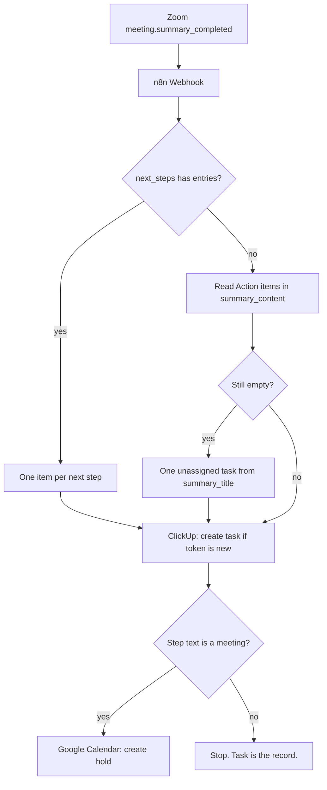

# Zoom Meeting Summaries to ClickUp Tasks and Calendar Follow-Ups

**My Zoom PA n8n build waits for Zoom's `meeting.summary_completed` webhook, then turns each `next_steps` entry into a ClickUp task.** It adds a Google Calendar hold only when the step calls for a meeting. The raw transcript file never becomes the task source.

I am William Spurlock, founder of Spurlock Studios LLC, an AI Systems Architect, and a Fractional AI CTO. I have built 600+ automations with 500+ live, spent 20,000+ hours architecting agentic systems, and saved clients 35,000+ hours of busywork across that body of work. This library card is named Zoom PA. Its chain reads Zoom API, meeting summary, action steps, then ClickUp. I will not invent a workflow id, client name, or saved-hours figure for this canvas. The canvas CSV is not open on this machine, so I applied the wiring that Zoom, ClickUp, n8n, and Google Calendar document to the card.

Zoom says meeting summary uses speech-to-text data to generate the summary ([Using Meeting Summary with AI](https://support.zoom.com/hc/en/article?id=zm_kb&sysparm_article=KB0058013), read September 24, 2026). The PA reads that finished summary object. I do not download a VTT or ask a model to invent extra tasks from the transcript.

This is a back-office spoke. I use the credential pattern from [how I connect n8n to a CRM, email, and a site](/blog/how-to-connect-n8n-to-your-crm-email-and-website-in-under-an-hour). A missing summary body goes through the [HTTP Request node](/blog/n8n-http-request-node-guide). I cover webhook hosting in [what you get on n8n's free plan, and when I self-host](/blog/is-n8n-free-what-you-get-on-the-free-plan-and-when-to-self-host).

## How does William's Zoom PA n8n build turn meeting transcripts into ClickUp tasks and follow-ups?

**I treat the Zoom summary as the transcript's finished product, write one ClickUp task for each `next_steps` string, and book a calendar hold only for a meeting step.** Speech-to-text stays inside Zoom. n8n waits until the summary exists.

Zoom added `meeting.summary_completed` and `GET /v2/meetings/{meetingId}/meeting_summary` on November 20, 2023 ([Meetings changelog](https://developers.zoom.us/changelog/meetings/november-20-2023/)). The event reference, read September 24, 2026, says the webhook fires when the summary is available after the summarized meeting or webinar ends ([meeting.summary_completed](https://developers.zoom.us/docs/api/rest/reference/zoom-api/events/#operation/meeting.summary_completed)).

That event has three gates. I do not route around them.

- **Plan.** The host must be on a Pro or higher plan.
- **Feature.** Meeting Summary with AI Companion has to be on for that host.
- **Encryption.** End-to-end encrypted meetings do not have the summary feature. No summary means no tasks. I do not fall back to a guessed list.

The same page lists the granular scopes `meeting:read:summary`, `meeting:read:summary:admin`, and `meeting:read:summary:master`. The app also needs a working event notification URL and the "Meeting summary has been completed" subscription.

Zoom added `summary_content` to `meeting.summary_completed` and `meeting.summary_updated` on April 24, 2025 ([changelog](https://developers.zoom.us/changelog/meetings/april-24-2025/)). It added `summary_doc_url` to the GET and those same events on August 18, 2025 ([changelog](https://developers.zoom.us/changelog/meetings/august-18-2025/)). When an older payload arrives without `summary_content`, I GET the summary by `meeting_id` through the HTTP Request node with the Zoom credential. I do not use the Zoom meeting node for that call. As of September 24, 2026, that node only creates, deletes, retrieves, and updates meetings ([Zoom node](https://docs.n8n.io/integrations/builtin/app-nodes/n8n-nodes-base.zoom/)).

<table>
  <thead>
    <tr>
      <th>Webhook field</th>
      <th>What I do with it</th>
    </tr>
  </thead>
  <tbody>
    <tr>
      <td><code>meeting_id</code></td>
      <td>Idempotency parent. Also the path id if I have to GET the summary.</td>
    </tr>
    <tr>
      <td><code>meeting_uuid</code></td>
      <td>Second half of the token. I do not put the UUID in the GET path.</td>
    </tr>
    <tr>
      <td><code>meeting_topic</code></td>
      <td>Prefix on the task name, so a list of tasks still shows which call they came from.</td>
    </tr>
    <tr>
      <td><code>meeting_host_email</code></td>
      <td>Logged on the task. Not used as a ClickUp assignee.</td>
    </tr>
    <tr>
      <td><code>summary_title</code></td>
      <td>Fallback task name when <code>next_steps</code> is empty.</td>
    </tr>
    <tr>
      <td><code>summary_overview</code></td>
      <td>Fallback description when there is no step list.</td>
    </tr>
    <tr>
      <td><code>summary_details</code></td>
      <td>Stored under the overview. Not turned into tasks.</td>
    </tr>
    <tr>
      <td><code>next_steps</code></td>
      <td>One ClickUp task per string. This is the source of work.</td>
    </tr>
    <tr>
      <td><code>summary_content</code></td>
      <td>Fallback only, and only the Action items block in Zoom's example shape.</td>
    </tr>
    <tr>
      <td><code>summary_doc_url</code></td>
      <td>Link on the task and, if a hold exists, in the calendar description.</td>
    </tr>
  </tbody>
</table>

Zoom's example payload includes an Action items section inside `summary_content` and a `next_steps` array with the sample string `step1`. The two fields can disagree. My rule is simple. When `next_steps` has entries, those entries become the tasks. I do not create another set from the markdown and duplicate the same work.



The Meetings webhook index also lists `meeting.aic_transcript_completed`, while the recording index lists `recording.transcript_completed`. I subscribe to neither event for this build. Their payloads are outside this canvas because the summary event already carries the action list.

## What breaks when Zoom next steps never become ClickUp tasks?

**The summary email becomes another inbox while the work gets no owner, due date, or record I can audit on Friday.** Zoom did its job. The studio did not.

I see this failure in four places. None needs a made-up client story.

1. **The host is the only person who can act.** Zoom sends the summary to people the host chose to share with. A task system is different. ClickUp notifies assignees. If the step never becomes a task, the person who was named in the call may never see it, because they were not on the Zoom email.
2. **`summary_updated` looks like a new meeting.** Someone fixes a name in Zoom Docs. A second automation run, with no token, files a second task. Now two people do the same step, or one person does it twice.
3. **The calendar and the list disagree.** Someone blocks 25 minutes because the email said "let's sync," and nobody creates the task the hold was supposed to protect. Friday's review shows an empty list and a full calendar.
4. **E2EE calls vanish.** Those meetings do not get a summary. If the build pretends they did, you file tasks for a conversation Zoom refused to transcribe. I would rather have a gap than a fiction.

<table>
  <thead>
    <tr>
      <th>Failure</th>
      <th>What you still have</th>
      <th>What you do not have</th>
    </tr>
  </thead>
  <tbody>
    <tr>
      <td>Summary sits in email</td>
      <td>A Zoom doc URL</td>
      <td>An assignee, a due date, a list</td>
    </tr>
    <tr>
      <td>Second run with no token</td>
      <td>Two tasks, one step</td>
      <td>A way to know which task is current</td>
    </tr>
    <tr>
      <td>Calendar hold with no task</td>
      <td>A block on a morning</td>
      <td>A status you can close</td>
    </tr>
    <tr>
      <td>E2EE meeting</td>
      <td>A normal Zoom call</td>
      <td>A summary object. Stop there.</td>
    </tr>
    <tr>
      <td><code>meeting.ended</code> as the trigger</td>
      <td>A fast webhook</td>
      <td>A summary that is not ready yet</td>
    </tr>
  </tbody>
</table>

The event page says the summary event fires when the summary becomes available after the meeting ends. `meeting.ended` is a separate event on the same index. I do not use it to start this canvas. The call can end before `next_steps` exists.

One quieter failure bothers me more than a missed task. ClickUp's Create Task reference says assignees and watchers are always notified, while `notify_all: true` also notifies the creator ([Create Task](https://developer.clickup.com/reference/createtask), read September 24, 2026). A bad assignee map does not fail quietly. It pings the wrong person. I do not turn a summary name into an assignee until it matches a table I maintain.

## How do I turn Zoom next_steps into ClickUp tasks in n8n?

**I use a Webhook node for `meeting.summary_completed`, then send one item at a time to the ClickUp node's Create a task operation.** A token in the description tells later runs that the task already exists. The Zoom node stays off this canvas.

As of September 24, 2026, the ClickUp node documents Task: Create a task, Get a task, and Get all tasks ([ClickUp node](https://docs.n8n.io/integrations/builtin/app-nodes/n8n-nodes-base.clickup/)). Create Task itself is `POST /v2/list/{list_id}/task`. The body requires `name`. `assignees` is an array of integer user ids. `due_date` is an integer. `due_date_time` is a boolean. The example value on that page is `1508369194377`, a 13-digit integer, with `due_date_time` beside it.

I keep four settings in n8n, outside the prompt:

- **List id.** One list for meeting follow-ups. Not "whatever space was handy."
- **Name table.** Display name to ClickUp user id. Unmatched names stay in the description and the assignee array stays empty.
- **Token.** `zoom:` plus `meeting_uuid` plus the step index, written as the first line of `markdown_description`.
- **Due date.** End of the next business day when the step has no clock time. `due_date_time` stays false unless the step actually named a time.
- **`notify_all`.** False. Assignees still get notified. I do not also ping the token owner for every line.

Before creating anything, I Get all tasks on that list and look for the token. A match means Update a task. No match means create. I do not delete a task someone already closed. An updated summary may change the description, but it cannot reopen a decision.

```json
{
  "name": "Ops weekly: send the revised scope",
  "markdown_description": "zoom:aDYlohsHRtCd4ii1uC2+hA==:0\nHost: jchill@example.com\nDoc: https://docs.example.com/doc/1aBcDeFgHiJkLmNoPqRsTu\n\nSend the revised scope.",
  "assignees": [],
  "status": "Open",
  "due_date": 1508369194377,
  "due_date_time": false,
  "notify_all": false
}
```

That `due_date` number comes from ClickUp's example. It is not a date I computed for a client. The UUID and doc URL are Zoom event schema samples. Replace them with the live payload. Never send the sample strings.

Empty `next_steps` gets a separate, deliberately small branch.

1. Look for an Action items heading inside `summary_content`. Zoom's example schema uses that heading. Bullets under it become the step list.
2. If that block is missing too, create one task. Name it from `summary_title`. Description is `summary_overview` plus `summary_doc_url`. Assignee stays empty.
3. Do not call a model to "find the tasks." A model will invent owners. I would rather have one unassigned task than five confident fakes.

`summary_details` is an array of label plus summary. I append it below the overview on the fallback task. I do not turn its entries into extra tasks. Details are notes. Steps are work.

When `summary_content` is absent, the HTTP Request path is `GET /v2/meetings/{meetingId}/meeting_summary`, using the meeting id from the webhook and the Zoom credential already stored for the app. If that GET fails, I stop the branch and leave one execution error on the webhook item. I will not create a task from half a payload and hope.

## When should a Zoom next step also become a Google Calendar follow-up?

**I add a hold only when the step is a meeting, call, review, or sync.** Every other step remains a ClickUp task with a due date and no calendar block. The calendar holds the time. ClickUp holds the record.

As of September 24, 2026, n8n's Google Calendar node can create an event and check availability ([Google Calendar node](https://docs.n8n.io/integrations/builtin/app-nodes/n8n-nodes-base.googlecalendar/)). The Availability operation defaults to a window from the current time through one hour later, and it points at Google's freebusy query ([calendar operations](https://docs.n8n.io/integrations/builtin/app-nodes/n8n-nodes-base.googlecalendar/calendar-operations/)). That default cannot check a hold for tomorrow morning. I set the intended start and end first, then check whether the slot is free.

Google's insert method is `POST https://www.googleapis.com/calendar/v3/calendars/calendarId/events`. `start` and `end` are required. `calendarId` can be `primary` for the logged-in calendar. `sendUpdates` defaults to false. Google warns that `none` can stop an event from syncing to some external calendars ([events.insert](https://developers.google.com/workspace/calendar/api/v3/reference/events/insert), read September 24, 2026).

These are my hold rules:

- **No clock time in the step.** Next business morning, 9:00 to 9:25, `America/New_York`, on my primary calendar. Twenty-five minutes is a choice, not a Zoom field.
- **Clock time present.** Use it as `start.dateTime`. End is 25 minutes later unless the step named a duration.
- **Slot busy.** Push 30 minutes and check availability once more. If the second slot is busy, skip the hold and write "calendar skipped, slot busy" on the ClickUp task. Do not keep sliding all day.
- **No attendees on an internal hold.** `sendUpdates` stays `none`, because there is no guest to notify, and the warning about external sync matters less on a private primary calendar.
- **A named guest.** Put their email on `attendees` and set `sendUpdates` to `all`. An email is required when you add an attendee. I do not invent one from a first name.
- **Summary updated later.** Leave the hold where it is. I will not move someone's morning because a sentence changed in Zoom. A person moves the hold.

```json
{
  "summary": "Follow-up: revised scope",
  "description": "ClickUp token zoom:MEETING_UUID:0\nZoom doc: https://docs.example.com/doc/example",
  "start": {
    "dateTime": "2026-09-25T09:00:00-04:00",
    "timeZone": "America/New_York"
  },
  "end": {
    "dateTime": "2026-09-25T09:25:00-04:00",
    "timeZone": "America/New_York"
  }
}
```

Skipping the hold does not remove the task. That split matters. A missed slot is a scheduling problem. A missing task is lost work.

<table>
  <thead>
    <tr>
      <th>Step text</th>
      <th>ClickUp task</th>
      <th>Calendar hold</th>
    </tr>
  </thead>
  <tbody>
    <tr>
      <td>Send the revised scope</td>
      <td>Yes, due next business day, no clock time</td>
      <td>No</td>
    </tr>
    <tr>
      <td>Review the scope Thursday at 2pm</td>
      <td>Yes, <code>due_date_time</code> true</td>
      <td>Yes, 2:00 for 25 minutes if free</td>
    </tr>
    <tr>
      <td>Sync with Alex tomorrow</td>
      <td>Yes, unassigned unless Alex is in the id table</td>
      <td>Yes, next business morning if free</td>
    </tr>
    <tr>
      <td>Think about pricing</td>
      <td>Yes, unassigned, due next business day</td>
      <td>No. "Think" is not a meeting.</td>
    </tr>
    <tr>
      <td>Empty <code>next_steps</code> and empty Action items</td>
      <td>One fallback task</td>
      <td>No</td>
    </tr>
  </tbody>
</table>

I do not create a Zoom meeting from this canvas. The Zoom node can create meetings, but this build has no reason to do so. The follow-up is a hold on the operator's existing calendar. Giving every action item a new Zoom link fills the week with empty rooms.

## How do I audit that one Zoom summary became the right ClickUp task and calendar hold?

**I pick one `meeting_uuid` from a webhook execution, count its `next_steps`, and match every token to one ClickUp task and, when the rule calls for it, one calendar event.** A count mismatch means the run failed, even when both APIs returned 200.

I audit one meeting at a time. A weekly vibe check can hide a duplicate.

<table>
  <thead>
    <tr>
      <th>Check</th>
      <th>Pass</th>
      <th>Fail</th>
    </tr>
  </thead>
  <tbody>
    <tr>
      <td>Webhook event name</td>
      <td><code>meeting.summary_completed</code> or, on an edit, <code>summary_updated</code> with the same uuid</td>
      <td><code>meeting.ended</code> created tasks</td>
    </tr>
    <tr>
      <td>Step count</td>
      <td>Tasks with that uuid token equals <code>next_steps</code> length, or one fallback task</td>
      <td>Two tasks for one step, or zero tasks when steps existed</td>
    </tr>
    <tr>
      <td>Assignee</td>
      <td>Integer id from the name table, or empty</td>
      <td>A display name stuffed into <code>assignees</code></td>
    </tr>
    <tr>
      <td>Due date</td>
      <td>13-digit integer, <code>due_date_time</code> false unless a clock time was in the step</td>
      <td>A date string ClickUp will reject</td>
    </tr>
    <tr>
      <td>Doc URL</td>
      <td><code>summary_doc_url</code> present on the task description</td>
      <td>Sample URL from Zoom's schema still in the task</td>
    </tr>
    <tr>
      <td>Calendar</td>
      <td>Hold exists only for meeting-shaped steps, description contains the same token</td>
      <td>Hold exists and no task does, or a "send the file" step booked 25 minutes</td>
    </tr>
    <tr>
      <td>Second delivery</td>
      <td><code>summary_updated</code> updated the description, hold stayed put</td>
      <td>A second task and a second hold</td>
    </tr>
    <tr>
      <td>E2EE</td>
      <td>No execution, or an execution that stopped with no summary</td>
      <td>Tasks filed anyway</td>
    </tr>
  </tbody>
</table>

On Monday, I check the pass row for the last five meetings instead of reading a dashboard score. Five meetings is my habit, not a vendor benchmark.

What I want to see on one task, in order:

1. First line is the token `zoom:{uuid}:{index}`.
2. Host email from the payload, unchanged.
3. `summary_doc_url` as a link.
4. The step string, unchanged, under a blank line.
5. If the hold was skipped, one line that says the slot was busy.

If someone rewrites the description and removes the token, the next `summary_updated` will create a duplicate. I tell operators to leave the first line alone because it is the audit key. ClickUp custom fields can also hold the token, and Create Task accepts `custom_fields` when the field applies to that task. I keep it in the description because Get all tasks is easier to check by eye than a custom field buried in the UI.

I do not ask a model to grade this build. The pass table is a count, and a count does not need a paragraph of advice.

## FAQ

**These answers follow the documented product behavior and dates cited in each entry.**

### Does the n8n Zoom node read meeting summaries?

**No.** As of September 24, 2026, the [Zoom node](https://docs.n8n.io/integrations/builtin/app-nodes/n8n-nodes-base.zoom/) lists create, delete, retrieve, retrieve all, and update for meetings. The same page directs other calls through the HTTP Request node with the Zoom credential. I use a Webhook for `meeting.summary_completed` and HTTP only when `summary_content` is missing.

### Which Zoom plan is required before a meeting summary exists?

**The host has to be on a Pro or higher plan, with Meeting Summary with AI Companion enabled.** The [meeting.summary_completed](https://developers.zoom.us/docs/api/rest/reference/zoom-api/events/#operation/meeting.summary_completed) reference lists that prerequisite, read September 24, 2026. A free host can still hold a call, but this build will not receive its summary.

### Do end-to-end encrypted Zoom meetings produce a summary?

**No. Zoom says E2EE meetings do not have the summary feature enabled.** I do not invent tasks for those calls. If the work mattered, someone writes the task by hand from memory and puts their name on it.

### What if the next_steps array is empty?

**I read the Action items block inside `summary_content` when it exists. Otherwise, I file one unassigned task from `summary_title`.** I do not ask a model to invent steps. Zoom's example payload shows `next_steps` and the markdown Action items as separate fields, so the first is my primary list and the second is my fallback. I do not merge them.

### How do I stop a second ClickUp task when Zoom updates the summary?

**I put `zoom:{meeting_uuid}:{index}` on the description's first line and search for it before every create.** `summary_content` was added to both `meeting.summary_completed` and `meeting.summary_updated` on April 24, 2025, so an edit can arrive as a second event ([changelog](https://developers.zoom.us/changelog/meetings/april-24-2025/)). A match means update the description. A miss means create. I do not delete a task someone already finished.

### Should the calendar event replace the ClickUp task?

**No. The task is the record, and the hold is optional.** A busy slot skips the hold and records that fact on the task. Someone can still close a task with no hold. A hold with no task protects nothing.

### Can I trigger this build on meeting.ended instead of meeting.summary_completed?

**No. The summary event fires when the summary becomes available after the meeting ends.** `meeting.ended` is a different, earlier event. Starting there often gives me a meeting id before `next_steps` exists. I subscribe to the summary event and stop.

### Where should the Zoom summary_doc_url go?

**I put it on the ClickUp task description and on the calendar description when I create a hold.** Zoom added `summary_doc_url` to the GET summary response and to `meeting.summary_completed` and `meeting.summary_updated` on August 18, 2025 ([changelog](https://developers.zoom.us/changelog/meetings/august-18-2025/)). The doc is the human-readable copy. The task is the work. I do not treat the doc as another system of record.

### Why are ClickUp assignees user ids and not the names in the summary?

**Create Task takes `assignees` as an array of integer user ids, not display names.** A line that says "Sarah" cannot map until a table I maintain identifies Sarah's integer. Unmatched names stay in the description, the array stays empty, and nobody receives the wrong notification. Assignees and watchers are notified on create even when `notify_all` is false.

## Book an AI automation strategy call

**I build this as a fixed canvas.** Webhook, token, ClickUp create-or-update, then a calendar hold only for meeting-shaped steps. No model sits in the middle.

If you want me to map that canvas to your Zoom app, ClickUp list, and hold calendar, [book an AI automation strategy call](/contact). I will name the list, assignee table, and one event subscription before anything creates a task.
